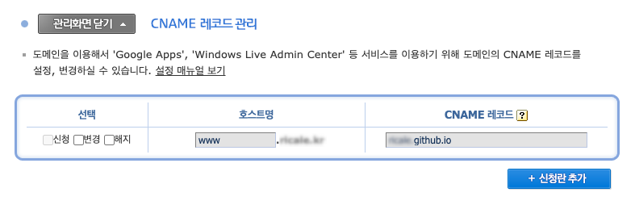
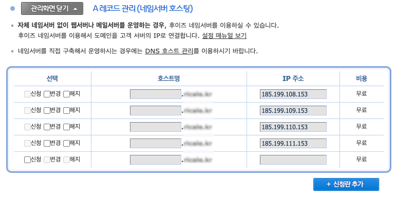

## References

[managing-domain]: https://docs.github.com/en/pages/configuring-a-custom-domain-for-your-github-pages-site/managing-a-custom-domain-for-your-github-pages-site

- [Create React App documentation - Deployment](https://create-react-app.dev/docs/deployment/) - [GitHub Pages](https://create-react-app.dev/docs/deployment/#github-pages)
- [GitHub Docs](https://docs.github.com/en) - [Managing a custom domain for your GitHub Pages site][managing-domain]

---

[Create React App](https://create-react-app.dev)은 React 웹앱을 만들고자 할 때 프로젝트 초기 셋팅 (디펜던시 설치, 각종 설정 적용 등) 을 도와주는 편리한 툴이다. 이 글에서는 이 툴을 가지고 생성한 앱을 [GitHub Pages](https://pages.github.com/)에 배포해 볼 것이다.

이 글은 위 References 의 두 문서를 보며 진행한 작업을 정리한 것이다. 따라서 영어를 읽는데 문제가 없다면 이 문서를 보는 것 보다는 References 의 두 문서를 보는 것을 권한다.

## 1. React 앱 생성

먼저 Create React App 으로 웹앱을 만들자.

`create-react-app`을 설치하자. 전역적으로 설치해야 하므로 `yarn global add` 명령어를 쓴다.

```shell
yarn global add create-react-app
```

그리고 앱을 생성한다.

```shell
# ./app-name 폴더에 프로젝트 생성
yarn create react-app app-name

# 현재 폴더에 프로젝트 생성
yarn create react-app .

# 타입스크립트가 적용된 프로젝트 생성
yarn create react-app app-name --template typescript
```

`./src/index.ts`가 엔트리 포인트다. (앱을 구현하는 자세한 방법은 [Create React App 공식 문서](https://create-react-app.dev/docs/documentation-intro)와 [React 공식 문서](https://reactjs.org/docs/getting-started.html)를 참고하자.)

개발 중에는 개발 서버를 띄워서 확인하고

```shell
yarn start # 로컬 개발 서버를 띄운다
```

개발이 끝나면 빌드한 뒤 그 결과물을 배포하면 된다.

```shell
yarn build # 빌드한다.
```

### 1.1. `eject`

`create-react-app`은 webpack 등 설정과 관련된 것을 [react-scripts](https://github.com/facebook/create-react-app/tree/master/packages/react-scripts) 모듈에 몰아넣어서, 사용자는 신경쓰지 않아도 되게끔 관리하고 있다. webpack 설정을 직접 수정할 일이 없다면 신경쓰지 않아도 되지만, 만약 직접 수정하고 싶다면 `eject`를 해주어야 한다.

```shell
yarn eject # `react-scripts` 내부에 숨겨져있던 설정 파일들이 프로젝트에 생성된다.
```

`eject` 과정은 GitHub Pages 기능을 사용하는 데 필요한 과정은 아니므로 생략해도 무방하다.

## 2. 설정 및 배포

구현한 앱을 GitHub Pages 에 배포하려면 간단한 설정을 해주어야 한다.

### 2.1. 주소 설정

먼저 프로젝트의 `package.json` 파일에 아래 내용을 추가하자.

```javascript
"homepage": "https://username.github.io",
```

만약 username.github.io 코드저장소가 아닌, 기존 프로젝트에 GitHub Pages 기능을 사용하는 것이라면 아래 형식으로 해야 한다.

```javascript
"homepage": "https://username.github.io/my-app",
```

### 2.2. 빌드 명령어 추가

[gh-pages](https://github.com/tschaub/gh-pages)를 설치한 뒤

```shell
yarn add --dev gh-pages
```

`package.json`의 `scripts` 에 아래 내용을 추가하자.

```javascript
"scripts": {
  "predeploy": "yarn build",
  "deploy": "gh-pages -b master -d build",
  // ...
}
```

`-b master` 옵션은 빌드 결과를 `master` 브랜치로 올려주겠다는 옵션이다. 만약 다른 브랜치를 사용하려면 변경해주어도 좋다. 브랜치를 설정해주지 않으면 (`-b` 옵션을 제거하면) `gh-pages` 브랜치에 빌드 결과가 올라간다.

### 2.3. 빌드

```shell
yarn deploy
```

`yarn build` 명령어를 통해 생성된 빌드 결과가 `master` 브랜치의 새로운 커밋으로 푸시된다.

### 2.4. GitHub 코드저장소 설정

코드저장소의 [settings] 페이지의 [Pages] 메뉴에 들어가면 GitHub Pages 관련 설정을 수정할 수 있다.


#### Source

GitHub Pages 로 쓰일 브랜치와 디렉토리를 지정할 수 있다. 기본값은 `master` 브랜치와 root 디렉토리이다. 위의 과정을 쭉 따라왔다면 이 값은 수정할 필요가 없다.

#### Custom domain

이 메뉴에서 커스텀 도메인 설정이 가능하다.

## 3. 커스텀 도메인 적용

usename.github.io 도메인이 마음에 들지 않는다면 위에서 언급한 Custom domain 메뉴 및 몇 가지 설정을 통해 자신이 갖고 있는 도메인으로 설정할 수 있다.

### 3.1. 주소 설정

먼저 "2.1. 주소 설정"에서처럼 `package.json`의 `homepage` 항목을 수정하자.

```javascript
"homepage": "http://mydomain.com",
```

### 3.2. 도메인 네임서버 CNAME 설정

도메인 등록 업체로 가서 CNAME 을 설정해주어야 한다. 업체마다 설정 페이지가 다를 수 있다. [후이즈](https://whois.co.kr/) 기준으로 [네임서버 고급설정] - [CNAME 레코드 관리] 메뉴로 들어가면 설정할 수 있다.



| 호스트명         | CNAME 레코드       |
| ---------------- | ------------------ |
| www.mydomain.com | username.github.io |

위처럼 설정해준다.

### 3.3. 도메인 네임서버 A 레코드 설정

A 레코드도 설정해주자. [후이즈](https://whois.co.kr/) 기준으로 [네임서버 고급설정] - [A 레코드 관리 (네임서버 호스팅)] 메뉴에서 설정할 수 있다.



| 호스트명     | IP 주소         |
| ------------ | --------------- |
| mydomain.com | 185.199.108.153 |
| mydomain.com | 185.199.109.153 |
| mydomain.com | 185.199.110.153 |
| mydomain.com | 185.199.111.153 |

주의할 점은 여기에서는 www.mydomain.com 이 아니라 mydomain.com 이라는 것이다. www 를 뺀다.

### 3.4. 코드저장소의 Custom domain 설정

코드저장소의 Settings 페이지의 Pages 메뉴에 들어가면 Custom domain 섹션이 존재한다. 이곳에 사용하고자 하는 도메인(mydomain.com)을 적자.

Save 버튼을 누르면 자동으로 `master` 브랜치에 추가 커밋이 생성되는데, 해당 커밋에서는 루트 디렉토리에 `CNAME` 파일을 자동 생성해준다. 해당 파일에는 방금 작성한 도메인이 작성되어 있다.

주의할 점은, 작업 브랜치의 `./public` 디렉토리에도 동일한 파일을 생성해 주어야 한다. 만약 생성해주지 않으면 다음 `yarn deploy` 때는 `CNAME` 파일이 자동 생성되지 않는다.

### 3.4. 결과

이제 mydomain.com 으로 내 GitHub Pages 가 접속된다.

#### 결과물 예시

이 [코드저장소](https://github.com/ricale/ricale.github.io)에서 결과물을 볼 수 있다.

## 4. 이슈

### 4.1. `NotServedByPagesError`

"3.4. 코드저장소의 Custom domain 설정" 메뉴에서 도메인을 입력하고 Save 버튼을 누르면 아래와 같은 메시지가 뜰 때가 있다.

> Both www.mydomain.com and its alternate name are improperly configured
> Domain does not resolve to the GitHub Pages server. For more information, see Learn more (NotServedByPagesError). We recommend you change this to a CNAME record pointing to username.github.io.

정확한 원인이 무엇인지 알아내지 못했는데, 네임서버 설정은 원래 전파되는데 시간이 걸릴 수 있어서 그렇다는 이야기가 있다. 실제로 몇 시간이 지나고 부터는 에러 메시지가 없어졌다.
