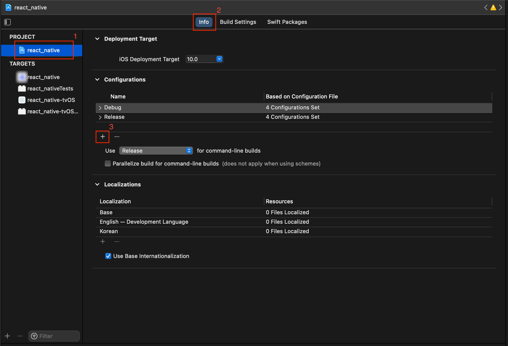
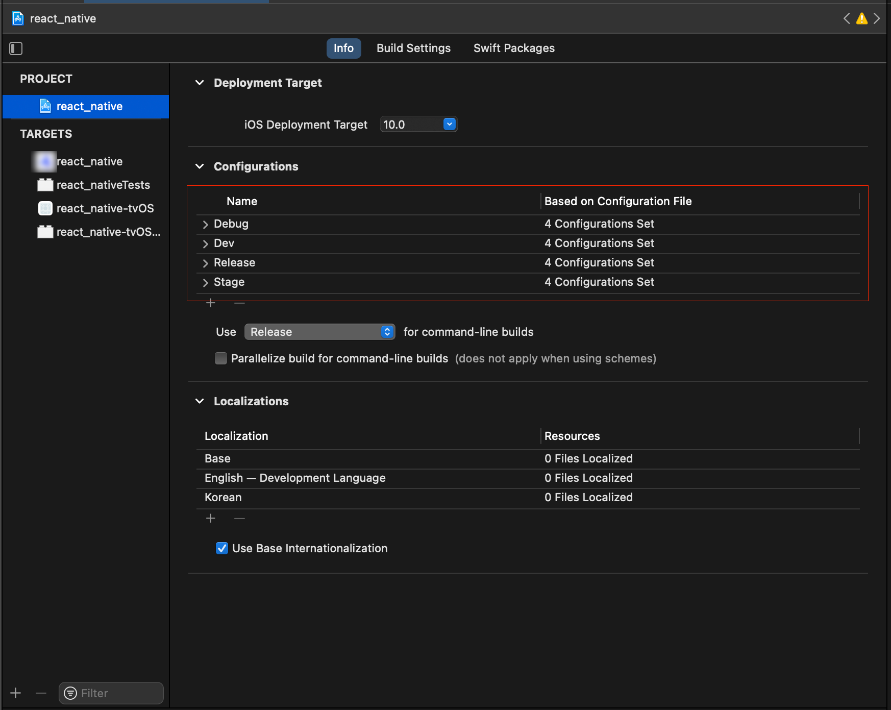
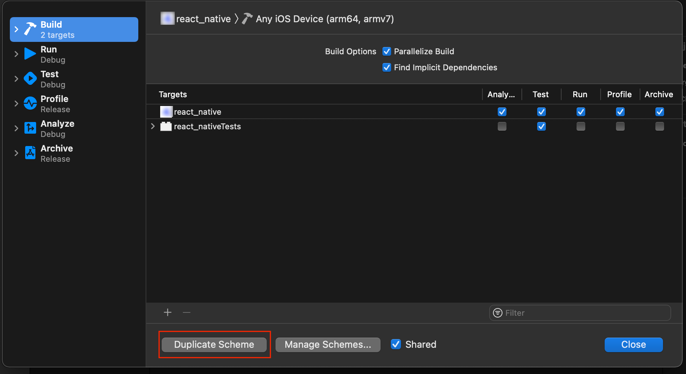
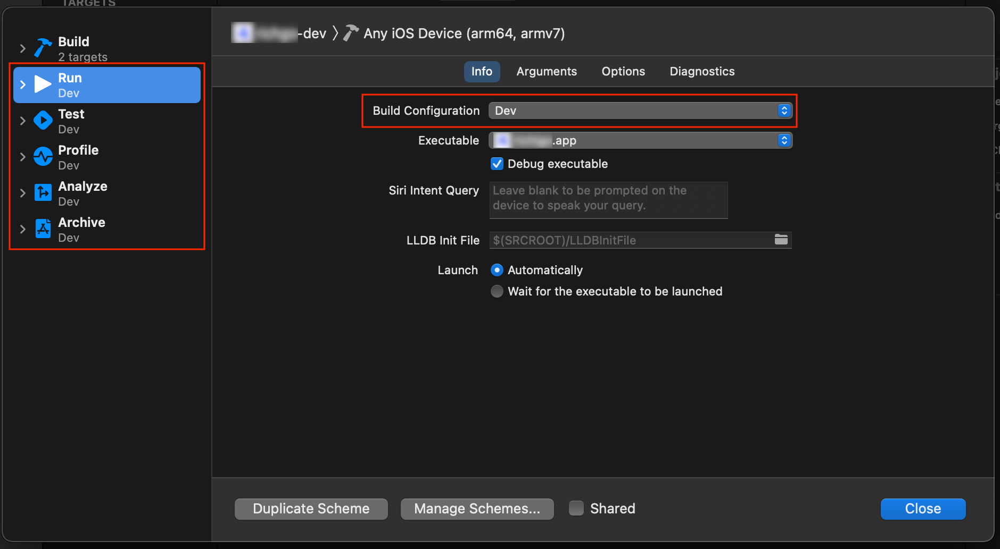
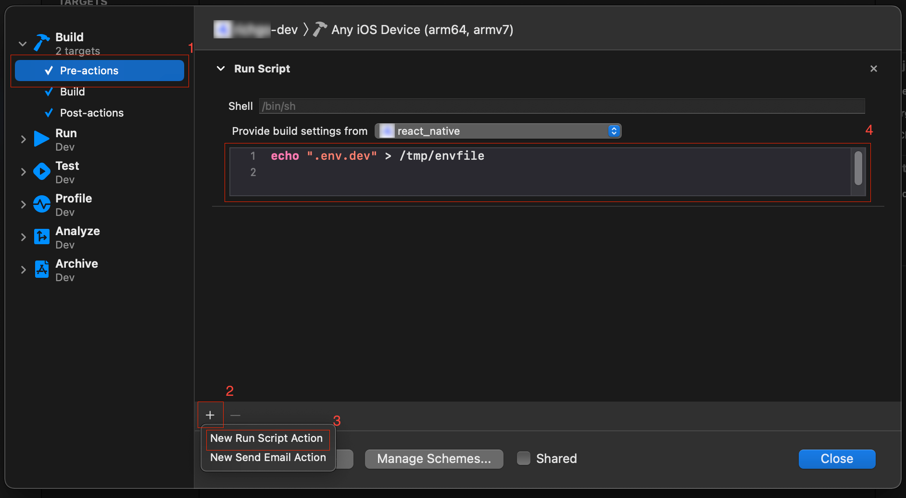
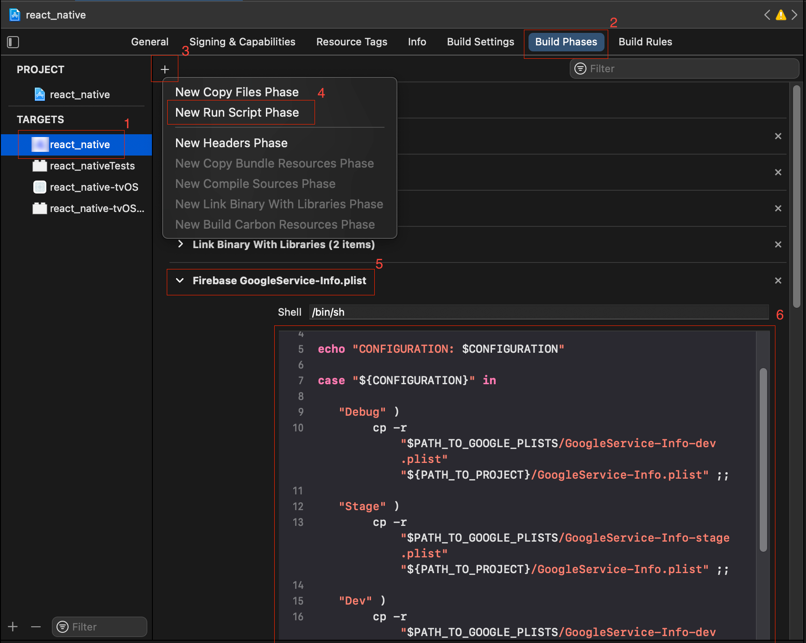
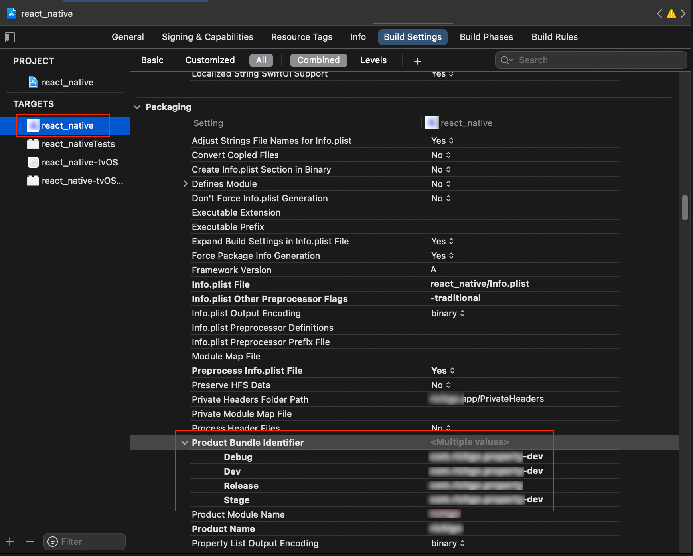
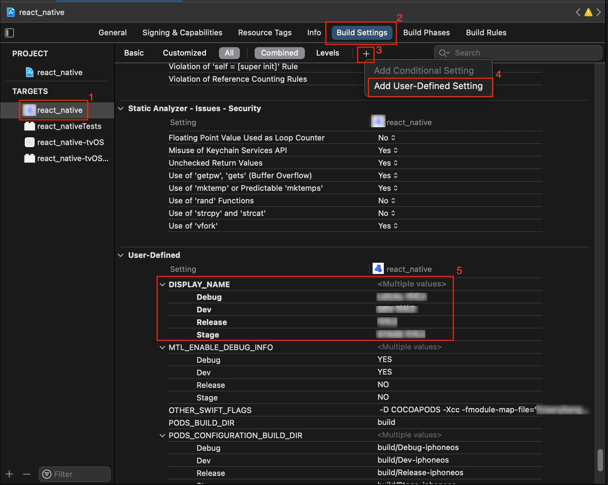
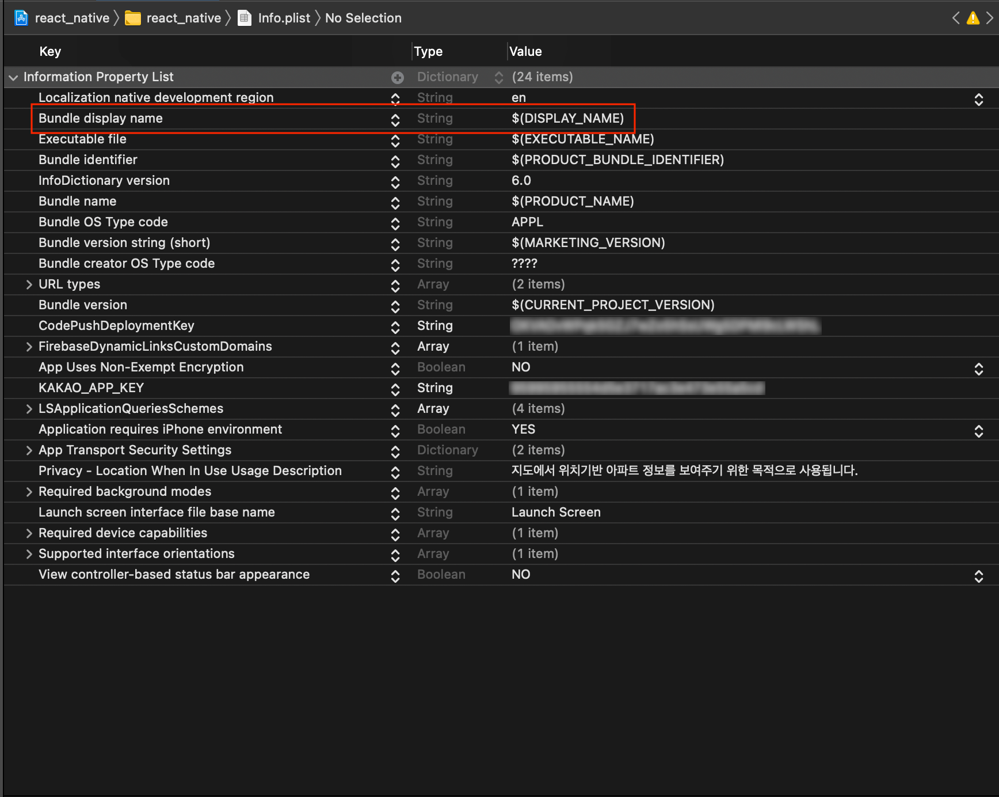

한 프로젝트는 여러 환경에서 빌드 혹은 실행될 수 있다. 가장 단순하게는 개발 환경과 운영(production) 환경 두 환경으로 분리할 수 있고, local, dev, stage, test 등을 보다 세분화해서 분리할 수도 있다.

이 글에서는 여러 환경에 따라 React Native 프로젝트를 빌드 및 실행해야 할 때, 어떻게 설정을 나누어 관리할 수 있는지 설명한다.

## 1. react-native-config 설치

일단 [react-native-config](https://github.com/luggit/react-native-config)를 설치한다. 이 라이브러리는 `.env.ENV_NAME`파일들을 이용해 각 환경별로 필요한 값을 관리할 수 있다.

### 1.1. react-native-dotenv vs react-native-config

react-native-config 라이브러리와 비슷한 라이브러리로는 [react-native-dotenv](https://github.com/goatandsheep/react-native-dotenv)가 있다. 두 라이브러리는 단일 환경 사용자 측면에서는 거의 동일하지만, 현재 react-native-dotenv 가 다중 환경 지원이 제대로 되지 않는 이슈가 있어서 여기서 사용하기에는 적합하지 않다. (GitHub issue - [APP_ENV doesn't work as expected](https://github.com/goatandsheep/react-native-dotenv/issues/131) 참고)

따라서 이 글에서는 react-native-config 를 사용한다.

### 1.2. `.env` 파일 작성

프로젝트 root 디렉토리에, 만들려는 환경만큼 파일을 생성한다. (이 파일들은 `.gitignore` 에 추가되는 게 좋다. [참고](https://github.com/luggit/react-native-config/issues/422))

```json
.env             // 기본, local 환경을 위한 env 파일로 사용
.env.dev         // dev 환경을 위한 env 파일
.env.stage       // stage 환경을 위한 env 파일
.env.production  // production 환경을 위한 env 파일
```

각 파일에서 원하는 값은 `key=value` 형식으로 작성하면 된다.

```json
BUILD_ENV=LOCAL
BASE_URL=http://localhost:3000
```

## 2. 안드로이드 설정

### 2.1. `android/app/build.gradle`

안드로이드 설정에서 가장 중요한 것은 이 `android/app/build.gradle` 파일이다. 하나씩 설정을 추가해보자.

#### 2.1.1. react-native-config 를 위한 설정

react-native-config 는 [단일 환경이 아닌 여러 빌드 환경을 설정할 때는, autolinking 말고도 추가로 해줘야 할 설정이 있다.](https://github.com/luggit/react-native-config#extra-step-for-android) 문서를 자세히 읽지 않으면 놓치기 쉬우므로 정리하고 넘어간다.

파일 최상단에 (`apply plugin: "com.android.application"` 바로 아랫줄에) 아래 코드를 추가한다.

```js
apply from: project(':react-native-config').projectDir.getPath() + "/dotenv.gradle"
```

`android.defaultConfig` 항목에는 아래 코드를 추가한다.

```js
android {
    // ...
    defaultConfig {
        // ...
        // APP_PACKAGE_NAME 대신 자신의 앱 패키지명을 넣으면 된다
        resValue "string", "build_config_package", "APP_PACKAGE_NAME"
    }
    // ...
}
```

#### 2.1.2. 환경 분리를 위한 설정

`android.buildTypes` 항목에 환경별 설정을 추가한다.

```js
android {
    // ...
    buildTypes {
        debug {
            signingConfig signingConfigs.debug
            applicationIdSuffix ".dev"
        }
        release {
            // Caution! In production, you need to generate your own keystore file.
            // see https://facebook.github.io/react-native/docs/signed-apk-android.
            signingConfig signingConfigs.debug
            minifyEnabled enableProguardInReleaseBuilds
            proguardFiles getDefaultProguardFile("proguard-android.txt"), "proguard-rules.pro"
        }
        //
        // 아래부터가 추가되는 코드
        //
        devDebug {
            initWith debug
            applicationIdSuffix ".dev"
            matchingFallbacks = ['debug']
        }
        devRelease {
            initWith release
            applicationIdSuffix ".dev"
            matchingFallbacks = ['release']
        }
        stageDebug {
            initWith debug
            applicationIdSuffix ".test"
            matchingFallbacks = ['debug']
        }
        stageRelease {
            initWith release
            applicationIdSuffix ".test"
            matchingFallbacks = ['release']
        }
    }
}
```

`devDebug`, `devRelease` 등이 추가된 환경들이다. 앞에 붙은 `dev`, `stage` 가 빌드 환경 이름이고 뒤에 붙은 `Debug`, `Release` 가 빌드 유형 정보다. (네이밍 방식이 정해진 것은 아니다. 꼭 이 형식을 따를 필요는 없다.)

- `initWith`: 해당 타입을 기반으로 새 타입을 생성하겠다는 의미다.
- `applicationIdSuffix`: 앱이 빌드되면 패키지명 뒤에 이 값을 붙여준다. 즉 같은 앱을 환경별로 나눠서 설치할 수 있게 해준다.
- `matchingFallbacks`: 앱 빌드 시 환경이름을 buildTypes 이름이 아니라 이 값으로 대체한다. (`devDebug`로 빌드해도 React Native 코드 상에서 환경 이름에 접근할 때는 `debug`가 된다.) 기본 node 환경에도 대응되게 하려면 이 값을 설정해주는 게 좋다.

#### 2.1.3. 스토어키 등록

안드로이드 스튜디오에서는 실행 및 빌드 시 원하는 `.env.ENVNAME` 파일 적용을 할 수 없다. (사실 가능할 수도 있다. 찾아보진 않았다.) 커맨드라인에서는 가능한데, 실행은 아무 추가적 설정 없이 가능한 반면 (릴리즈)빌드는 스토어 키 설정을 해주어야 한다.

`android.signingConfigs` 에 릴리즈용 키 정보를 등록하면 된다.

```js
signingConfigs {
    debug {
        storeFile file('debug.keystore')
        storePassword 'android'
        keyAlias 'androiddebugkey'
        keyPassword 'android'
    }
    // 이름을 release 로 하긴 했지만 다른 이름도 가능하다.
    // 단, 그 경우 `android.buildTypes.release`의 `signingConfig` 값도 같이 바꿔주어야 한다.
    release {
        if(project.hasProperty('MYAPP_UPLOAD_STORE_FILE')) {
            storeFile file(MYAPP_UPLOAD_STORE_FILE)
            storePassword MYAPP_UPLOAD_STORE_PASSWORD
            keyAlias MYAPP_UPLOAD_KEY_ALIAS
            keyPassword MYAPP_UPLOAD_KEY_PASSWORD
        }
    }
}
```

보다 자세한 내용은 React Native 공식 문서 ([Publishing to Google Play Store](https://reactnative.dev/docs/signed-apk-android)) 를 참고.

### 2.2. 환경별 파일 분리

`./android/app/src/main` 디렉토리에 아래와 같은 파일들이 존재할 것이다.

- `AndroidManifest.xml`
- `MainActivity.java`
- `MainApplication.java`
- 각종 리소스(이미지, `res/values/*.xml` 등)

해당 파일들을 환경별로 따로 관리하고 싶다면, 환경별로 디렉토리를 별도로 만들어 관리하면 된다.

예를 들어 devDebug 환경의 `AndroidManifest.xml` 파일을 따로 관리하고 싶다면 `android/app/src/devDebug` 디렉토리를 만든 뒤, 해당 디렉토리에 `AndroidManifest.xml` 파일을 새로 작성하면 된다. (일반적으로는 기존의 파일을 복사해와서 수정하고 싶은 부분만 수정하게 될 것이다)

### 2.3. Firebase 설정 파일 분리

일반적으로 Firebase 설정 파일인 `google-services.json`은 `android/app` 디렉토리에 위치하게 된다. 하지만 환경별로 분리해주고 싶을 경우, 2.2. 와 동일한 방법으로 환경별로 각각 파일을 만들어주어야 한다.

- `android/app/google-services.json`: 환경별 Firebase 설정 파일이 없을 경우 일괄적으로 적용되는 설정 파일
- `android/app/src/ENV_NAME/google-services.json`: ENV_NAME 환경에만 적용되는 Firebase 설정 파일

### 2.4. 실행/빌드 명령어 작성

환경별 실행/빌드 명령어를 `package.json` 파일에 작성해두자.

```javascript
{
  // ...
  "scripts": {
    // ...
    "android": "ENVFILE=.env react-native run-android --appIdSuffix=dev",
    // 아래 주석 처리된 내용은 2.4.1. 항목 참고.
    // "android-dev": "ENVFILE=.env.dev react-native run-android --variant=devDebug --appIdSuffix=dev",
    // "android-stage": "ENVFILE=.env.stage react-native run-android --variant=stageDebug --appIdSuffix=test",
    "android-dev": "ENVFILE=.env.dev react-native run-android",
    "android-stage": "ENVFILE=.env.stage react-native run-android",
    "build-android-dev": "cd ./android && ENVFILE=.env.dev ./gradlew assembleDevRelease && cd ../",
    "build-android-stage": "cd ./android && ENVFILE=.env.stage ./gradlew assembleStageRelease && cd ../",
    "build-android-production": "cd ./android && ENVFILE=.env.production ./gradlew assembleRelease && cd ../",
  }
}
```

이렇게 하면 커맨드라인에서 아래 같은 명령어들로 안드로이드앱을 실행 및 빌드하는 것이 가능해진다.

```bash
yarn android                  # 로컬/개발 환경 실행
yarn android-dev              # dev/개발 환경 실행
yarn android-stage            # stage/개발 환경 실행
yarn build-android-dev        # dev 빌드
yarn build-android-stage      # stage 빌드
yarn build-android-production # production 빌드
```

#### 2.4.1. `react-native run-android --variant=VAR_NAME` 이슈

현재 `react-native run-android --variant=VAR_NAME` 명령어를 사용하면 metro 번들러가 정상적으로 동작하지 않아 에러가 발생한다. 의도적인 것인지 버그인지는 불명, 해결 방법도 불명이다.

`react-native bundle` 명령어를 선행하면 에러는 제거할 수 있지만 hot-reload 가 동작하지 않는다. (이 말은 js/ts 파일이 수정될 때마다 다시 빌드해줘야 함을 의미한다.)

따라서 `react-native run-android` 명령어 사용 시에는 `variant` 옵션을 사용하지 않기를 권한다. `ENVFILE` 옵션만 써줘도 테스트는 충분히 할 수 있다.

## 3. iOS 설정

### 3.1. Configuration 추가

PROJECT - [Info] - [Configuration] 에서 [+] 버튼 클릭한다.



[Duplicate "Debug" Configuration] ("Release" 도 크게 상관 없음) 눌러서 필요한 만큼 설정을 추가하자.



### 3.2. Scheme 추가

최상단 메뉴에서 [Product] - [Scheme] - [Edit Scheme] 을 선택한다. 이후 [Duplicate Scheme] 버튼으로 Scheme 추가한다.



환경 이름 설정 후 [Run], [Test], [Profile], [Analyze], [Archive] 탭의 Build Configuration 항목을 모두 변경하자.



여기서 Build Configuration 은 _"3.1. Configuration 추가"_ 에서 추가했던 항목들을 선택할 수 있다. 되도록 Scheme과 Build Configuration은 1:1로 매칭해주는 것이 좋다. (반드시 그래야 하는 것은 아니고, 편의성을 위해서다)

##### > Scheme - Build Configuration 설정 예

| Scheme                | Build Configuration |
| --------------------- | ------------------- |
| my-project            | (기본값 유지)       |
| my-project-dev        | Dev                 |
| my-project-stage      | Stage               |
| my-project-production | Production          |

#### 3.2.1. Scheme 의 Pre-actions, Post-actions 적용

iOS 는 환경별 `.env` 파일 적용이 자동으로 이루어지지 않기 때문에, 별도의 선행 스크립트를 삽입해주어야 한다.

[Edit Scheme] 의 [Build] 탭에서 [Pre-actions] 선택해 스크립트를 작성하자.



```bash
echo ".env.ENVNAME" > /tmp/envfile
```

[Post-actions] 에는 아래 스크립트를 삽입하자.

```bash
rm /tmp/envfile
```

### 3.3. Firebase 설정 파일 관련 설정 추가

빌드될 때마다 각 환경에 맞는 firebase 설정 파일을 사용하게 하는 설정도 추가할 것이다.

일단 `./ios/firebaseInfo` 디렉토리 생성(디렉토리 이름은 이후 설정에서 일관되게 유지하기만 하면 바꿔도 상관 없다)해 환경별로 `GoogleService-Info.plist`를 작성하자. 아래처럼 파일이 추가될 것이다.

- `./ios/firebaseInfo/GoogleService-Info-dev.plist`
- `./ios/firebaseInfo/GoogleService-Info-stage.plist`
- `./ios/firebaseInfo/GoogleService-Info.plist`

TARGET - [Build Phases] 에서 [+] 버튼을 눌러서 스크립트 추가하자.



스크린샷에서는 스크립트 이름을 "Firebase GoogleService-Info.plist" 라고 작성했으나, 다른 이름을 써도 무방하다.

순서는 대략 "Link Binary With Libraries" 와 "Copy Bundle Resources" 사이로 했는데, 다른 위치에 있어도 정상 동작할 수도 있다.

스크립트는 아래 형식으로 작성한다.

```bash
PATH_TO_GOOGLE_PLISTS="${PROJECT_DIR}/firebaseInfo"
PATH_TO_PROJECT="${PROJECT_DIR}"

echo "CONFIGURATION: $CONFIGURATION"

case "${CONFIGURATION}" in

"Debug" )
                cp -r "$PATH_TO_GOOGLE_PLISTS/GoogleService-Info-dev.plist" "${PATH_TO_PROJECT}/GoogleService-Info.plist" ;;

           "Stage" )
                cp -r "$PATH_TO_GOOGLE_PLISTS/GoogleService-Info-stage.plist" "${PATH_TO_PROJECT}/GoogleService-Info.plist" ;;

           "Dev" )
                cp -r "$PATH_TO_GOOGLE_PLISTS/GoogleService-Info-dev.plist" "${PATH_TO_PROJECT}/GoogleService-Info.plist" ;;

           "Release" )
                cp -r "$PATH_TO_GOOGLE_PLISTS/GoogleService-Info.plist" "${PATH_TO_PROJECT}/GoogleService-Info.plist" ;;

            *)
                ;;
        esac
```

### 3.4. Package 이름 분리

TARGET - [Build Settings] - [Packaging] - [Product Bundle Identifier] 항목을 수정하자.



### 3.5. 앱 이름 분리

먼저 TARGET - [Build Settings] 에서 앱 이름으로 사용될 User-defined 값을 추가하자.



그 추가한 값을 Info.plist - [Bundle display name] 에 적용하면 된다.



### 3.6. 실행 및 빌드

이제 Xcode 에서 알맞는 Scheme 을 고른 뒤 [Run] 혹은 [Archive]를 하면 앱을 실행 혹은 빌드할 수 있다.

(커맨드라인에서 하는 방법은 찾고 있다.)

## 4. 이슈

- 현재 iOS 빌드 시 `GoogleService-Info.plist`가 제대로 생성되지 않아 에러가 발생하는 현상이 있다. 이 경우 다시 빌드를 하면 문제 없이 된다. 원인 및 해결 방법은 찾는 중이다.
- `.env`파일들을 어떻게 공유하는 게 좋을지 방법을 고민 중이다. 수정할 때마다 팀원들에게 넘겨주기에는 번거롭고 실수를 유발하기도 쉽다.
