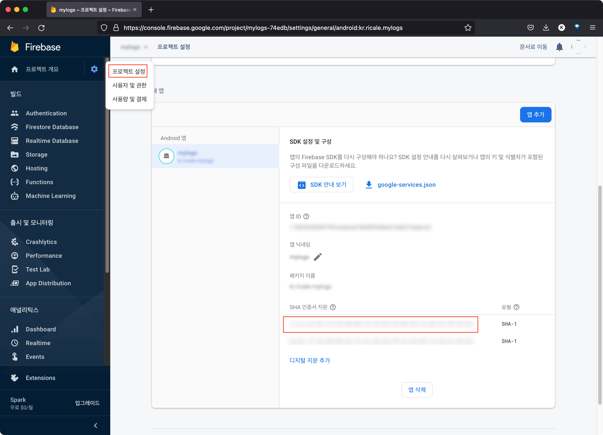
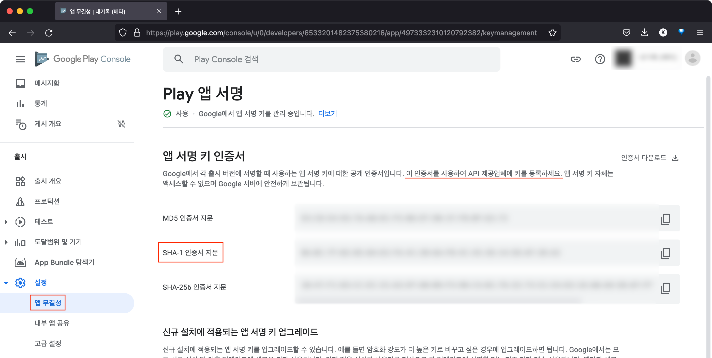

### 발단 및 전개

React Native 를 활용해 토이 프로젝트를 진행하고 있다. Firebase 의 Authentication 기능을 활용해 구글 로그인을 붙였다. 이전에도 써 본 기능이었기 때문에 별다른 어려움은 없었다. 로컬의 개발 환경에서 잘 동작하는 것을 확인하고, 프로덕션 환경으로도 테스트해보았다.

```bash
$ ENVFILE=.env.production react-native run-android --variant=release
```

아무런 문제가 없었다. 그래서 프로덕션 환경으로 빌드를 해서 aab 파일을 구글 플레이 콘솔에 올렸다. 그런데, 로그인이 되지 않는다면서 심사가 반려되었다.

다시 로컬에서 프로덕션 환경으로 실행해봤다. 여전히 잘 되었다. 뭐지? 이번에는 구글 플레이 콘솔에 들어가 내가 올린 파일을 다운로드했다. 어라? 로그인이 되지 않았다.

> Error: DEVELOPER_ERROR

이 에러는 익히 잘 알고 있다. Firebase 콘솔에 내 안드로이드 앱의 SHA-1 키를 등록하지 않았을 때 발생하는 인증 에러다. 하지만 이상하다. 나는 분명히 키를 등록했다.



(분명 키는 등록되어있다.)

뭘 잘못한 것일까? 잘못된 키를 등록한 것일까? Gradle 의 기능을 활용해 다시 키값을 확인해봤다.

```
$ ./gradlew signReport
```

동일한 키값이 나온다. 이번엔 keytool 로 확인해보자.

```
$ keytool -list -v -keystore {keystore_name} -alias {alias_name}
```

마찬가지의 키 값이 나온다.

어떻게 된 거지? 구글링을 해봐도 거의 대부분 키를 등록하지 않았던 사람들의 이야기 뿐이었다.

### 해결

그렇게 몇 시간을 헤메다가 결국 [나와 동일한 현상의 글](https://github.com/react-native-google-signin/google-signin/issues/823#issuecomment-606271524)을 찾을 수 있었다.

> Everything worked swimmingly with debug builds (we generated SHA1 hashes of our local dev keystore) and everything worked great with release APKs that we were installing directly to device (we generated a SHA1 hash of our production key to get this to work). However, when generating an AAB and uploading to the Beta channel and trying this version, we would get the nefarious DEVELOPER_ERROR.
>
> The fix? I went into the PlayStore console and found a tab named "App Signing" under "Release management" There, I found yet another SHA1 which I then put into our Google Console account. After that, everything worked.

간단히 말하자면, .aab 파일로 빌드해서 구글 플레이 콘솔에 올리면 구글 측에서 앱을 한 번더 서명하기 때문에, 플레이 콘솔에서 서명 키 값을 가져와야 한다는 것이었다.

이제야 비밀이 풀렸다. 그래서 로컬에서 프로덕션 환경으로 실행해봤을 때는 잘 되었던 것이다. 구글이 서명을 한 번 더 하기 전이니까.

좋다. 이제 구글 플레이 콘솔에서 키값을 가져오자.



Firebase 콘솔로 돌아가 키값을 입력해보자. 좋다. 이제 에러가 없어졌다.

### 결론

.aab 파일로 빌드한다면, 구글 플레이 콘솔에서 SHA-1 키값을 찾아내서 Firebase 콘솔에 입력해주자.
