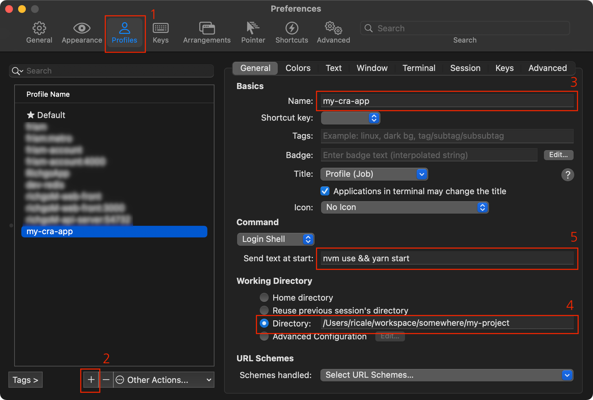

[nvm](https://github.com/nvm-sh/nvm) 은 하나의 컴퓨터에 여러 버전의 [Node.js](https://nodejs.org/en/) 를 설치하고 관리할 수 있게 해주는 툴이다. 한 컴퓨터에 하나 이상의 프로젝트를 진행하고 있을 때, 각각의 프로젝트의 기반 nodejs 버전이 다를 경우 필수적으로 사용해야 한다.

nvm 이 설치되어 있을 때, 프로젝트 별로 어떻게 nodejs 버전을 지정하고 자동으로 버전을 변경할 수 있는지 알아보자.

## 0. `nvm` 설치 및 기본적인 사용 방법

[공식 문서](https://github.com/nvm-sh/nvm/blob/master/README.md)를 참고하시라.

## 1. `.nvmrc`

프로젝트에 nodejs 버전을 기록하기 위해, 프로젝트 최상단에 `.nvmrc` 파일을 만들자. 내용은 아래처럼 넣어주면 된다.

```
v14.17.6
```

## 2. `nvm use`

nodejs 버전을 변경하기 위해서는 `.nvmrc` 파일이 있는 프로젝트 최상위 디렉토리에서 아래 명령어를 실행하면 된다.

```bash
nvm use
# Found '/Users/ricale/workspace/somewehre/my-project/.nvmrc' with version <v14.17.6>
# Now using node v14.17.6 (npm v6.14.15)
```

이제 해당 셸 인스턴스의 nodejs 버전은 `.nvmrc` 에 기록된 `v14.17.6` 으로 변경되었다.

## 3. 자동화

프로젝트를 사용할 때마다 최상위 디렉토리에서 `nvm use`를 사용하는 것은 생각보다 번거롭고 잊어버리기 쉬운 일이다. 그래서 자동으로 nodejs 버전이 변경되도록 할 것이다.

접근법은 두 가지가 있다.

(a) 하나는 iTerm2 등 터미널 앱에서 특정 프로필을 실행할 시 `nvm use` 를 사용하게 하는 방법이고,
(b) 다른 하나는 `package.json` 에 등록된 특정 `scripts` 명령어에서 `nvm use`를 선행하게 하는 방법이다.

### 3.a. 터미널 앱으로 `nvm use` 를 자동으로 사용하게 하는 방법

iTerm2 이외의 다른 터미널 앱은 사용한 적이 없으므로 해당 앱 기준으로 설명한다.



0. 최상단 메뉴의 [iTerm2] - [Preferences...] 선택 후
1. [Profiles] 탭 선택
2. [+] 버튼을 눌러 프로필을 추가
3. 프로필 이름 입력
4. 해당 프로필로 셸 실행 시 시작지점이 될 디렉토리 입력
5. 해당 프로필로 셸 실행 시 자동으로 입력될 명령어. 별도의 스크립트 실행 없이 nodejs 버전만 맞추고 싶다면 `nvm use` 만 입력해도 된다.

### 3.b. `package.json` 에 `scripts` 수정 혹은 추가하는 방법

CRA 로 앱을 생성했을 경우의 `package.json` 파일을 기준으로 설명한다. 당연히 CRA 를 사용하지 않았더라도 적용 가능하다.

기본적으로 `sciprts` 의 `start` 항목은 아래처럼 설정되어 있을 것이다.

```js
// package.json
{
  // ...
  "scripts": {
    "start": "node scripts/start.js",
  }
  // ...
}
```

위 스크립트를 아래처럼 수정하면 된다.

```js
{
  // ...
  "scripts": {
    // 오답
    "start": "nvm use && cross-env PORT=4000 node scripts/start.js",
    // 정답
    "start": "source ~/.nvm/nvm.sh && nvm use && cross-env PORT=4000 node scripts/start.js",
  }
  // ...
}
```

오답과 정답의 차이는 `source ~/.nvm/nvm.sh` 로 시작하는지 여부다. 해당 구문이 없으면 정상적으로 동작하지 않는다.

이유는 `start` 명령어 자체가 별개의 셸 인스턴스라서 nvm 사용 전에 nvm 초기화가 필요하기 때문이다. ([출처](https://stackoverflow.com/a/34321623))

## 4. 마무리

nvm 사용자라면 프로젝트 별로 nodejs 버전을 설정해서 불필요한 버그를 줄여보자.

nvm 사용자가 아니라면 nvm 을 사용해보자. 좋다.

## 5. 참고

- [How to Change Node.js Version Between Projects Using NVM](https://betterprogramming.pub/how-to-change-node-js-version-between-projects-using-nvm-3ad2416bda7e)
- [Is there a way to run "nvm use" automatically in a prestart npm script?](https://stackoverflow.com/a/34321623)
