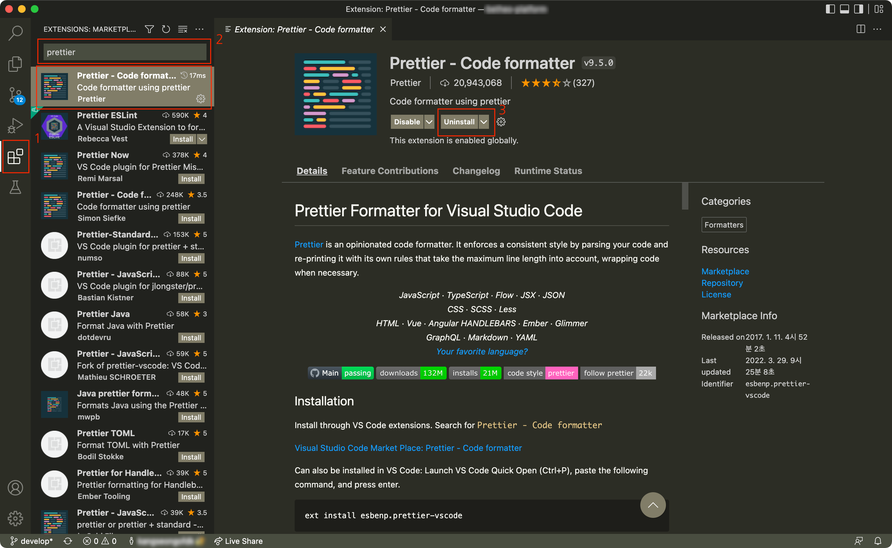
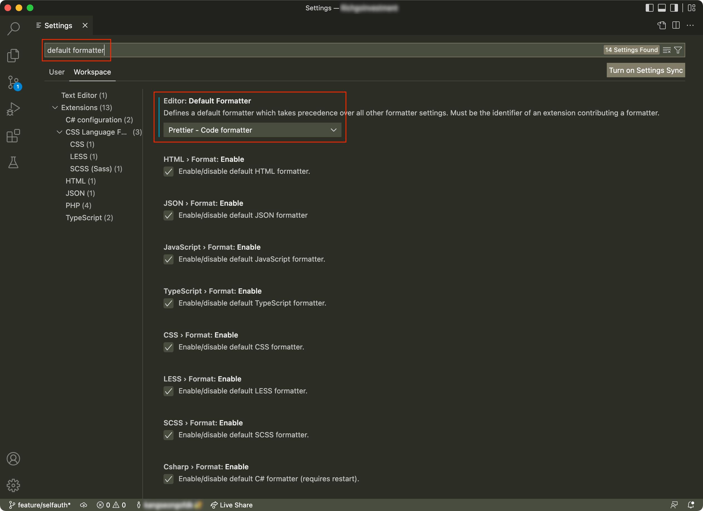
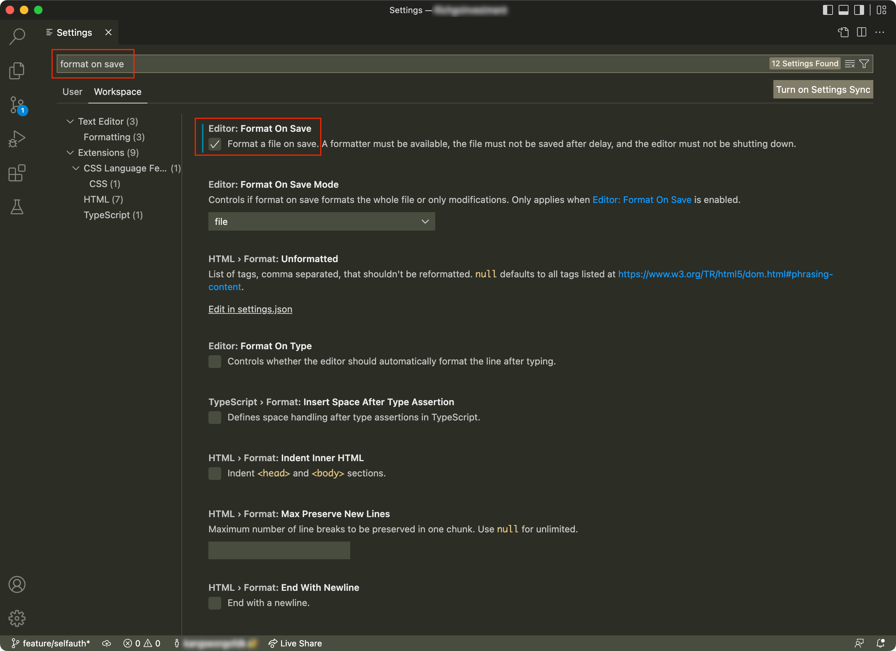

원래는 [Prettier](https://prettier.io/) 를 사용하지 않는다. 이유는 그들이 **독선적인 코드 포맷터(Opinionated Code Formatter)** 를 표방하기 때문이다.

설정 옵션을 최소화해서 스타일을 강제하고, 그럼으로써 (정답이 없는) 코드 스타일 논쟁을 원천 봉쇄한다, 불필요한 논쟁이 없기 때문에 생산성이 향상된다, 이것이 그들의 철학이다.

나는 그 철학 자체는 동의하지만, 스타일은 동의할 수 없었다. 내가 타협할 수 없는 스타일이 있었으니, 그것은 아래 두 가지였다.

1. 함수 컴포넌트 선언부의 props 가 한 줄에 하나의 항목만 표시

   ```typescript
   // 내 스타일
   function SomeComp({ value, onChange }: SomeCompProps) {
     // ...
   }
   // Prettier 의 스타일
   function SomeComp({ value, onChange }: SomeCompProps) {
     // ...
   }
   ```

2. JSX 구문에서, 컴포넌트의 props 가 한 줄에 하나의 항목만 표시

   ```tsx
   // 내 스타일
   <SomeComp
     value={someValue}
     onChange={handleChange}
   />
   // Prettier 의 스타일
   <SomeComp value={someValue} onChange={handleChange} />
   ```

둘 중 하나만 되더라도 타협할 수 있었겠지만 Prettier 는 둘 다 되지 않았다. 오로지 글자수로만, `printWidth` 라는 옵션에 의해서만 props 를 한 줄에 모두 표시할지, 한 줄에 하나씩 표시할지를 판단했다.

그래서 마음에 들지 않아 쓰지 않고 있었다.

## 1. Single Attribute Per Line 옵션

그런데 드디어 22년 4월에 공개된 2.6.0 버전부터 "JSX 구문에서, 컴포넌트의 props 가 한 줄에 하나의 항목만 표시"하는 기능을 지원하기 시작했다. 그것이 이 [`singleAttributePerLine`](https://prettier.io/docs/en/options.html#single-attribute-per-line) 옵션이다.

얼마 전 우연히 옵션을 확인하고 나서야, 드디어 Prettier 와 타협할 마음이 생겼다. 자, 타협을 하였으니 적용해보자.

## 2. Prettier 2.6 설치

위에서 언급한 `singleAttributePerLine` 옵션을 사용하기 위해서는 2.6.0 이상의 버전을 설치해야 한다.

### 2.1. Prettier 새로 설치

Prettier 가 설치되어있지 않은 프로젝트는 아래 명령어로 설치해주면 된다.

```
yarn add --dev prettier
```

### 2.2. Prettier 버전 업그레이드

Prettier 가 설치되어있다면 버전을 올려줘야 한다.

Prettier 를 직접 설치해 사용하고 있었다면 아래 명령어를 실행해주면 된다.

```
yarn upgrade prettier@^2.6.2
```

#### 2.2.1. Prettier 가 설치한 다른 라이브러리의 디펜던시로 포함되어 있었다면

[@react-native-community/eslint-config](https://www.npmjs.com/package/@react-native-community/eslint-config) 처럼 Prettier 를 디펜던시로 포함하고 있는 라이브러리를 사용하고 있다면 Prettier 를 직접 설치한 적이 없더라도 설치되어 있을 것이다.

설치가 되어있는지 확실히 알아보려면 yarn.lock 파일에서 `prettier@` 로 검색해보자. 설치되어 있다면 아래와 같은 구문을 찾을 수 있다.

```
prettier@^2.0.2:
  version "2.5.1"
  resolved "https://registry.yarnpkg.com/prettier/-/prettier-2.5.1.tgz#fff75fa9d519c54cf0fce328c1017d94546bc56a"
  integrity sha512-vBZcPRUR5MZJwoyi3ZoyQlc1rXeEck8KgeC9AwwOn+exuxLxq5toTRDTSaVrXHxelDMHy9zlicw8u66yxoSUFg==
```

만약 `version` 부분이 2.6.0 이상이면 제대로 설치되어 있는 것이므로 업그레이드를 할 필요가 없다. 그 이전 버전이라면, 버전을 올려줘야 한다.

어떻게 업그레이드 할까? `yarn upgrade prettier@^2.6.2` 로 해주면 될까? 해당 명령어를 실행하면 package.json 파일에는 prettier 가 추가되고

```js
// package.json
{
  "prettier": "^2.6.2"
}
```

yarn.lock 파일은 아래처럼 바뀐다.

```
prettier@^2.0.2:
  version "2.5.1"
  resolved "https://registry.yarnpkg.com/prettier/-/prettier-2.5.1.tgz#fff75fa9d519c54cf0fce328c1017d94546bc56a"
  integrity sha512-vBZcPRUR5MZJwoyi3ZoyQlc1rXeEck8KgeC9AwwOn+exuxLxq5toTRDTSaVrXHxelDMHy9zlicw8u66yxoSUFg==

prettier@^2.6.2:
  version "2.6.2"
  resolved "https://registry.yarnpkg.com/prettier/-/prettier-2.6.2.tgz#e26d71a18a74c3d0f0597f55f01fb6c06c206032"
  integrity sha512-PkUpF+qoXTqhOeWL9fu7As8LXsIUZ1WYaJiY/a7McAQzxjk82OF0tibkFXVCDImZtWxbvojFjerkiLb0/q8mew==
```

이 상태로 Prettier 를 실행했을 때 2.6 버전이 잘 적용된다면 다음 항목으로 넘어가면 된다.

하지만 내 경우에는 위처럼 해도 2.5.1 버전이 적용되고 2.6 버전의 기능이 적용되지 않았다. node_modules 디렉토리를 다 지우고 다시 설치해도 해결되지 않았다. (이유는 불명)

결국 내가 선택한 방법은 yarn.lock 에서 2.5.1 버전을 제거하는 것이었다.

직접 새로 설치 혹은 업그레이드한 Prettier 는 지우고 (`yarn remove prettier`) yarn.lock 을 아래처럼 직접 편집했다.

```
prettier@^2.0.2:
  version "2.6.2"
  resolved "https://registry.yarnpkg.com/prettier/-/prettier-2.6.2.tgz#e26d71a18a74c3d0f0597f55f01fb6c06c206032"
  integrity sha512-PkUpF+qoXTqhOeWL9fu7As8LXsIUZ1WYaJiY/a7McAQzxjk82OF0tibkFXVCDImZtWxbvojFjerkiLb0/q8mew==
```

수정한 뒤 다시 `yarn` 을 실행한 후 Prettier 를 실행하니 2.6.2 버전이 잘 적용되었다.

## 3. 옵션 설정

`singleAttributePerLine` 이외에도 Prettier 는 20여가지의 옵션을 제공한다. [공식 문서](https://prettier.io/docs/en/options.html)에 잘 설명되어있기 때문에 여기서 부언하지는 않겠다.

옵션은 프로젝트의 최상단 디렉토리의 `.prettierrc.js` 파일에 작성하면 된다.

```js
// .prettierrc.js
module.exports = {
  printWidth: 95,
  singleQuote: true,
  arrowParens: "avoid",
  singleAttributePerLine: true,
};
```

js 파일로 작성하고 싶지 않다면 JSON, YAML 등 다른 형식으로도 가능하다. 자세한 방법은 [공식 문서](https://prettier.io/docs/en/configuration.html)를 참고하시라.

## 4. 자동화

이런 툴은 자동화가 필수다. 필요할 때마다 직접 실행한다면 생각보다 번거롭고 까먹기도 쉽기 때문이다.

자동화를 하는 방법에는 두 가지가 있다. 하나는 git 의 pre-commit 훅을 이용하는 것이고, 다른 하나는 에디터의 기능을 이용하는 것이다.

### 4.1. pre-commit 훅을 사용해 자동화

pre-commit 훅은 커밋 명령어 실행 시 커밋 직전에 실행되는 스크립트다.

pre-commit 훅을 사용해 자동화하는 방법은 일전에 작성한 [ESLint 적용 및 자동화](https://velog.io/@ricale/ESLint-%EC%A0%81%EC%9A%A9-%EB%B0%8F-%EC%9E%90%EB%8F%99%ED%99%94#2-%EC%9E%90%EB%8F%99%ED%99%94) 글에서 확인할 수 있다.

Prettier 를 ESLint 플러그인으로 사용하고 있는 경우에는 해당 글과 똑같이 하면 된다. 만약 단독으로 사용하고 있다고 해도 방법이 크게 다르지 않으니 해당 글을 참고하시라.

### 4.2. 에디터 기능을 사용해 자동화

에디터를 사용해 소스코드를 저장할 때마다 Prettier 를 적용할 수도 있다. 개인적으로 Prettier 는 pre-commit 훅을 사용하는 것보다는 이 방식을 선호한다. 왜냐하면 ESLint 는 ESLint 가 자동으로 고칠 수 없는 에러들이 존재하지만, Prettier 는 그렇지 않기 때문이다.

현재 VSCode 를 사용하고 있기 때문에 VSCode 를 기준으로 방법을 설명하겠다.

#### 4.2.1. 먼저 [Prettier - Code formatter](https://marketplace.visualstudio.com/items?itemName=esbenp.prettier-vscode) 익스텐션을 설치해준다.



#### 4.2.2. 그리고 설정에서 Default formatter 를 방금 설치한 익스텐션으로 설정해준다.



#### 4.2.3. 마지막으로 Format on save 설정을 켜준다.



이 설정까지 완료하면 js/ts 파일을 저장할 때마다 Prettier 가 자동으로 적용된다.

## 5. 플러그인: prettierX

Prettier 의 지나치게 적은 옵션이 불만이라면 [prettierX](https://github.com/brodybits/prettierx) 를 고려하는 것도 좋은 선택이 될 수 있다.

이 라이브러리는 Prettier 의 fork 프로젝트로 Prettier 보다 더 많은 옵션을 제공한다. 단독으로 쓸 수도 있고 Prettier 의 플러그인 형태로도 쓸 수 있다.

(개인적으로는 딱히 필요한 옵션이 없어서 쓰지 않고 있다.)

## 참고

- [Prettier 공식 문서](https://prettier.io/docs/en/index.html)
- [ESLint 적용 및 자동화](https://velog.io/@ricale/ESLint-%EC%A0%81%EC%9A%A9-%EB%B0%8F-%EC%9E%90%EB%8F%99%ED%99%94)
