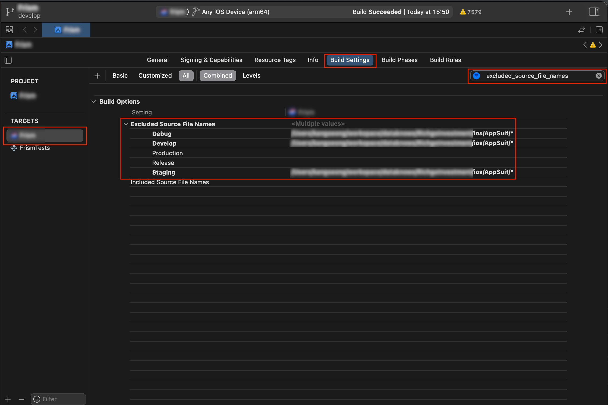

Mac OS 를 쓰면서 마주한 React Native 빌드 에러에 대해 정리한다.

M1 프로세서를 사용 중인데 이것이 원인 중 하나인지는 명확하지 않다.

## iOS

### 1. Undefined symbol: \_OBJC_CLASS\_$_StockNewsdmManager

앱 보안 및 무결성을 위해, 외부 보안 솔루션을 사용한다. 해당 솔루션을 프로덕션 환경에만 적용해놨는데, 개발 환경 컴파일 때 해당 솔루션의 파일이 포함되면서 발생된 에러다.

컴파일에 포함되면 안 되는 파일은 Build Settings 에서 `excluded_source_file_names` 항목에 추가해주면 된다. 환경별로 따로 설정도 가능하다.



### 2. mach-o file, but is an incompatible architecture (have 'x86_64', need 'arm64e')

[@react-native-seoul/kakao-login](https://github.com/react-native-seoul/react-native-kakao-login) 를 사용해 카카오 로그인 연동 시 발생한 에러다. 상세 내용은 아래와 같다.

> [!] CocoaPods could not find compatible versions for pod "KakaoSDKUser":
>
> In Podfile:  
> kakao-login (from `../node_modules/@react-native-seoul/kakao-login`) was resolved to 4.0.0, which depends on  
> KakaoSDKUser (~> 2.9.0)
>
> None of your spec sources contain a spec satisfying the dependency: `KakaoSDKUser (~> 2.9.0)`.
>
> You have either:
>
> - out-of-date source repos which you can update with `pod repo update` or with `pod install --repo-update`.
> - mistyped the name or version.
> - not added the source repo that hosts the Podspec to your Podfile.

에러 내용을 자세히 안 봐서 좀 해멨는데 결국 repo update 를 해주면 될 일이었다.

```sh
pod install --repo-update
```

앗 그래도 에러가 나네?

> LoadError - dlopen(/Library/Ruby/Gems/2.6.0/gems/ffi-1.15.5/lib/ffi_c.bundle, 0x0009): tried: '/Library/Ruby/Gems/2.6.0/gems/ffi-1.15.5/lib/ffi_c.bundle' (mach-o file, but is an incompatible architecture (have 'x86_64', need 'arm64e')), '/usr/lib/ffi_c.bundle' (no such file) - /Library/Ruby/Gems/2.6.0/gems/ffi-1.15.5/lib/ffi_c.bundle

그럼 아래처럼 해주면 되겠다. (아마도 M1 프로세서 한정)

```sh
arch -x86_64 pod install --repo-update
```

## 안드로이드

### 1. Error: Unexpected token name «\_890_340», expected punc «,»

자바스크립트는 긴 숫자의 가독성을 위해 [1_890_340 같은 형식의 문법을 제공](https://v8.dev/features/numeric-separators)한다. 그런데 이게 RN 안드로이드 환경에서는 에러를 발생시킨다.

"\_"를 지우니 에러가 발생하지 않았다. 내 더미 데이터의 가독성은 떨어졌지만 어차피 더미 데이터니까, 빨리 프로젝트에서 삭제할 날이 오기를 기도하기로 하자.
