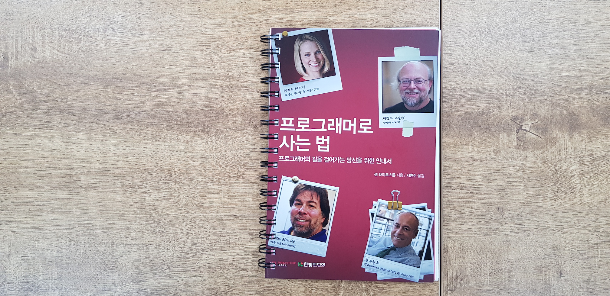

\#

책 "프로그래머로 사는 법"은 좋은 프로그래머가 되려면 어떻게 해야 할까? 에 대한 책이다. 학생, 취준생 시절부터 신입, 리더, 거물, 선지자, 대표 까지 프로그래머로서 거칠 수 있는 모든 단계에 대해 이야기한다. 한 책에서 말하기에는 너무나도 많은 이야기이다 보니 깊이를 기대하기는 어렵지만, 맥락을 얻기에는 나쁘지 않다.

저자는 미국 대기업 (IBM) 에서 디렉터까지 역임한 사람이다. 스타트업 같은 작은 기업에 다닌 경력은 거의 없는 것 같아 보이는데, 왜냐면 이 책이 어느 정도 규모 있는 회사의 프로그래머 관점에서만 쓰였기 때문이다. 따라서 (나처럼) 대기업에 다녀보지 못한 사람은 와닿지 않을 내용들이 꽤 많다. 게다가 "10년 전" "미국" 대기업이기 때문에, 우리나라 대기업과는 또 다르지 않을까 하는 느낌도 받았다.

\#

한편 이 책에는 소프트웨어 업계의 유명인사 (제임스 고슬링, 리누스 토발스, 스티브 워즈니악 등) 17명의 인터뷰도 담고 있다. 이 일을 어떻게 시작하게 되었는지, 성공의 비결이 무엇인지, 시간 관리는 어떻게 하는지, 10~15년 뒤의 미래에는 업계가 어떤 식으로 흘러갈 것 같은지, 새로 커리어를 시작하는 프로그래머에게 해주고 싶은 조언은 무엇인지 등을 묻는다.

흥미로운 내용이 많은 인터뷰들이지만 제일 인상적인 것은 모든 인터뷰이들이 한결같이 말하는 것이 있다는 것이다. "하고 싶은 일, 즐거운 일을 해라." 일이 많고 고된 업계인 만큼 그렇지 않으면 견뎌내기 힘들다는 것이다. 인터뷰이 대부분은 출세하겠다는 목표가 있었다기 보다는 자신이 하고 싶은 일 즐거운 일을 하다 보니 보상이 따라왔다고 말한다.

\#

이외에도 기억에 남는 이야기가 몇 개 있다.

인적 네트워크의 중요성을 대단히 강조한다. 아무리 대단한 사람이라도 혼자서는 한계가 있기 때문이다.

또 업무 시간과 사적인 시간을 확실히 분리하라고도 말한다. 휴식과 영감을 얻기 위해, 그리고 가족들과의 시간을 보내기 위해서다.

그리고 승진을 위한 구체적인 목표를 잡으라는 것도 신기했다. 승진을 목표로 하는 것이 이기적이거나 나쁜 것이 아니므로, 상사에게도 적극적으로 의견을 물으라고 말한다. 개인적으로는 승진을 목표로 해 본 적이 없으므로, 주변에서도 그다지 접한 적이 없으므로 (나의 인적 네트워크는 좁다..) 색다른 의견으로 다가왔다.

\#

어떻게 보면 뻔한 내용들이라고 할 수도 있다. 하지만 뻔한 내용일지라도 정리된 문장으로 접하는 것은 의미가 있다. 비판적으로 수용하면서 내 생각을 정리할 수 있기 때문이다. 그런 의미에서 좋은 책이다.
