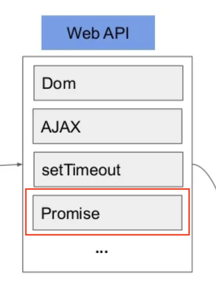

## 1. 프로미스는 Web API 인가?

[자바스크립트는 정말 싱글 스레드인가?](https://ricale.kr/blog/posts/220926-is-javascript-single-threaded/) 글을 작성하다가 이상한 이미지를 발견했다.



프로미스가 Web API 에 포함되어 있는 그림이었다. 다른 어떤 글에서도 프로미스가 Web API 에 속해있다는 내용을 본 적이 없었다. 그런데 그렇지 않다는 확신도 없었으므로, 이참에 확실히 하기 위해 찾아보았다.

결론은 프로미스는 [자바스크립트의 표준 API](https://velog.velcdn.com/images/ricale/post/39354cb5-e62f-4ac4-b6ec-e094acfeae62/image.png)라는 것이다. Web API 는 웹브라우저와 소통하기 위한 프로그래밍 인터페이스이므로, _프로미스는 Web API 에 속하지 않는다_.

## 2. 마이크로태스크큐?

프로미스는 Web API 와 비슷하게 실행된다. 본문의 실행이 완료되면 완료 콜백을 [메시지큐*MessageQueue*](https://developer.mozilla.org/en-US/docs/Web/JavaScript/EventLoop#queue)에 밀어넣는 방식이다. 다만 Web API 와 다른 점은 프로미스가 사용하는 메시지큐가 우리가 일반적으로 알고 있는 메시지큐가 아니라, 마이크로태스크큐*MicrotaskQueue*라는 별도의 큐라는 점이다.

- 메시지큐 (= 매크로태스크큐*MacrotasksQueue*): Web API 가 사용
- 마이크로태스크큐: 자바스크립트가 프로미스 등을 위해 사용

마이크로태스크큐는 메시지큐보다 높은 우선순위를 갖고 있다. 콜스택이 비었을 때 마이크로태스크큐와 메시지큐가 모두 태스크를 갖고 있다면 자바스크립트는 마이크로태스크큐에 있는 태스크를 먼저 가져가 실행한다.

## 3. `'unhandledrejection'` 이벤트

프로미스에서 에러 핸들링을 하지 않았다면? (`.then()` 만 쓰고 `.catch()` 를 하지 않았다면? `await` 을 `try`/`catch` 로 감싸지 않았다면?) 앱이 죽을 가능성이 높다. 웹브라우저에서는 이런 핸들링되지 않은 프로미스를 위한 전역 에러 이벤트를 제공한다. 그것이 `unhandledrejection` 이벤트다.

```js
window.addEventListener("unhandledrejection", function (event) {
  console.log(event.promise);
  console.log(event.reason);
});

new Promise(function () {
  throw new Error("TestError");
});
```

([HTML 표준 스펙](https://html.spec.whatwg.org/multipage/webappapis.html#unhandled-promise-rejections)에 포함되므로, 어느 브라우저에서든 쓸 수 있다.)

## 4. References

- mdn web docs - [Promise](https://developer.mozilla.org/en-US/docs/Web/JavaScript/Reference/Global_Objects/Promise)
- mdn web docs - [Web APIs](https://developer.mozilla.org/en-US/docs/Web/API)
- [Microtasks](https://javascript.info/microtask-queue)
- [Error handling with promises](https://javascript.info/promise-error-handling)
- [자바스크립트는 어떻게 약속을 지킬까?](https://ui.toast.com/posts/ko_20220725)
