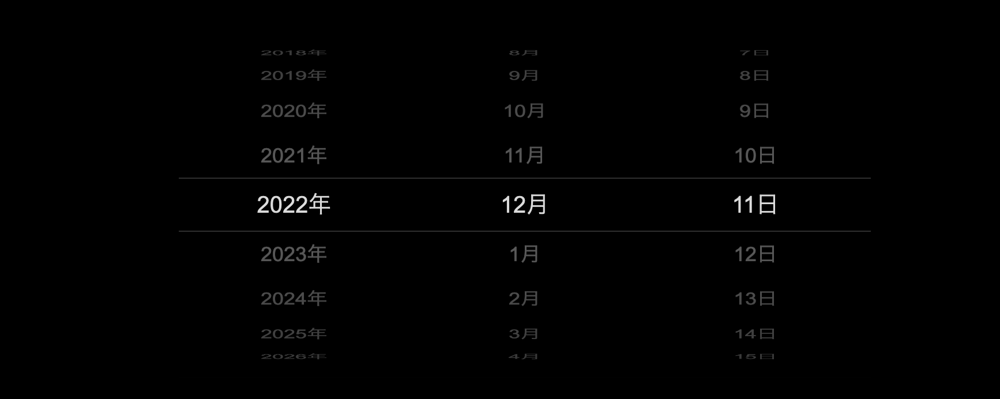
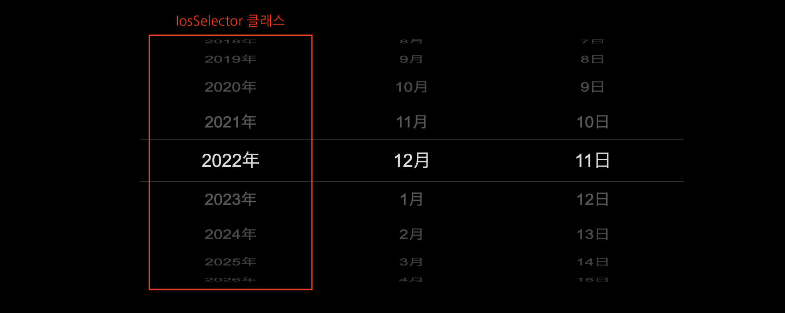
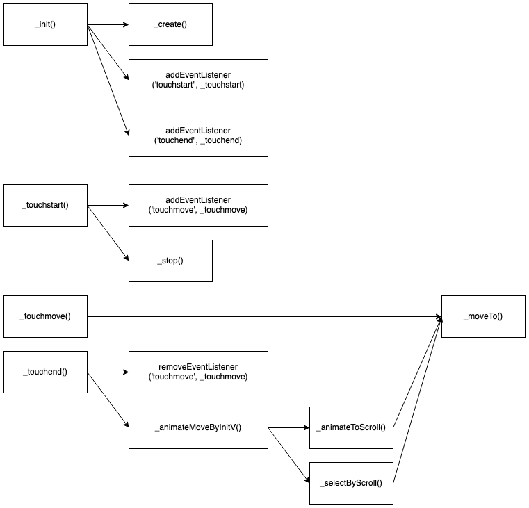

## 1. 발단

회사의 React 기반 웹앱 프로젝트에서, iOS 스타일의 Date Picker UI 를 사용해야 하는 일이 생겼다. 직접 구현하기에는 기능에 비해 주어진 시간이 많지 않았으므로 오픈소스 라이브러리를 찾아 설치하려고 했다. 그런데 의외로 원하는 스타일의 Date Picker 를 찾기 어려웠다. iOS 스타일의 스크롤되는 형식보다는 안드로이드 스타일의 달력 형식이 주류였다.

어찌저찌 찾기는 찾았다. 다만 라이브러리는 아니고 [Gist 에 올라와있는](https://gist.github.com/wjpeters/876a8fe4040a2bb4b4eb28d2270620a5), 순수 자바스크립트로 작성된 코드 조각이었다. (아래 이미지는 CodePen 에 올라와있는 해당 코드 조각 [실행 예제](https://codepen.io/gnauhca/pen/JrdpZZ)다.)



일단 확인해 본 예제가 마음에 들었기 때문에, 회사 프로젝트에서는 스타일을 좀 수정하고 React 컴포넌트로 래핑만 해서 사용했다. 잘 적용하고 돌아보니 이 코드를 React 컴포넌트로 만들어서 패키지로 만들고 싶은 욕심이 생겼다. (라이센스를 확인해보니 다행히 자유로운 사용이 가능했다.)

그래서 **_iOS 스타일의 Date Picker UI 를 라이브러리로 구현_**해보기로 하겠다. 물론 그 이전에 기존 코드에 대한 이해를 먼저 해야겠다.

## 2. 기존 코드 리뷰

기존 코드는 `IosSelector` 라는 클래스를 중심으로 이루어져있다.



해당 클래스만 450라인이 조금 넘는 정도고, 초기화를 돕는 나머지 유틸 함수들이 100라인 미만으로 존재한다.

(아래 이미지는 `IosSelector` 클래스 내부 메서드들의 콜 다이어그램이다.)



클래스 내에서 눈여겨볼만한 로직은 아래 세 가지 정도가 있다.

1. 엘리먼트 생성 및 이벤트 처리
2. 터치 이벤트 처리
3. 월별 일수가 다른 것 처리

하나씩 천천히 살펴보자.

### 2.1. 엘리먼트 생성 및 이벤트 처리

엘리먼트는 DOM 에 직접 접근해서 `innerHTML` 을 사용해 생성한다.

```js
this.elems.el.innerHTML = template
  .replace("{{circleListHTML}}", circleListHTML)
  .replace("{{highListHTML}}", highListHTML);
```

여기서 `template` 은 그냥 엘리먼트를 문자열로 하드코딩한 값이다.

```js
let template = `
  <div class="select-wrap">
    <ul class="select-options" style="transform: translate3d(0, 0, ${-this
      .radius}px) rotateX(0deg);">
      {{circleListHTML}}
    </ul>
    <div class="highlight">
      <ul class="highlight-list">
        {{highListHTML}}
      </ul>
    </div>
  </div>
`;
```

`circleListHTML`은 사용자가 스크롤하면 돌아갈 아이템들이다. 여기서 스크롤은 실제로 엘리먼트들이 스크롤되는 것이 아니라 `transfrom: rotateX translate3d()`를 활용한 애니메이션이다.

```js
for (let i = 0; i < source.length; i++) {
  circleListHTML += `<li class="select-option"
    style="
      top: ${this.itemHeight * -0.5}px;
      height: ${this.itemHeight}px;
      line-height: ${this.itemHeight}px;
      transform: rotateX(${-this.itemAngle * i}deg) translate3d(0, 0, ${
    this.radius
  }px);
    "
    data-index="${i}"
    >${source[i].text}</li>`;
}
```

이 `transform` 은 추후에 애니메이션이 필요할 때마다 아래처럼 값이 변경된다.

```js
this.elems.circleList.style.transform =
  `translate3d(0, 0, ${-this.radius}px) ` +
  `rotateX(${this.itemAngle * scroll}deg)`;
```

`highListHTML`은 `circleListHTML`과 거의 동일하다. 다만 선택된 값을 표시하는 부분만 보이도록 처리되어, 선택된 값을 강조하는 용도로 사용된다.

### 2.2. 터치 이벤트 처리

평소에는 `touchstart`와 `touchend` 이벤트 리스너만 설정되어 있다.

- `touchstart` 이벤트가 발생하면 `touchmove` 리스너를 붙였다가,
  ```js
  this.elems.el.addEventListener("touchmove", this.events.touchmove);
  ```
- `touchend` 이벤트 발생 시 `touchmove` 리스너를 떼어낸다.
  ```js
  this.elems.el.removeEventListener("touchmove", this.events.touchmove);
  ```

#### `touchstart`

- "이벤트 시작 지점 좌표"를 저장해둔다.
- 혹시 애니메이션 중이었다면 중지시킨다.

#### `touchmove`

- `touchstart` 시점에 저장해놓은 "이벤트 시작 지점 좌표"와 "현재 이벤트 발생 지점 좌표"를 비교해 적절한 아이템까지 엘리먼트를 스크롤 시킨다.
- 그리고 `touchend` 에서 사용하기 위해, 이벤트 발생 시점 타임스탬프와 좌표를 따로 저장해둔다. (최대 다섯 개)
  ```js
  let eventY = e.clientY || e.touches[0].clientY;
  touchData.yArr.push([eventY, new Date().getTime()]);
  if (touchData.length > 5) {
    touchData.unshift();
  }
  ```

#### `touchend`

- 마지막 `touchmove` 이벤트 두 건에 대한 정보 (타임스탬프, 좌표)로 반동 스크롤이 어디까지 가야할지 계산한다.

  ```js
  let startTime = touchData.yArr[touchData.yArr.length - 2][1];
  let endTime = touchData.yArr[touchData.yArr.length - 1][1];
  let startY = touchData.yArr[touchData.yArr.length - 2][0];
  let endY = touchData.yArr[touchData.yArr.length - 1][0];

  v = (((startY - endY) / this.itemHeight) * 1000) / (endTime - startTime);
  let sign = v > 0 ? 1 : -1;

  v = Math.abs(v) > 30 ? 30 * sign : v;
  ```

- 애니메이션을 한 번에 적용하는 게 아니라 작게 나눠서 `requestAnimationFrame` 을 반복해서 호출하는 방식으로 적용한다.

  - `touchstart` 이벤트가 치고 들어오면 언제든 `cancelAnimationFrame` 을 써서 중지할 수 있다

  ```js
  return new Promise((resolve, reject) => {
    this.moving = true;
    const tick = () => {
      pass = new Date().getTime() / 1000 - start;

      if (pass < t) {
        this.scroll = this._moveTo(
          initScroll + easing[easingName](pass / t) * totalScrollLen
        );
        this.moveT = requestAnimationFrame(tick);
      } else {
        resolve();
        this._stop();
        this.scroll = this._moveTo(initScroll + totalScrollLen);
      }
    };
    tick();
  });
  ```

### 2.3. 월별 일수가 다른 것 처리

월을 표시하는 `IosSelector` 의 `onChange` 이벤트가 발생할 때마다 해당 년월에 선택하는한 일 범위를 계산해, 일을 표시하는 `IosSelector` 에게 전달한다.

```js
onChange: (selected) => {
  currentMonth = selected.value;

  daySource = getDays(currentYear, currentMonth);
  // `daySelector`: 일을 표시하는 `IosSelector` 인스턴스
  daySelector.updateSource(daySource);
};
```

## 3. 다음

이제 다음으로 해야할 일은 아래와 같다.

- 취향에 맞는 리팩토링
- vite 로 빌드 및 배포 환경 구성
- storybook 으로 데모 페이지 작성 및 배포
- npm 에 패키지 배포

이 글에서 모두 이야기하기에는 글이 길어질 것 같으므로, 나눠서 작성하도록 하겠다.
