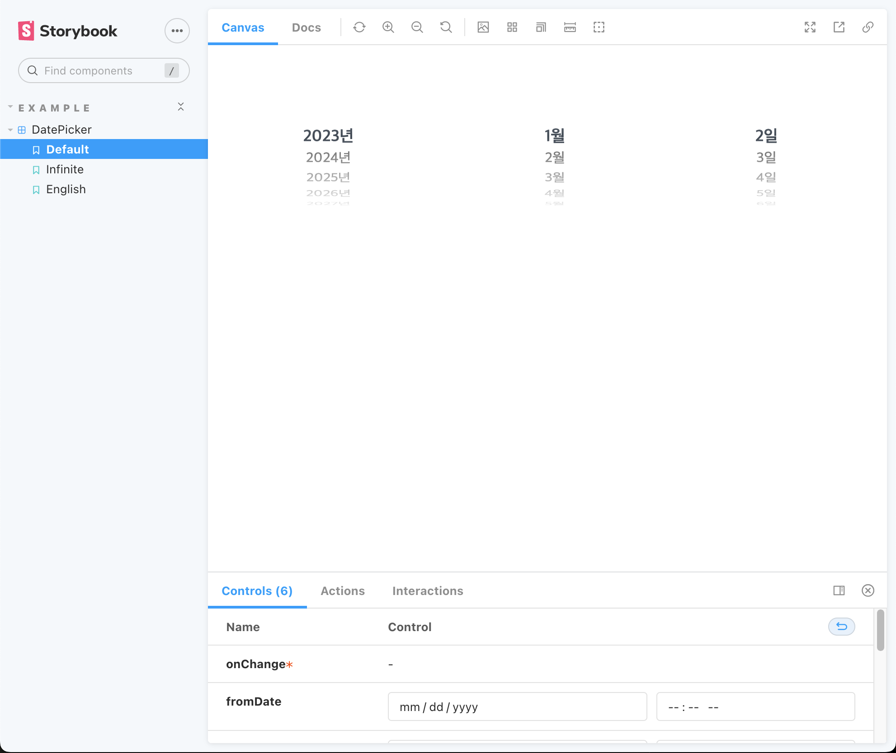
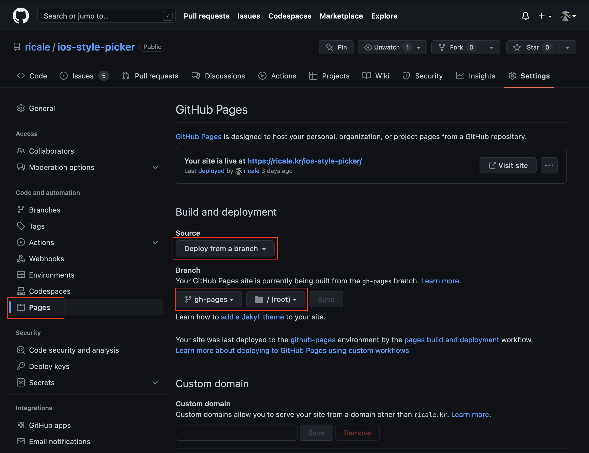
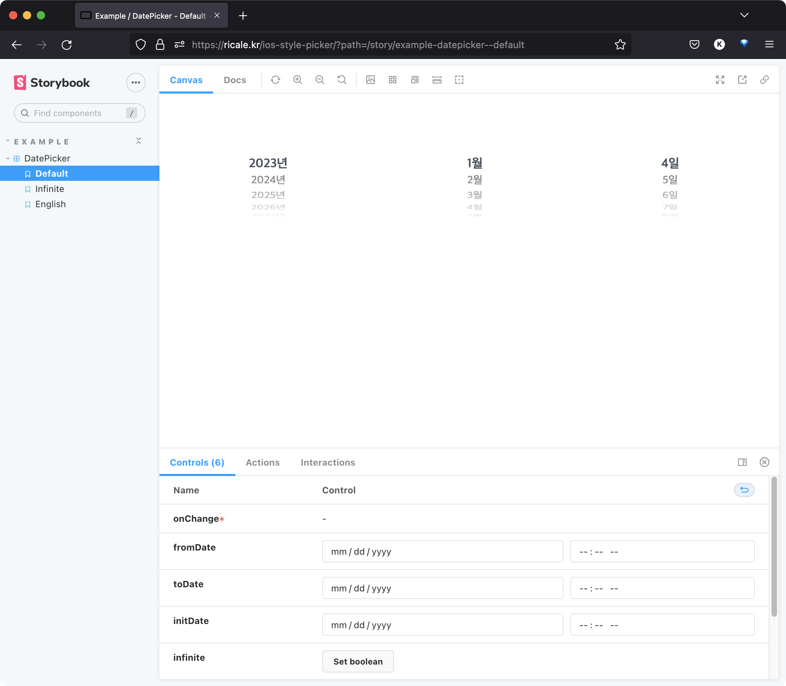

(이전 글들을 읽지 않았더라도 본문을 읽는 데에는 지장이 없다.)

[이전 글들](https://ricale.kr/blog/series/iOS%20%EC%8A%A4%ED%83%80%EC%9D%BC%20Date%20Picker%20%EB%9D%BC%EC%9D%B4%EB%B8%8C%EB%9F%AC%EB%A6%AC%20%EA%B5%AC%ED%98%84/)에서는 TypeScript 와 React 로 _iOS 스타일 Date Picker_ 를 구현했고, 구현한 컴포넌트를 라이브러리로 만들어 NPM 에 배포했다.

이번에는 라이브러리의 데모 페이지를 만들어서 GitHub Pages 에 배포해보자.

# 1. Storybook 적용

데모 페이지는 [Storybook](https://storybook.js.org/docs/react/get-started/introduction) 으로 만든다. Storybook 은 프로젝트 내 UI 컴포넌트들의 예제 페이지를 손쉽게 만들어주는 툴이다.

프로젝트의 루트 디렉토리에서 아래 명령어를 실행하자.

```sh
$ npx storybook init
```

그러면 `package.json` 에 Storybook 을 위한 패키지들과 함께 명령어가 추가된다.

```js
{
  "scripts": {
    // ...
    "storybook": "start-storybook -p 6006",
    "build-storybook": "build-storybook"
  },
  // ...
  "devDependencies": {
    // ...
    // 설치되는 패키지는 개발 환경 (React/Vue/TypeScript 사용 여부) 에 따라
    // 다를 수 있다.
    "@babel/core": "^7.20.7",
    "@storybook/addon-actions": "^6.5.15",
    "@storybook/addon-essentials": "^6.5.15",
    "@storybook/addon-interactions": "^6.5.15",
    "@storybook/addon-links": "^6.5.15",
    "@storybook/builder-vite": "^0.2.6",
    "@storybook/react": "^6.5.15",
    "@storybook/testing-library": "^0.0.13",
    "babel-loader": "^8.3.0",
  }
}
```

## 1.1. 파일 구조

Storybook 실행에 필요한 기본적인 파일들도 프로젝트에 아래처럼 추가된다.

```
ROOT_DIRECTORY
|- .stroybook/
|- src/
   |- stories/
      |- assets/
      |- button.css
      |- Button.stories.tsx
      |- Button.tsx
      |- header.css
      |- Header.stories.tsx
      |- Header.tsx
      |- Introduction.stories.mdx
      |- page.css
      |- Page.stories.tsx
      |- Page.tsx
```

### 1.1.1. `.storybook/`

Storybook 설정 파일들. 일반적인 사용에서는 수정할 필요가 거의 없다.

### 1.1.2. `src/stories/`

Storybook 에서는 UI 컴포넌트의 예제 겸 문서화 페이지를 story 라고 부른다. 이 디렉토리는 story 들이 위치할 디렉토리다.

기본적인 예제는 Storybook 에 의해 자동으로 생성되어 있다. 만약 해당 예제들을 봐도 어떻게 작성해야할지 감이 오지 않는다면 [공식 문서](https://storybook.js.org/docs/react/writing-stories/introduction)를 참고하자.

## 1.2. story 작성

우리의 UI 컴포넌트 (`DatePicker`) 를 위한 story 를 간단히 작성해보자. 기존 예제들은 필요 없으므로 `src/stories/` 디렉토리 내에 있던 기존 파일들은 삭제하고, `DatePicker.stories.tsx` 를 생성한 뒤 아래처럼 작성했다.

```tsx
import { Story } from "@storybook/react";
import DatePicker, { DatePickerProps } from "../components/DatePicker";
import enFormatter from "../formatters/en";

export default {
  title: "Example/DatePicker",
  component: DatePicker,
};

const Template: Story<DatePickerProps> = (args) => <DatePicker {...args} />;

export const Default = Template.bind({});
export const Infinite = Template.bind({});
Infinite.args = {
  infinite: true,
};

// NOTE: 간단한 i18n 구현은 다음 글에서 이어진다.
export const English = Template.bind({});
English.args = {
  formatters: enFormatter,
};
```

## 1.3. 로컬에서 확인

아래 명령어를 실행해 로컬에서 Storybook 서버를 띄워보고

```sh
$ yarn storybook
```

아래 이미지처럼 잘 뜨는지 확인하자.



# 2. GitHub Pages 에 배포

Storybook 으로 간단하게 예제 페이지를 만들었으니 이제 그걸 GitHub Pages 에 배포해보자.

## 2.1. Storybook Deployer

Storybook 은 배포용 패키지도 따로 제공해준다. [@storybook/storybook-deployer](https://www.npmjs.com/package/@storybook/storybook-deployer) 다. (배포 타겟: Github Pages 혹은 AWS S3)

아래 명령어로 패키지를 설치하자.

```sh
$ yarn add --dev @storybook/storybook-deployer
```

그리고 package.json 에 아래 명령어를 추가해주자.

```js
{
  // ...
  "scripts": {
    // ...
    "deploy-storybook": "storybook-to-ghpages"
  }
}
```

추가한 명령어를 터미널에서 실행하면 배포가 진행된다.

```sh
$ yarn deploy-storybook
```

이제 자동으로 gh-pages 브랜치로 GitHub Pages 에 배포된다.

### 2.1.1. 서브도메인에 배포한다면?

만약 배포 도메인이 루트 도메인이라면 (예, https://ricale.github.io) 아무런 설정도 추가할 필요가 없다. 하지만 배포 도메인이 서브 도메인이라면 (예, https://ricale.github.io/ios-style-picker) `.storybok/main.cjs` 에 아래 설정을 추가해주어야 한다.

```js
module.exports = {
  // ...
  async viteFinal(config) {
    config.base = "/ios-style-picker/";
    return config;
  },
};
```

`viteFinal()` 이 정확히 어떤 역할을 하는지는 [공식 문서](https://storybook.js.org/docs/react/builders/vite)를 참고하자.

## 2.2. GitHub Pages 설정

다 끝났다. 이제 GitHub 에서 설정만 확인해주면 된다. 빨간 네모 속 설정들을 스크린샷과 동일하게 해주자.



# 3. 확인

이제 배포한 페이지로 들어가보자. Storybook 대시보드가 잘 뜨는 걸 확인할 수 있다.



# 4. 다음

Storybook 과 GitHub Pages 로 예제 페이지를 간단히 만들어 배포했다. 이제 해야할 일들은 아래와 같다.

- 간단한 i18n 구현
- 몇몇 상황에서 애니메이션을 더 매끄럽게 처리
  - `variant="infinite"` 일 때
  - PC 에서 사용할 때

다음 글에서는 "간단한 i18n 구현"을 다룬다.

# 5. 참고

- [Deploying Storybook in a subdirectory](https://github.com/storybookjs/storybook/discussions/17433?sort=new)
