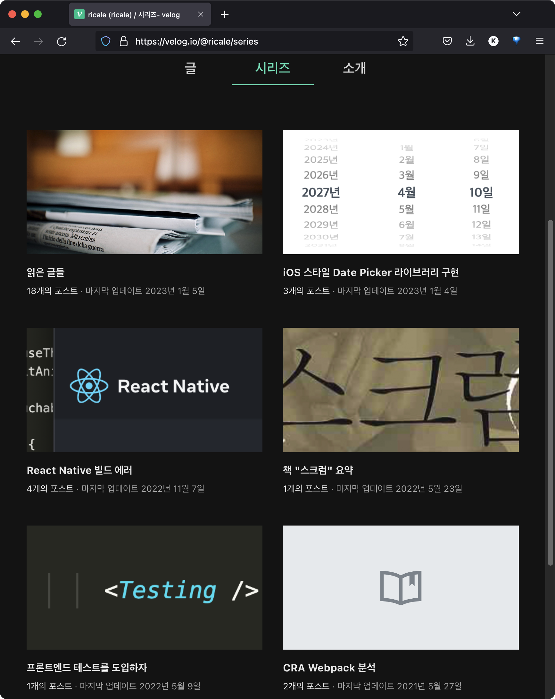
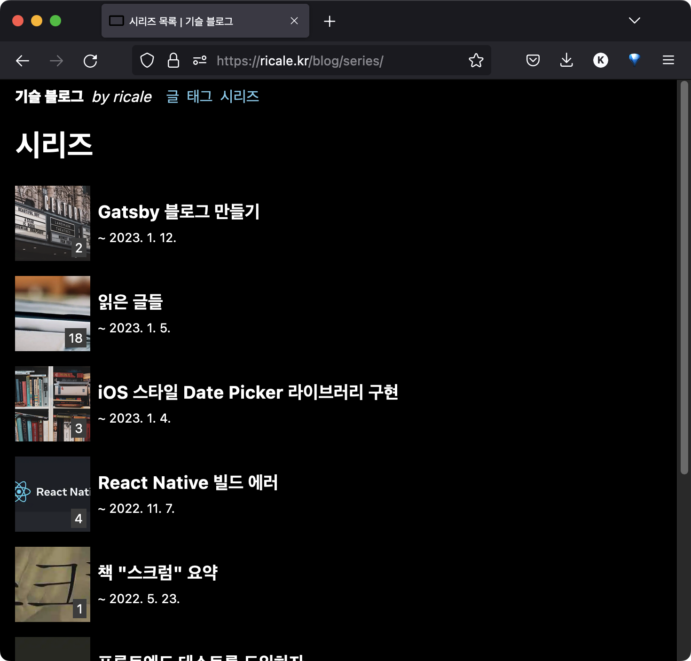
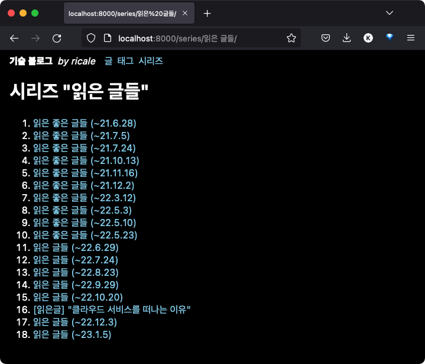
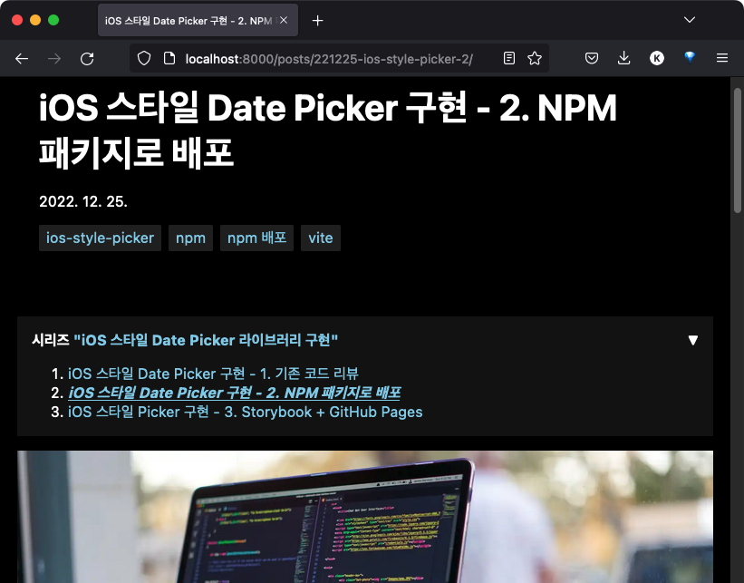

이전 글에서는 Gatsby [기본 기능을 구현을 위한 튜토리얼을 소개했고 태그 기능을 구현](https://ricale.kr/blog/posts/230111-gatsby-1/)했으며, [MDX 글 안에 인라인 이미지와 테이블을 삽입](https://ricale.kr/blog/posts/230112-gatsby-2/)했다.

오늘은 시리즈 기능을 구현해보자.

# 1. 개요

시리즈 기능은 여러 글들을 하나로 묶어주는 기능이다. 카테고리와 유사한 기능이지만, 같은 종류의 글을 묶는 카테고리와 달리 이어지는 글들을 하나로 묶어주는 기능이라고 보면 된다. 이전에 사용하던 블로그 서비스인 velog 에서 해당 기능을 확인할 수 있다.



Gatsby 의 GraphQL 과 mdx, gatsby-node 기능을 사용해 시리즈를 구현해보겠다.

# 2. 구현

구현을 위해 해야 할 일은 아래와 같다.

1. mdx 파일에 시리즈 정보 넣기
2. 시리즈 목록 페이지 구현
3. 시리즈 상세 페이지 구현
4. 글 상세 페이지에 해당 글이 속한 시리즈의 글 목록 추가

## 2.1. mdx `frontmatter` 에 시리즈 필드 추가

mdx 파일에 시리즈를 위한 필드를 추가하자. 이름은 `series` 로 하겠다. 이제 같은 시리즈로 포함시킬 글들은 `series` 필드에 같은 이름을 넣어주면 된다.

```
---
title: # ...
date: # ...
slug: # ...
tags: # ...
series: "Gatsby 블로그 만들기"
---
```

## 2.2. 시리즈 목록 페이지 구현

시리즈 목록을 위한 페이지를 `src/pages/series/index.tsx` 에 만들어보자.

### 2.2.1. 기본 페이지 추가

기본 구현은 [태그 목록을 위한 페이지 구현](https://ricale.kr/blog/posts/230111-gatsby-1/) 방법과 같다.

```tsx
// src/pages/series/index.tsx

import * as React from "react";
import { graphql, Link, PageProps } from "gatsby";
import Layout from "../../components/Layout";
import Seo from "../../components/Seo";

type SeriesPageData = {
  allMdx: {
    group: {
      fieldValue: string;
      totalCount: number;
    }[];
  };
};
const SeriesPage = ({ data }: PageProps<SeriesPageData>) => {
  const series = data.allMdx.group;
  return (
    <Layout>
      <h1>시리즈</h1>
      <ul>
        {series.map((sr) => (
          <li key={sr.fieldValue}>
            <Link to={`/series/${sr.fieldValue}/`}>{`${sr.fieldValue}`}</Link>{" "}
            <small>{sr.totalCount}</small>
          </li>
        ))}
      </ul>
    </Layout>
  );
};

export const query = graphql`
  query {
    allMdx(limit: 2000) {
      group(field: { frontmatter: { series: SELECT } }) {
        fieldValue
        totalCount
      }
    }
  }
`;

export const Head = () => <Seo title="시리즈 목록" />;

export default SeriesPage;
```

이렇게 구현하면 시리즈 목록 페이지가 완성된다.

하지만 완성된 모습이 다소 허전하다. velog 의 시리즈 목록 페이지를 보면 해당 시리즈의 썸네일과 마지막 작성글 날짜까지 보인다. 하지만 우리가 만든 페이지에는 시리즈들의 이름과 글 수만 덩그러니 있을 뿐이다.

우리도 썸네일과 마지막 작성글 날짜를 추가해보자.

### 2.2.2. GraphQL 쿼리 수정

쿼리에 `edges` 를 추가하자. 이렇게 하면 시리즈별로 시리즈에 속한 글들을 (모두) 가져올 수 있다.

```tsx
// src/pages/series/index.tsx

export const query = graphql`
  query {
    allMdx(limit: 2000) {
      group(field: { frontmatter: { series: SELECT } }) {
        fieldValue
        totalCount
        edges {
          node {
            frontmatter {
              title
              originalDate: date
              date(formatString: "YYYY. M. D.")
              heroImageAlt
              heroImage {
                childImageSharp {
                  gatsbyImageData
                }
              }
            }
          }
        }
      }
    }
  }
`;
```

### 2.2.3. 데이터 정렬 및 시리즈별 마지막 글 선택

아쉽게도 GraphQL 쿼리로 해당 시리즈에 속한 글 중 최신글만 골라서 가져올 수는 없다. (정말 불가능한 건지는, GraphQL 을 잘 몰라서 확실치 않다.)

또한 GraphQL 의 group 쿼리에는 정렬을 적용할 수 없다. (이것 또한, GraphQL 의 한계인지 Gatsby 의 한계인지는 잘 모르겠다.)

따라서 가져온 데이터를 코드로 직접 정렬하고, 시리즈별로 마지막 글만을 골라내야 한다.

```tsx
// src/pages/series/index.tsx

const SeriesPage = ({ data }: PageProps<SeriesPageData>) => {
  const series = data.allMdx.group
    .map(({ edges, ...sr }) => ({
      ...sr,
      // 시리즈별로 가장 최신 글만 골라서 `node` 필드에 넣자
      node: edges.sort((a, b) =>
        b.node.frontmatter.originalDate.localeCompare(
          a.node.frontmatter.originalDate
        )
      )[0].node,
    }))
    // 최신 글의 작성일 기준으로 시리즈를 내림차순 정렬하자.
    .sort((a, b) =>
      b.node.frontmatter.originalDate.localeCompare(
        a.node.frontmatter.originalDate
      )
    );
  // ...
```

### 2.2.4. 뷰 업데이트

데이터를 가져왔으니 뷰를 업데이트 해보자.

```tsx
// src/pages/series/index.tsx
import SeriesItem from "../../components/SeriesItem";

// ...

const SeriesPage = ({ data }: PageProps<SeriesPageData>) => {
  // ...

  return (
    <Layout>
      <h1>시리즈</h1>
      <SeriesList>
        {series.map((sr) => (
          // 코드가 길어져서 별도의 컴포넌트로 분리
          <SeriesItem key={sr.fieldValue} {...sr} />
        ))}
      </SeriesList>
    </Layout>
  );
};
```

```tsx
// src/components/SeriesItem.tsx
import { GatsbyImage, getImage } from "gatsby-plugin-image";
import { navigate } from "gatsby";

// ...

function SeriesItem({ fieldValue, totalCount, node }: SeriesItemProps) {
  const { date, heroImage, heroImageAlt } = node.frontmatter;

  const image = heroImage ? getImage(heroImage) : null;

  return (
    // 링크를 연결하고
    <Container onClick={() => navigate(`/series/${fieldValue}`)}>
      <ThumbnailWrapper>
        {/* 썸네일이 있으면 썸네일을 그리고 */}
        {!!image && <ThumbnailImage image={image} alt={heroImageAlt ?? ""} />}
        {/* 시리즈에 포함된 글 수를 표시하고 */}
        <small>{`${totalCount}`}</small>
      </ThumbnailWrapper>
      <Info>
        {/* 시리즈 이름을 보여주고 */}
        <h3>{fieldValue}</h3>
        {/* 마지막 글의 작성일을 표시한다 */}
        <small>{`~ ${date}`}</small>
      </Info>
    </Container>
  );
}

// ...

const ThumbnailImage = styled(GatsbyImage)`
  width: 100%;
  height: 100%;
  object-fit: cover;
`;

// ...
```

그럼 이제 시리즈 목록 페이지는 완성이다. 아래처럼 보일 것이다.



### 2.2.5. 상세 코드

위 코드 조각들은 생략된 부분이 있으므로, 코드 전문을 보고 싶다면 아래를 참고하자.

- [src/pages/series/index.tsx](https://github.com/ricale/blog/blob/0106af9fd1f92b86c0f1b486a0b687e538dbc282/src/pages/series/index.tsx)
- [src/components/SeriesItem.tsx](https://github.com/ricale/blog/blob/0106af9fd1f92b86c0f1b486a0b687e538dbc282/src/components/SeriesItem.tsx)

## 2.3. 시리즈 상세 페이지 구현

시리즈 상세 페이지도 구현해보자.

(이건 이전에 작성했던 [Gatsby 블로그 만들기 1 - 기본 구현 및 태그 기능 구현](https://ricale.kr/blog/posts/230111-gatsby-1/) 글에서 태그의 상세 페이지를 만드는 방법과 동일하다.)

빌드 타임에 현재 존재하는 모든 시리즈 이름을 GraphQL 로 가져와서, 시리즈 별로 상세 페이지를 만들어 줄 것이다. 상세 페이지에는 해당 시리즈에 속한 글들이 작성일자 순으로 정렬되어 보일 것이다.

이것을 위해 페이지를 만들 때 쓰일 템플릿을 만들고, 빌드 타임에 실행될 스크립트를 작성하자.

### 2.3.1. 탬플릿 작성

```tsx
// src/templates/SeriesDetailPageTemplates.ts
import * as React from "react";
import { graphql, Link, PageProps } from "gatsby";
import Layout from "../components/Layout";

type SeriesDetailPageTemplateData = {
  // ...
};
type SeriesDetailPageTemplateContext = {
  series: string;
};
const SeriesDetailPageTemplate = ({
  // `pageContext` 에는 gatsby-node.ts 의 createPages 에서 넘겨주는 값들이 들어있다.
  pageContext,
  // `data` 에는 아래 쪽에 있는 pageQuery 쿼리의 결과값이 들어있다.
  data,
}: PageProps<
  SeriesDetailPageTemplateData,
  SeriesDetailPageTemplateContext
>) => {
  const { series } = pageContext;
  const { totalCount, edges } = data.allMdx;

  return (
    <Layout>
      <h1>{`시리즈 "${series}"`}</h1>
      <ol>
        {edges.map(({ node: { frontmatter } }) => (
          <li key={frontmatter.slug}>
            <Link to={`/posts/${frontmatter.slug}`}>{frontmatter.title}</Link>
          </li>
        ))}
      </ol>
    </Layout>
  );
};

// $series 는 gatsby-node.ts 의 createPages 로부터 넘겨받는다.
export const pageQuery = graphql`
  query ($series: String) {
    allMdx(
      limit: 2000
      sort: { frontmatter: { date: ASC } }
      filter: { frontmatter: { series: { in: [$series] } } }
    ) {
      totalCount
      edges {
        node {
          frontmatter {
            title
            slug
          }
        }
      }
    }
  }
`;

export default SeriesDetailPageTemplate;
```

### 2.3.2. `gatsby-node.ts` 의 `createPages` 수정

`gatsby-node.ts` 의 `createPages` 함수에서는 빌드 타임에 페이지를 생성할 수 있다. 만약 기존에 해당 함수를 구현한 적이 없었다면, 아래 코드를 `gatsby-node.ts` 에 그대로 추가해주면 된다. 만약 해당 함수가 이미 있다면, 아래 내용의 함수 안 코드를 기존의 `createPages` 안에 적당히 끼워넣어주자.

```ts
// gatsby-node.ts
export const createPages: GatsbyNode["createPages"] = async ({
  actions,
  graphql,
  reporter,
}) => {
  // 존재하는 모든 시리즈를 가져온다.
  const result = await graphql<TagGroupsQueryData>(`
    {
      seriesGroup: allMdx(limit: 2000) {
        group(field: { frontmatter: { series: SELECT } }) {
          fieldValue
        }
      }
    }
  `);

  if (result.errors || !result.data) {
    reporter.panicOnBuild(`Error while running GraphQL query.`);
    return;
  }

  // 상세 페이지 생성에 쓰일 템플릿 컴포넌트의 경로를 가져온다.
  const seriesTemplatePath = path.resolve(
    "src/templates/SeriesDetailPageTemplate.tsx"
  );

  const { seriesGroup } = result.data;

  // 시리즈 별로 페이지를 생성한다.
  // `context` 를 통해 시리즈 이름을 템플릿에 넘겨주자.
  seriesGroup.group.forEach((series) => {
    actions.createPage({
      path: `/series/${series.fieldValue}/`,
      component: seriesTemplatePath,
      context: { series: series.fieldValue },
    });
  });
};
```

이제 개발 서버를 껐다 켜면, 시리즈 상세 페이지가 잘 생성된 것을 확인할 수 있다.



취향에 따라 스타일을 바꾸고 글의 썸네일이나 작성일 등을 넣어주자. (나중에 진행할 예정)

### 2.3.3. 상세 코드

위 코드 조각들의 원문을 보고 싶다면 아래를 참고하자.

- [src/templates/SeriesDetailPageTemplate.tsx](https://github.com/ricale/blog/blob/0106af9fd1f92b86c0f1b486a0b687e538dbc282/src/templates/SeriesDetailPageTemplate.tsx)
- [gatsby-node.ts](https://github.com/ricale/blog/blob/0106af9fd1f92b86c0f1b486a0b687e538dbc282/gatsby-node.ts)

## 2.4. 글 상세 페이지에 해당 글이 속한 시리즈의 글 목록 추가

글이 특정 시리즈에 속해있다면, 해당 글의 상세 페이지 상단에 시리즈의 글 목록을 넣어주자.

상세 페이지(`src/pages/posts/{mdx.frontmatter__slug}.tsx`)에서 해당 글이 속한 시리즈의 글 목록을 얻기 위해, 일단 `gatsby-node.ts` 를 또 수정할 것이다.

### 2.4.1. `gatsby-node.ts` 의 `createResolvers` 수정

`createResolvers` 에서는 GraphQL 쿼리에서 사용할 수 있는 필드를 추가할 수 있다. 우리는 `sameSeriesPosts` 필드를 추가할 것이다.

```tsx
// gatsby-node.ts

export const createResolvers: GatsbyNode["createResolvers"] = ({
  createResolvers,
}) => {
  createResolvers({
    Mdx: {
      sameSeriesPosts: {
        type: ["Mdx"],
        resolve: async (source, args, context, info) => {
          if (!source.frontmatter.series) {
            return;
          }

          const { entries } = await context.nodeModel.findAll({
            query: {
              filter: {
                frontmatter: {
                  series: {
                    eq: source.frontmatter.series,
                  },
                },
              },
            },
            type: "Mdx",
          });

          //  공식 문서에 의하면 createResolvers 내에서
          // GraphQL 기능으로 정렬하는 건 불가능하다고 한다.
          // 스크립트 코드로 직접 정렬해주자
          return [...entries].sort((a, b) =>
            a.frontmatter.date.localeCompare(b.frontmatter.date)
          );
        },
      },
    },
  });
};
```

이제 GraphQL 쿼리로 시리즈의 글 목록을 가져올 수 있다.

### 2.4.2. 글 상세 페이지에 시리즈의 글 목록 추가

```tsx
// src/pages/posts/{mdx.frontmatter__slug}.tsx
import SameSeriesPosts from "../../components/SameSeriesPosts";

// ...

const PostDetailPage = ({ data, children }: PageProps<PostDetailPageData>) => {
  const {
    frontmatter,
    //  아까 `createResolvers` 에서 추가한 필드인
    // `sameSeriesPosts` 를, GraphQL 쿼리로 가져올 수 있다.
    sameSeriesPosts,
  } = data.mdx;
  const { title, slug, date, tags, series, heroImage, heroImageAlt } =
    frontmatter;
  const image = heroImage ? getImage(heroImage) : null;

  return (
    <Layout>
      <Header>
        <h1>{title}</h1>
        <WrittenDate>{date}</WrittenDate>
        <Tags>
          {tags.map((tag) => (
            <li key={tag}>
              <Link to={`/tags/${tag}`}>{tag}</Link>
            </li>
          ))}
        </Tags>
      </Header>

      {/* 뷰 상세 코드는 생략 */}
      <SameSeriesPosts name={series} data={sameSeriesPosts} current={slug} />

      {!!image && <ThumbnailImage image={image} alt={heroImageAlt ?? ""} />}
      <MdxContent>{children}</MdxContent>
      <Comments />
    </Layout>
  );
};

// ...

export const query = graphql`
  query ($id: String) {
    mdx(id: { eq: $id }) {
      # ... 다른 필드는 생략 ...
      # 이렇게 가져오면 된다.
      sameSeriesPosts {
        frontmatter {
          title
          slug
        }
      }
    }
  }
`;
```

이렇게 하면 아래처럼 글 상세 페이지에 시리즈의 글 목록을 넣을 수 있다.



### 2.4.3. 상세 코드

위 코드 조각들은 생략된 부분이 있으므로, 코드 전문을 보고 싶다면 아래를 참고하자.

- [gatsby-node.ts](https://github.com/ricale/blog/blob/0106af9fd1f92b86c0f1b486a0b687e538dbc282/gatsby-node.ts)
- [src/pages/posts/\{mdx.frontmatter\_\_slug\}.tsx](https://github.com/ricale/blog/blob/0106af9fd1f92b86c0f1b486a0b687e538dbc282/src/pages/posts/%7Bmdx.frontmatter__slug%7D.tsx)

# 3. 다음

이로서 시리즈 기능을 구현해보았다. 다음으로 구현 및 정리할 것들은 아래와 같다.

- 댓글 기능 구현
- 코드블록 문법 하이라이팅 기능 구현
- 글의 목차 기능 구현
- 임시글 기능 구현
- GitHub Pages 배포
- 등등

순서는 미정이다.

# 4. 참고

- Gatsby Docs
  - [Gatsby Node APIs - createResolvers](https://www.gatsbyjs.com/docs/reference/config-files/gatsby-node/#createResolvers)
  - [GraphQL Query Options](https://www.gatsbyjs.com/docs/graphql-reference/#intro)
  - [Customizing the GraphQL Schema - Custom query fields](https://www.gatsbyjs.com/docs/reference/graphql-data-layer/schema-customization/#custom-query-fields)
- [Rename Fields by Using Aliases in GraphQL](https://devinschulz.com/rename-fields-by-using-aliases-in-graphql/)
