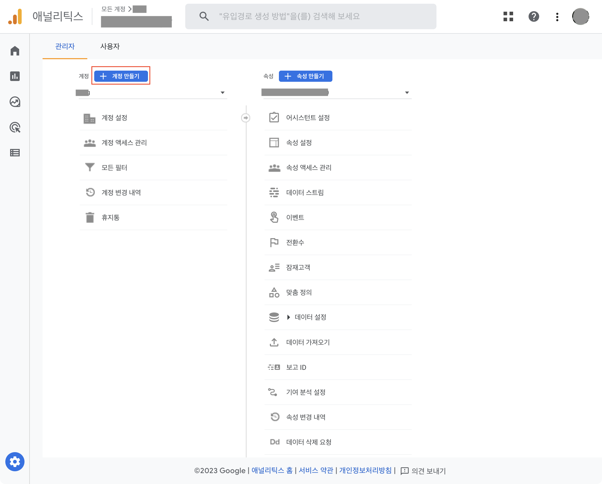
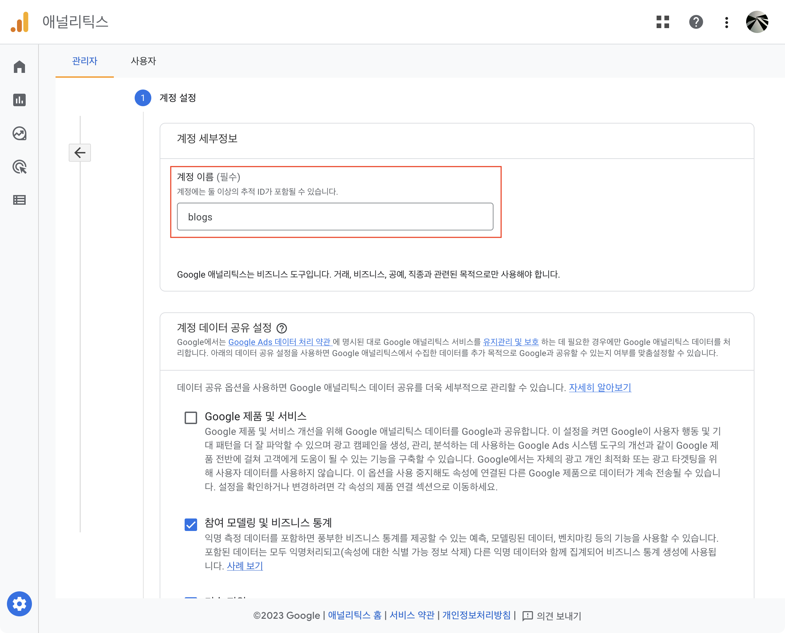
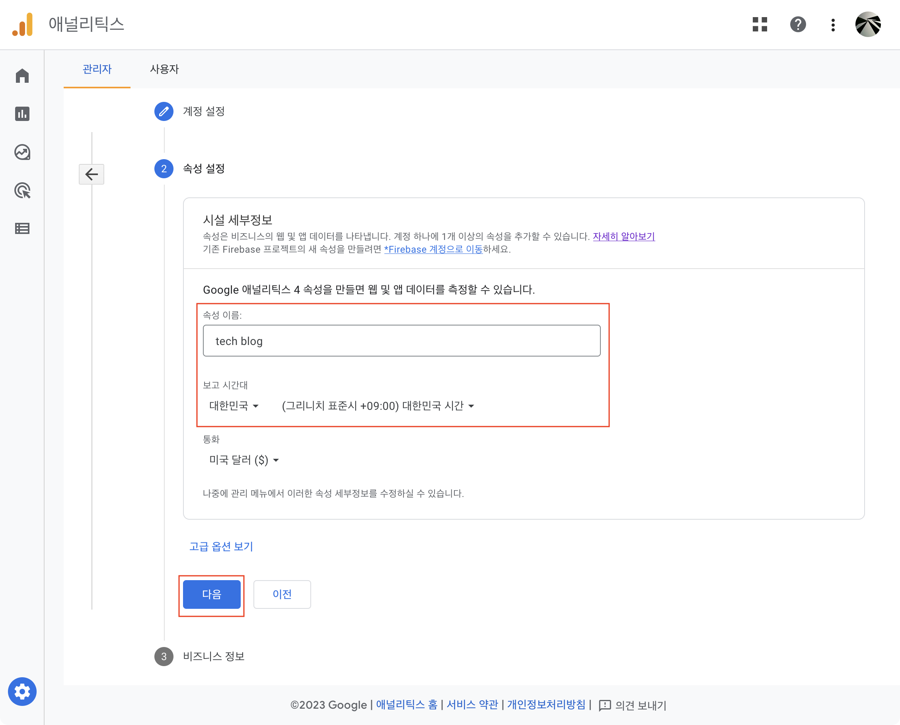
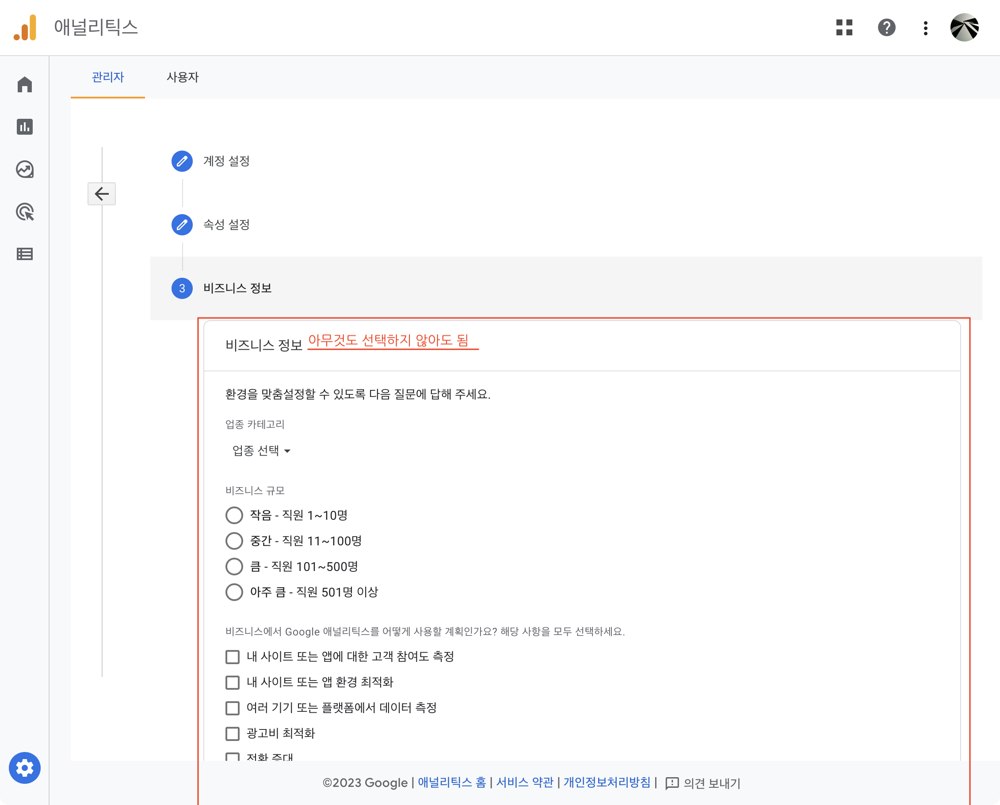
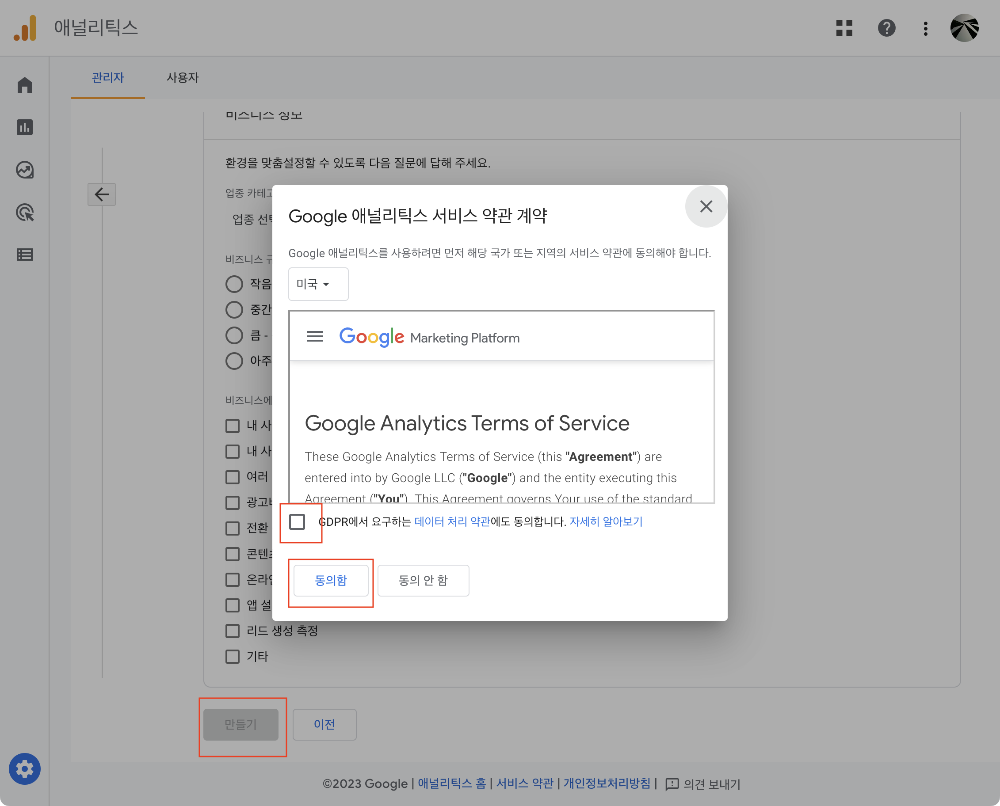
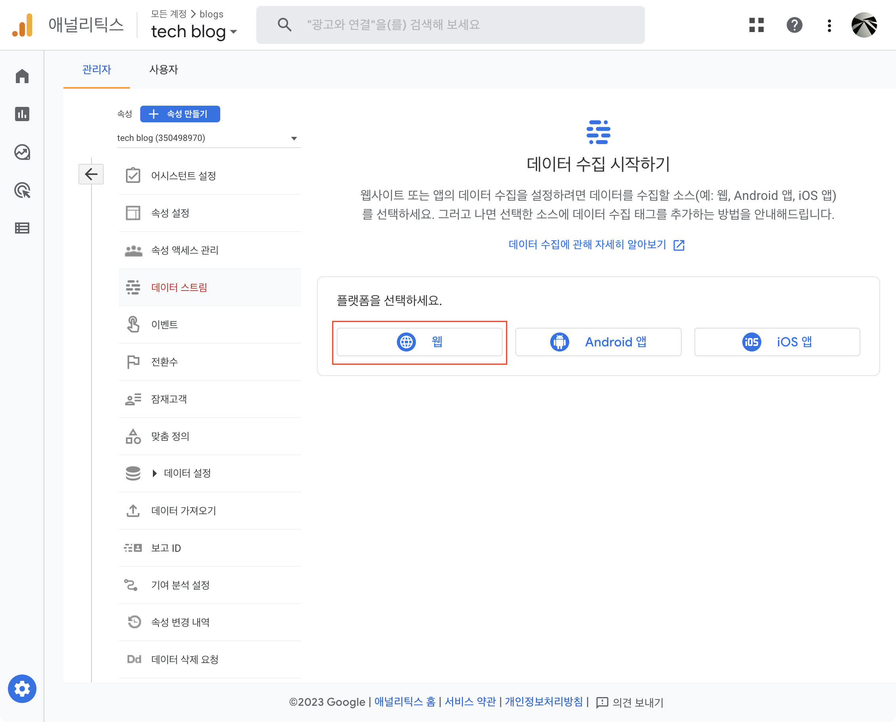
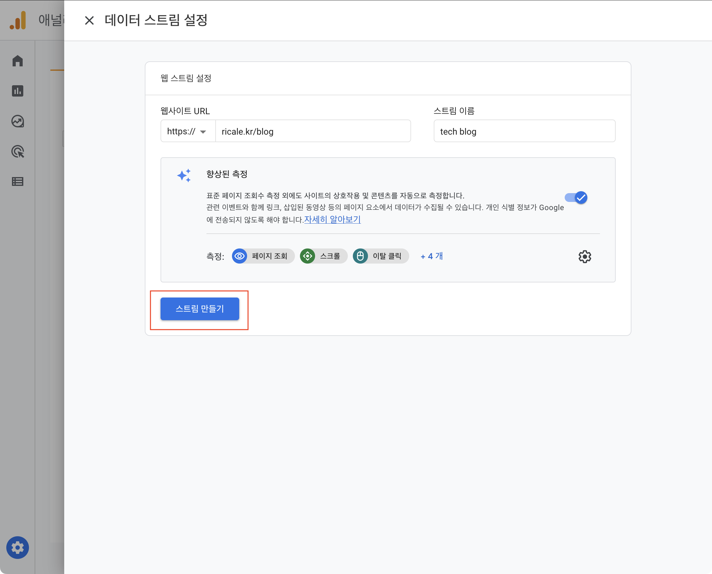
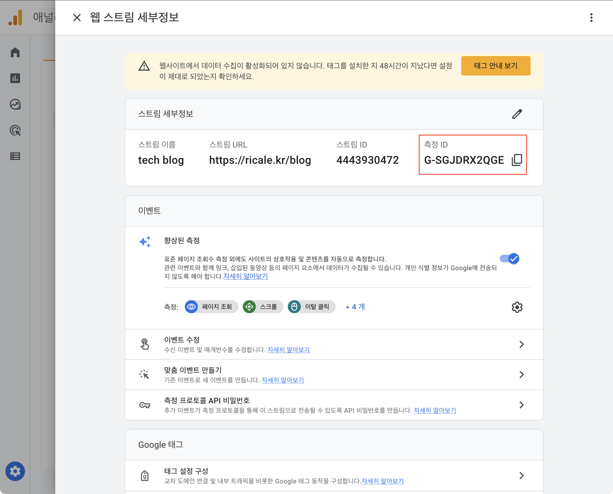

이전 글들에서는 Gatsby [기본 기능을 구현을 위한 튜토리얼을 소개했고 태그 기능을 구현](https://ricale.kr/blog/posts/230111-gatsby-1/)했고, [MDX 글 안에 인라인 이미지와 테이블을 삽입](https://ricale.kr/blog/posts/230112-gatsby-2/)했으며, [시리즈 기능도 만들어](https://ricale.kr/blog/posts/230119-gatsby-3-series/)보았고, [임시글 기능도 구현](https://ricale.kr/blog/posts/230122-gatsby-4-drafts/)했다.

이번에는 Google Analytics 를 적용해보자.

# 1. 개요

[Google Analytics](https://marketingplatform.google.com/about/analytics/)(이하 GA)는 웹사이트의 방문자를 분석해주는 도구이다. 방문자를 여러 지표 기준으로 나누어 보여주며 여러 차트들도 제공한다. (더 나아가서는 마케팅을 위한 여러 액션들도 제공한다고 하지만 이 블로그에는 필요 없는 기능이다.)

방문자 카운터나 분석 도구가 블로그 운영에 반드시 필요한 것은 아니지만, 내 블로그를 얼마나 많은 사람들이 방문하는지 궁금하므로 적용해보도록 하겠다.

# 2. 구현

구현을 위해서는 먼저 GA 에 프로젝트를 만들어야 한다. 그 후 `gatsby-plugin-google-gtag` 플러그인으로 해당 프로젝트를 블로그에 붙여보겠다.

(페이지 스크롤이 길지만 스크린샷이 많아서 그런거지 내용이 많지는 않다.)

## 2.1. GA 에 프로젝트 추가

일단 구글 계정은 있다고 가정하겠다. GA 계정 및 속성을 추가해보자. [이 링크](https://analytics.google.com/analytics/web/#/)로 들어가거나 구글에서 Google Analytics 로 검색해서 맨 위에 있는 링크로 들어가보자.

만약 기존에 GA 계정이 없다면 아래처럼 뜰 것이다. "측정 시작" 버튼을 누르자.


만약 기존에 GA 계정이 있다면 아래처럼 뜰 것이다. "계정 만들기" 버튼을 누르자.



이후에는 아래 나열되는 스크린샷들처럼 쭉 진행하면 된다.










모두 완료하면 마지막 스크린샷과 같은 화면에서 "측정 ID" 를 확인할 수 있다. 이 ID 를 플러그인에 넣어줘야 한다.

## 2.2. `gatsby-plugin-google-gtag` 플러그인 적용

플러그인을 설치하자.

```sh
npm install gatsby-plugin-google-gtag
```

그리고 `gatsby-config.ts` 에 설정을 추가하자.

```ts
// gatsby-config.ts

// ...

const config: GatsbyConfig = {
  // ...
  plugins: [
    // ...
    {
      resolve: "gatsby-plugin-google-gtag",
      options: {
        // "2.1. GA 에 프로젝트 추가" 에서 마지막에 얻은 아이디를 넣자.
        trackingIds: ["G-SGJDRX2QGE"],
      },
    },
  ],
};
```

이렇게만 해줘도 GA 의 기본적인 기능은 모두 동작한다. 더 상세한 설정 방법을 알고 싶다면 [공식 문서](https://www.gatsbyjs.com/plugins/gatsby-plugin-google-gtag/)를 참고하자.

## 2.3. 참고

`gatsby-plugin-google-gtag` 플러그인은 프로덕션에서만 동작한다. 만약 로컬에서 확인하고 싶다면 아래 명령어로 실행한 뒤 확인하자.

```sh
$ gatsby build && gatsby serve.
```

또한 GA 는 수집한 데이터가 대시보드에 보이기 시작하는 것이 조금 늦다. 최대 48시간까지 걸릴 수 있다고 되어있다. 따라서 처음으로 배포한 후 바로 테스트했을 때 GA 대시보드에서는 실시간 데이터를 제외하고 데이터가 보이지 않을 수 있는데, 당황하거나 낙심하지 말자. 하루이틀 지나면 그동안 누적된 데이터가 한 번에 보이기 시작할 것이다.

# 3. 다음

이로서 GA 를 적용해보았다. 다음으로 정리할 것들은 아래와 같다.

- 댓글 기능 구현
- 코드블록 문법 하이라이팅 기능 구현
- GitHub Pages 배포
- 글의 목차 기능 구현
- RSS 피드 기능 구현
- 등등

순서는 미정이다.

# 4. 참고

- [gatsby-plugin-google-gtag | Gatsby](https://www.gatsbyjs.com/plugins/gatsby-plugin-google-gtag/)
