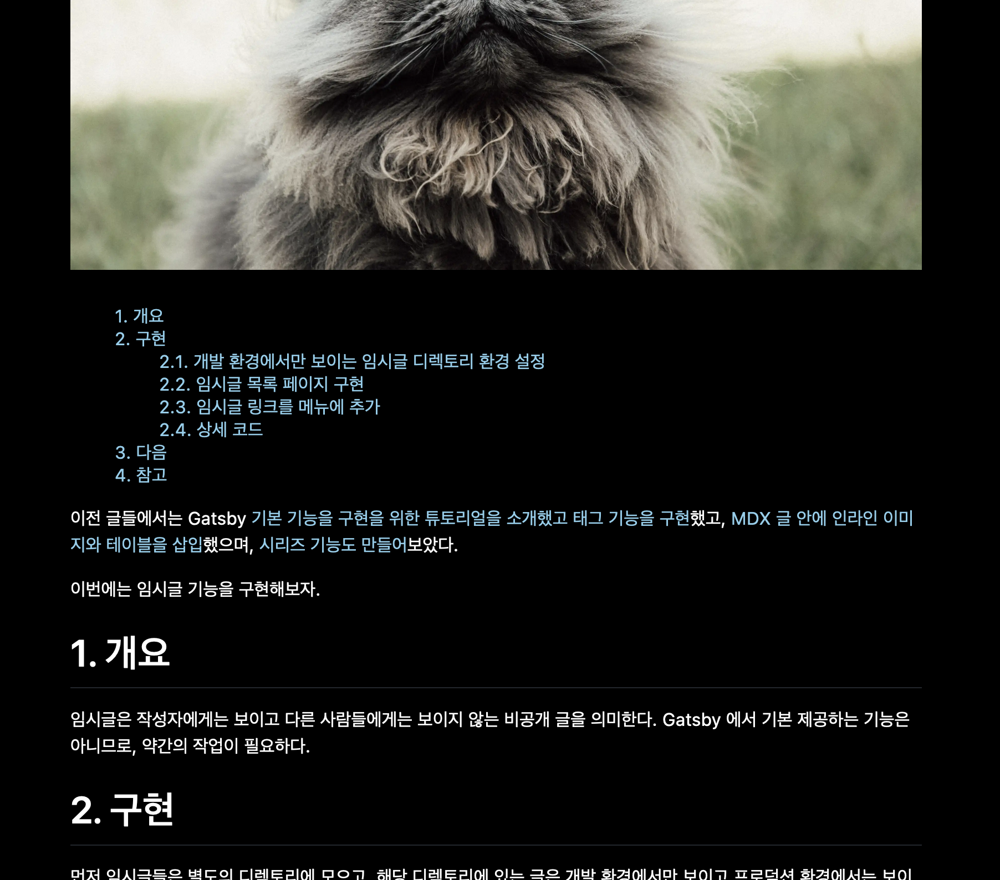
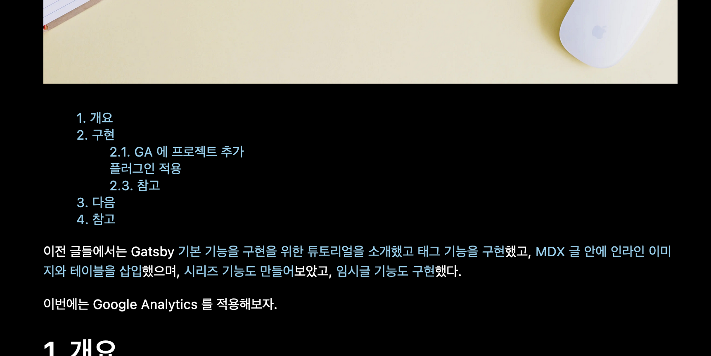
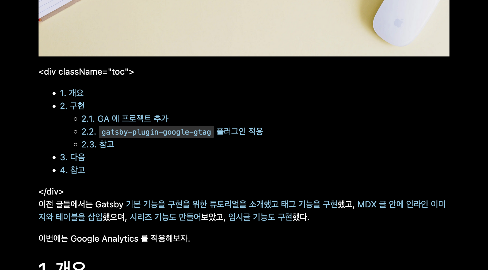
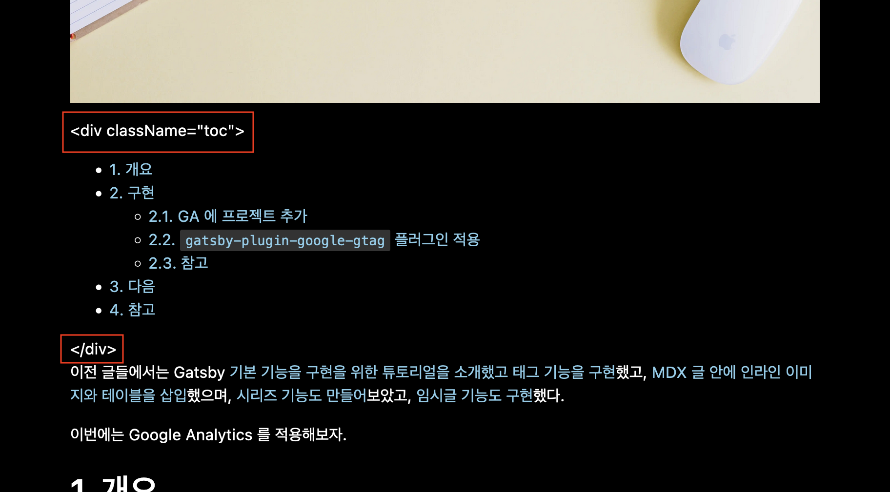
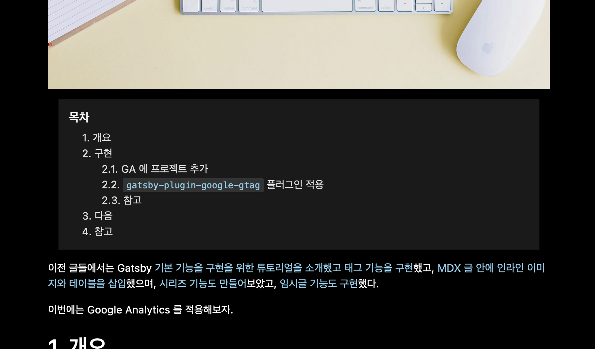

이전 글들에서는 Gatsby [기본 기능을 구현을 위한 튜토리얼을 소개했고 태그 기능을 구현](https://ricale.kr/blog/posts/230111-gatsby-1/)했고, [MDX 글 안에 인라인 이미지와 테이블을 삽입](https://ricale.kr/blog/posts/230112-gatsby-2/)했으며, [시리즈 기능도 만들어](https://ricale.kr/blog/posts/230119-gatsby-3-series/)보았고, [임시글 기능도 구현](https://ricale.kr/blog/posts/230122-gatsby-4-drafts/)했고. [Google Analytics 도 적용](https://ricale.kr/blog/posts/230126-gatsby-5-ga/)해보았다.

이번에는 목차를 추가해보자.

# 1. 개요

목차는 글 안에 있는 제목들을 모아서 보여주는 목록이다. 이 글에서는 글마다 제목들을 자동으로 모아서 목차를 만들어주는 기능을 블로그에 적용할 것이다.

# 2. 구현

본래는 `gatsby-plugin-mdx` 에서 기본 제공해주는 `tableOfContents` 필드로 해결하려 했으나 이슈가 있었다. 그래서 이슈를 어떻게 해결했는지를 기록한다.

## 2.1. `tableOfContents`

`gatsby-plugin-mdx` 는 `tableOfContents` 필드를 자동으로 만들어준다. 글 상세 페이지의 GraphQL 쿼리에 아래처럼 `tableOfContents` 필드를 추가하면 사용할 수 있다.

```tsx
// src/pages/posts/{mdx.frontmatter__slug}.tsx

export const query = graphql`
  query ($id: String) {
    mdx(id: { eq: $id }) {
      frontmatter {
        # ...
      }
      excerpt
      # ...
      tableOfContents # 이렇게 추가해주자.
    }
  }
`;
```

`tableOfContents` 데이터는 아래와 같은 형식으로 나온다.

```tsx
// mdx.tableOfContents
{
  items: [
    { url: "#1-개요", title: "1. 개요" },
    {
      url: "#2-구현",
      title: "2. 구현",
      items: [
        {
          url: "#21-개발-환경에서만-보이는-임시글-디렉토리-환경-설정",
          title: "2.1. 개발 환경에서만 보이는 임시글 디렉토리 환경 설정",
        },
        {
          url: "#22-임시글-목록-페이지-구현",
          title: "2.2. 임시글 목록 페이지 구현",
        },
        {
          url: "#23-임시글-링크를-메뉴에-추가",
          title: "2.3. 임시글 링크를 메뉴에 추가",
        },
        { url: "#24-상세-코드", title: "2.4. 상세 코드" },
      ],
    },
    { url: "#3-다음", title: "3. 다음" },
    { url: "#4-참고", title: "4. 참고" },
  ],
};

```

해당 데이터를 사용해서 목차를 렌더링하는 `<TableOfContents />` 컴포넌트는 아래처럼 구현해주었다.

```tsx
// src/components/TableOfContents.tsx

// ...

function TableOfContents({ data, slug }: TableOfContentsProps) {
  return (
    <Container>
      {data.map((item, i) => (
        <li key={i}>
          <Link to={`/posts/${slug}/${item.url}`}>{item.title}</Link>
          {!!item.items && <TableOfContents data={item.items} slug={slug} />}
        </li>
      ))}
    </Container>
  );
}

// ...

export default TableOfContents;
```

이 `<TableOfContents />` 컴포넌트를 글 상세 페이지에서 사용하자.

```tsx
// src/pages/posts/{mdx.frontmatter__slug}.tsx

function PostDetailPage({ data, children }: PageProps<PostDetailPageData>) {
  // data.mdx.tableOfContents 로 접근 가능하다.
  const { /* ... */, tableOfContents } = data.mdx;

  // ...

  return (
    <Layout>
      {/* ... */}

      {/* 본문 바로 위에 목차를 위치시켰다. */}
      <TableOfContents data={tableOfContents.items} slug={slug} />

      <PostContent>{children}</PostContent>

      {/* ... */}
    </Layout>
  );
}
```

그러면 아래처럼 목차가 나온다.



디자인이 너무 밋밋하긴 하지만 동작에는 전혀 문제가 없다. 이렇게 `gatsby-plugin-mdx` 에서 제공해주는 기능으로 간단하게 목차 구현을 완료했다.

...인줄 알았으나

## 2.2. `tableOfContents` 의 버그

`tableOfContents` 에는 현재 버그가 존재한다. 바로 제목 안에 인라인 코드(\`CODE\`)가 있으면 제목이 잘려서 보인다는 것이다.



위 이미지에 있는 "플러그인 적용" 이라는 제목에 주목하자. 나는 이런 제목을 작성한 적이 없다. 데이터를 확인해보면 아래와 같다.

```tsx
// data.mdx.tableOfContents
{
  items: [
    { url: "#1-개요", title: "1. 개요" },
    {
      url: "#2-구현",
      title: "2. 구현",
      items: [
        { url: "#21-ga-에-프로젝트-추가", title: "2.1. GA 에 프로젝트 추가" },
        {
          url: "#22-gatsby-plugin-google-gtag-플러그인-적용",
          title: " 플러그인 적용", // 제목이 url 과 너무 다르다!
        },
        { url: "#23-참고", title: "2.3. 참고" },
      ],
    },
    { url: "#3-다음", title: "3. 다음" },
    { url: "#4-참고", title: "4. 참고" },
  ],
};
```

중간에 보면 `url` 은 `"#22-gatsby-plugin-google-gtag-플러그인-적용"` 인데 `title` 은 `" 플러그인 적용"` 으로 되어있다. 해당 데이터의 mdx 원문은 아래와 같다.

```md
## 2.2. `gatsby-plugin-google-gtag` 플러그인 적용
```

인라인 코드를 포함한 앞부분이 모두 잘려버린 걸 짐작할 수 있다.

만약 제목에 인라인 코드를 쓰지 않는다면 문제가 없긴 하다. 하지만 인라인 코드를 자주 쓰는 (나같은) 사람이라면, 이 방식으로는 목차를 만들 수 없다. 대안을 찾아보자.

## 2.3. `gatsby-remark-table-of-contents` 플러그인

이 때 대안으로 생각할 수 있는 것이 [`gatsby-remark-table-of-contents`](https://github.com/signalwerk/gatsby-remark-table-of-contents) 플러그인이다.

이 플러그인은 글 본문에 자동으로 목차를 추가해준다.

플러그인을 설치한 뒤

```sh
$ npm install gatsby-remark-autolink-headers # 같이 설치해줘야 한다.
$ npm install gatsby-remark-table-of-contents
```

`gatsby-node.ts` 에 설정을 추가해주자.

```ts
// gatsby-config.ts

const config: GatsbyConfig = {
  // ...
  plugins: [
    // ...
    {
      resolve: "gatsby-plugin-mdx",
      options: {
        // ...
        gatsbyRemarkPlugins: [
          {
            resolve: "gatsby-remark-table-of-contents",
            options: {
              fromHeading: 1,
              tight: true,
            },
          },
          "gatsby-remark-autolink-headers",
          // ...
        ],
      },
    },
  ],
};
```

그리고 목차를 넣고자 하는 글의 원하는 부분에 아래처럼 추가해주면 된다.

````
```toc
```
````

그러면 플러그인에서 해당 영역이 위치한 부분에 자동으로 목차를 삽입해준다.



좋다. 이제 인라인 코드도 제목에 잘 들어간 걸 확인할 수 있다. 이렇게 플러그인을 사용해 간단히 목차를 구현해보았다.

아니 그런데...?

## 2.4. `gatsby-remark-table-of-contents` 플러그인의 버그



저 정체불명의 문자열은 무엇일까? 별 거 아니다. 그냥 플러그인의 버그다.

플러그인의 깃헙 이슈에 들어가보면 [해당 버그가 9월에 이슈로 등록](https://github.com/signalwerk/gatsby-remark-table-of-contents/issues/33)된 것을 확인할 수 있다. 하지만 해결되지 않은 것으로 보인다.

옵션을 어떻게 해도 해당 문자열은 노출되는 것으로 보인다. 그러면 이 플러그인도 쓸 수 없다.

## 2.5. 직접 플러그인 작성

`gatsby-remark-table-of-contents` 플러그인은 버그로 인해 쓰기 곤란해졌다. 하지만 해당 버그만 어떻게든 제거한다면 사용에는 문제가 없어보인다. 그러면 `gatsby-remark-table-of-contents` 라이브러리 코드를 최대한 참고해 직접 플러그인을 작성해서 사용해보자.

### 2.5.1. `gatsby-remark-table-of-contents` 핵심 로직 가져오기

일단 `gatsby-remark-table-of-contents` 의 핵심 디펜던시인 [`mdast-util-toc`](https://github.com/syntax-tree/mdast-util-toc) 를 설치해주자.

```sh
# 버전을 5로 지정하는 이유는 버전 6 부터 ESM only 이기 때문이다.
# gatsby 는 플러그인에 ESM 을 지원하지 않는다.
$ npm install mdast-util-toc@5
```

그리고 `plugins/gatsby-remark-toc/index.js` 파일을 생성해서 아래처럼 작성하자.

````js
// plugins/gatsby-remark-toc/index.js
// - `.ts` 가 아니라 `.js` 로 만든 이유는 본래 플러그인도 `.js` 라서 타입이 지정되어 있지 않기 때문이다.
//   타입은 나중에 개선할 때 추가하도록 하겠다.

const util = require("mdast-util-toc");

const transformer = (markdownAST, pluginOptions) => {
  const prefs = {
    tight: true,
    fromHeading: 1,
    toHeading: 6,
    className: "toc",
    ordered: false,
  };

  // 목차를 위한 빈 마크다운 AST 를 만든다.
  const tocMarkdownAST = {
    ...markdownAST,
    children: [],
  };

  // - 원본 마크다운으로부터 제목만 추려서 `tocMarkdownAST` 에 넣자.
  // - 여기서 굳이 제목만 추리는 이유는
  //   `node.depth >= prefs.fromHeading` 이 조건을 적용하기 위해서로 보인다.
  //   해당 조건이 필요 없다면 markdownAST 를 그대로 `mdast-util-toc` 에
  //   넣어도 될 것 같다.
  markdownAST.children.forEach((node) => {
    if (node.type === "heading" && node.depth >= prefs.fromHeading) {
      tocMarkdownAST.children.push(node);
    }
  });

  // `mdast-util-toc` 로 목차를 위한 마크다운 AST 를 만든다.
  const result = util(tocMarkdownAST, {
    maxDepth: prefs.toHeading,
    tight: prefs.tight,
    ordered: prefs.ordered,
    skip: Array.isArray(prefs.exclude)
      ? prefs.exclude.join("|")
      : prefs.exclude,
  });

  if (result.map) {
    // - 마크다운 원문 맨 앞에 목차를 끼워넣는다.
    // - 본래 플러그인은 마크다운 본문 내에 ` ```toc ` 영역을 찾아서
    //   해당 영역에 목차를 끼워넣지만
    //   나는 ` ```toc ` 를 쓰지 않아도 무조건 목차를 추가할 예정이라서
    //   해당 로직은 제거했다.
    markdownAST.children = [
      // - 이렇게 하면 목차를 `<div class='toc'></div>` 로 한 번 감싸주고,
      //   `### 목차`를 목차 앞에 추가해준다.
      // - 이런 과정이 다 필요없고 목차만 넣고 싶다면
      //   아래 객체 대신 `result.map` 을 직접 넣어주면 된다.
      {
        type: "parent",
        children: [
          {
            type: "heading",
            depth: 3,
            children: [{ type: "text", value: "목차" }],
          },
          result.map,
        ],
        data: {
          hProperties: { className: "toc" },
        },
      },
      ...markdownAST.children,
    ];
  }

  return markdownAST;
};

module.exports = ({ markdownAST }, pluginOptions) => {
  return transformer(markdownAST, pluginOptions);
};
````

### 2.5.2. 로컬 플러그인으로 만들기

로컬 플러그인을 만들기 위해서는 플러그인과 같은 디렉토리에 `package.json` 도 작성해주어야 한다.

```json
// plugins/gatsby-remark-toc/package.js
{
  "name": "gatsby-remark-toc",
  "version": "1.0.0",
  "description": "",
  "main": "index.js",
  "scripts": {
    "test": "echo \"Error: no test specified\" && exit 1"
  },
  "author": "",
  "license": "MIT"
}
```

이제 `plugins/gatsby-remark-toc` 디렉토리는 `gatsby-remark-toc` 플러그인으로 취급할 수 있다. 플러그인을 사용하도록 설정에 추가해주자.

```ts
// gatsby-config.ts

// ...

const config: GatsbyConfig = {
  // ...
  plugins: [
    // ...
    {
      resolve: "gatsby-plugin-mdx",
      options: {
        // ...
        gatsbyRemarkPlugins: [
          "gatsby-remark-toc",
          "gatsby-remark-autolink-headers",
          // ...
        ],
      },
    },
  ],
};
```

### 2.5.3. 스타일 수정

스타일은 클래스 이름으로 지정해서 적용해주면 된다. 2.5.1. 에서 목차를 `<div class='toc'></div>` 로 감싸주었던 것을 상기하자.

```ts
// src/components/MdxContent.tsx
// 마크다운 본문을 감싸고 있는 컴포넌트다.

import styled from "../themes";

const MdxContent = styled.div`
  /* ... */

  /*
    입맛에 맞게 스타일 지정을 해주자
  */
  .toc {
    margin: 0 16px 16px;
    padding: 16px 0 0 16px;
    background-color: #1a1a1a;
    > h3 {
      margin: 0;
      font-size: 1.125rem;
    }
    > ul {
      position: relative;
      margin: 0;
      padding: 8px 0 16px 20px;

      font-size: 1rem;
      list-style: none;

      a {
        color: #dddddd;
      }

      ul {
        list-style: none;
        padding-left: 30px;
      }
    }
  }

  /* ... */
`;

export default MdxContent;
```

그러면 이제 아래처럼 잘 적용된 것을 확인할 수 있다.



### 2.5.4. 상세 코드

본문의 코드 조각들은 생략된 부분이 있으므로, 코드 전문을 보고 싶다면 아래를 참고하자.

- [plugins/gatsby-remark-toc/index.js](https://github.com/ricale/blog/blob/40696c0b150bec7bbfb48b569ac207fab15b10c9/plugins/gatsby-remark-toc/index.js)
- [plugins/gatsby-remark-toc/package.json](https://github.com/ricale/blog/blob/40696c0b150bec7bbfb48b569ac207fab15b10c9/plugins/gatsby-remark-toc/package.json)
- [gatsby-config.ts](https://github.com/ricale/blog/blob/40696c0b150bec7bbfb48b569ac207fab15b10c9/gatsby-config.ts#L39)
- [src/components/MdxContent.tsx](https://github.com/ricale/blog/blob/40696c0b150bec7bbfb48b569ac207fab15b10c9/src/components/MdxContent.tsx#L7)

## 2.6. `excerpt` 필드를 위한 처리 (22.1.30.추가)

2.5. 내용을 모두 진행하면 목차는 잘 보인다. 하지만 이슈가 하나 있다. `excerpt` 필드와 관련이 있다.

`exceprt` 는 마크다운 본문 내용을 앞에서부터 N 글자만 추린 문자열이다 (N 기본값 = 140). 미리보기에 사용하라는 용도로 자동으로 생성되는 필드인데, 2.5. 에서처럼 목차를 본문 앞에 넣어버리면 이 필드에는 목차 내용이 대부분을 차지하게 된다.

아래가 목차를 앞에 두었을 때 이 글의 `excerpt` 값이다.

> 목차 1. 개요2. 구현  
> 2.1. tableOfContents2.1. tableOfContents 의 버그2.3. gatsby-remark-table-of-contents 플러그인2.4. gatsby-remark-table-of…

이건 당연히 우리가 바라는 바가 아니다. 따라서 수정하도록 하겠다.

방법은 간단하다. 목차를 분문 맨 뒤에 넣되, CSS 를 사용해서 보이는 것 자체는 맨 앞에서 보이도록 처리할 것이다.

### 2.6.1. 목차를 맨 뒤로

목차를 맨 뒤로 보내기 위해 `gatsby-reamrk-toc` 를 조금 수정해주자.

```js
// plugins/gatsby-remark-toc/index.js

// ...

const transformer = (markdownAST /*, pluginOptions*/) => {
  // ...

  if (result.map) {
    markdownAST.children = [
      // 마크다운 본문인 markdownAST 을 목차인 result.map 보다 앞으로 가져온다.
      // 그냥 앞으로 가져오는 게 아니라 <div class="md"></div> 로 감싸준다.
      {
        type: "parent",
        children: markdownAST.children,
        data: {
          hProperties: { className: "md" },
        },
      },
      // 목차는 이제 본문보다 뒤에 위치시킨다.
      {
        type: "parent",
        children: [
          {
            type: "heading",
            depth: 3,
            children: [{ type: "text", value: "목차" }],
          },
          result.map,
        ],
        data: {
          hProperties: { className: "toc" },
        },
      },
    ];
  }

  //...
};

// ...
```

이렇게 하면 `excerpt` 값이 (이 글 기준) 아래처럼 바뀐 걸 확인할 수 있다.

> 이전 글들에서는 Gatsby 기본 기능을 구현을 위한 튜토리얼을 소개했고 태그 기능을 구현했고, MDX 글 안에 인라인 이미지와 테이블을 삽입했으며, 시리즈 기능도 만들어보았고, 임시글 기능도 구현했고. Google Analytics 도 적용해보았다.…

하지만 이로서 목차는 글 아래로 이동하게 된다.

### 2.6.2. CSS 로 목차를 맨 위로 이동

글을 읽는 사람 임장에서 목차는 본문보다 앞에 있는 것이 더 좋다. 그러니 CSS 를 사용해서 목차를 맨 앞으로 가져오자.

```tsx
// src/components/MdxContent.tsx

const MdxContent = styled.div`
  // ...

  // 마크다운 본문 전체를 감싸고 있던 컴포넌트는 flex 박스로 만든다.
  display: flex;
  flex-direction: column;

  // 마크다운 본문은 order 를 1 로 설정하고,
  // 목차는 order 를 0 으로 설정해준다.
  // 이러면 목차가 마크다운 본문보다 앞으로 이동하게 된다.
  > .md {
    order: 1;
  }
  > .toc {
    order: 0;

    // ...
  }
  // ...
`;

export default MdxContent;
```

이제 다시 목차가 글보다 위에 있는 것을 확인할 수 있다.

### 2.6.3. 상세 코드

본문의 코드 조각들은 생략된 부분이 있으므로, 코드 전문을 보고 싶다면 아래를 참고하자.

- [plugins/gatsby-remark-toc/index.js](https://github.com/ricale/blog/blob/1cea57f71115b0395cc7aadf9f5159e7e49e916c/plugins/gatsby-remark-toc/index.js#L35)
- [src/components/MdxContent.tsx](https://github.com/ricale/blog/blob/1cea57f71115b0395cc7aadf9f5159e7e49e916c/src/components/MdxContent.tsx#L4)

# 3. 다음

이로서 목차 자동 생성 기능을 구현해보았다.

목차가 글 옆에서 떠다니면서 현재 읽고 있는 부분의 제목을 강조해주는 기능을 나중에 구현해도 재미있을 것 같다.

이외에도 다음에 정리할 것들은 아래와 같다.

- 댓글 기능 구현
- 코드블록 문법 하이라이팅 기능 구현
- GitHub Pages 배포
- RSS 피드 기능 구현
- 등등

순서는 미정이다.

# 4. 참고

- Gatsby Docs - [Creating a Remark Transformer Plugin](https://www.gatsbyjs.com/tutorial/remark-plugin-tutorial/)
- [signalwerk/gatsby-remark-table-of-contents](https://github.com/signalwerk/gatsby-remark-table-of-contents)
- [gatsby-plugin-mdx - Extending the GraphQL MDX nodes - headings](https://github.com/gatsbyjs/gatsby/tree/master/packages/gatsby-plugin-mdx#headings)
- [remark generated table of contents](https://digital-garden.dev/notes/remark-toc)
