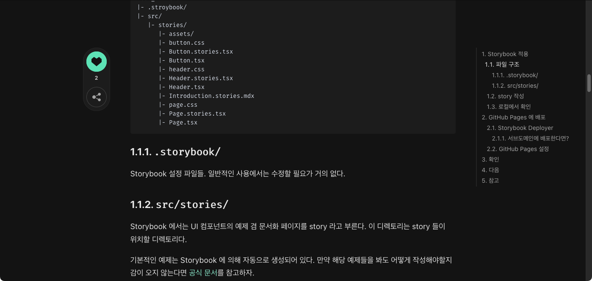
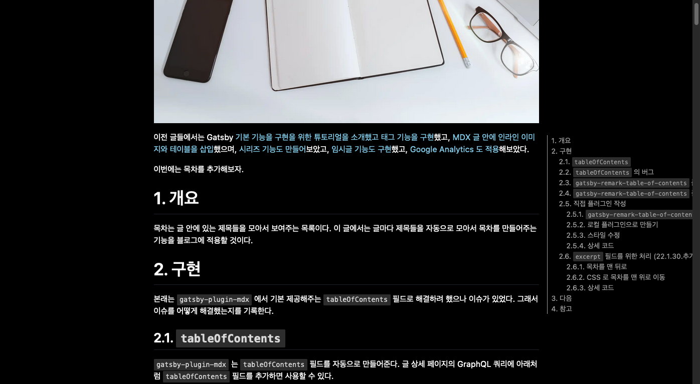
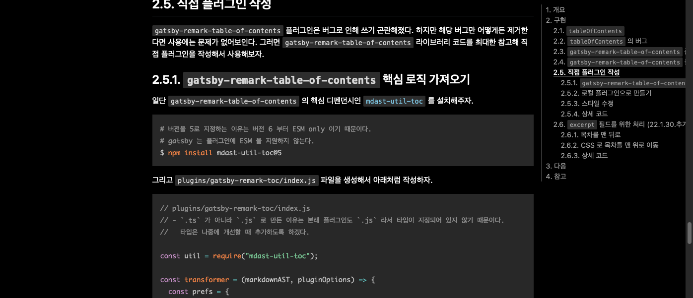

이전 글들에서는 Gatsby [기본 기능을 구현을 위한 튜토리얼을 소개하며 태그 기능을 구현](https://ricale.kr/blog/posts/230111-gatsby-1/)했고, [MDX 글 안에 인라인 이미지와 테이블을 삽입](https://ricale.kr/blog/posts/230112-gatsby-2/)했으며, [시리즈 기능도 만들어](https://ricale.kr/blog/posts/230119-gatsby-3-series/)보았고, [임시글 기능도 구현](https://ricale.kr/blog/posts/230122-gatsby-4-drafts/)했고, [Google Analytics 도 적용](https://ricale.kr/blog/posts/230126-gatsby-5-ga/)해보았으며, [목차 자동 생성 기능](https://ricale.kr/blog/posts/230128-gatsby-6-toc/)까지 구현했다.

이번에는 바로 이전 글에서 구현한 목차를 sticky 스타일로 발전시켜보자.

# 1. 개요

sticky 스타일은 유저가 화면을 스크롤해도 특정 범위에서는 특정 위치에 머무르는 스타일을 말한다. gatsby 이전에 사용하던 블로그 서비스인 velog 에서도 목차에 기본으로 적용해주던 스타일이다.



더불어 목차에서 현재 읽고 있는 영역의 제목만 하이라이팅(CSS 로 강조) 해주는 기능 또한, sticky 스타일의 목차와 거의 항상 같이 제공되는 기능이다.

오늘은 CSS 와 자바스크립트를 사용해 이 기능들을 구현할 것이다.

# 2. 구현

일단 CSS 를 사용해 sticky 목차를 구현하자. 그리고 자바스크립트의 `IntersectionObserver` 클래스를 활용해 현재 읽고 있는 영역의 제목을 하이라이팅 시키자.

## 2.1. sticky 스타일

우리의 목차는 velog 처럼 글 옆에 떠 있으면서, 스크롤을 하더라도 특정 범위 안에서는 계속 보이도록 할 것이다.

그래서 목차의 래핑 엘리먼트(`div.toc`)는 `position: absolute;` 로 지정할 것이며, 높이는 마크다운 컨텐츠 컨테이너와 동일하도록 `height: 100%;` 로 할 것이다.

```html
<!-- HTML 예시 -->
<div id="마크다운_컨텐츠_컨테이너">
  <!-- 마크다운 본문 -->
  <div class="md">
    <!-- ... -->
    <h1 id="1-%EA%B0%9C%EC%9A%94">1. 개요</h1>
    <!-- ... -->
    <h1 id="2-%EA%B5%AC%ED%98%84">2. 구현</h1>
    <!-- ... -->
    <h1 id="3-%EB%8B%A4%EC%9D%8C">3. 다음</h1>
    <!-- ... -->
    <h1 id="4-%EC%B0%B8%EA%B3%A0">4. 참고</h1>
    <!-- ... -->
  </div>
  <!-- 목차 -->
  <div class="toc">
    <ul>
      <li><a href="#1-%EA%B0%9C%EC%9A%94">1. 개요</a></li>
      <li><a href="#2-%EA%B5%AC%ED%98%84">2. 구현</a></li>
      <li><a href="#3-%EB%8B%A4%EC%9D%8C">3. 다음</a></li>
      <li><a href="#4-%EC%B0%B8%EA%B3%A0">4. 참고</a></li>
    </ul>
  </div>
</div>
```

목차 엘리먼트(`div.toc > ul`)는 `position: sticky;` 로 설정해서 스크롤하더라도 특정 영역에 계속 머무르게 할 것이다.

[MDN](https://developer.mozilla.org/en-US/docs/Web/CSS/position) 에는 `position: sticky;` 스타일을 아래와 같이 설명하고 있다.

> The element is positioned according to the normal flow of the document, and then offset relative to its nearest scrolling ancestor and containing block (nearest block-level ancestor)

"일반적인 흐름대로 위치하되, *가장 가까운 스크롤 가능한 부모 엘리먼트*에 상대적인 위치에 놓인다"고 되어있다. 이 블로그에서 `height` 를 지정하거나 `overflow-y` 관련 값을 지정한 상위 엘리먼트가 없으므로, 가장 가까운 스크롤 가능한 부모 엘리먼트는 브라우저 뷰포트 (= 브라우저 화면) 라고 생각하면 된다.

그럼 스타일을 지정하자.

```scss
/* src/components/MdxContent.tsx */

// ...

@media (min-width: 1100px) {
  .toc {
    position: absolute;
    top: 8px;
    left: calc(50% + 400px);
    height: 100%;

    // ...

    > ul {
      position: sticky;
      top: 10px;
      // ...
    }

    .highlight {
      color: #ffffff;
      text-decoration: underline;
      code {
        color: #ffffff;
        text-decoration: underline;
      }
    }
  }
  // ...
}
```

이제 목차가 글 오른쪽에 떠있는 걸 확인할 수 있다.



## 2.2. 현재 보고 있는 영역의 제목을 목차에서 하이라이팅

MDN 에서는 `IntersectionObserver` 를 아래처럼 설명하고 있다.

> The Intersection Observer API provides a way to asynchronously observe changes in the intersection of a target element with an ancestor element or with a top-level document's viewport.

"타겟 엘리먼트가 부모 엘리먼트 혹은 document 의 뷰포트와 교차하는지를 비동기적으로 관찰한다". 특정 엘리먼트가 보이게 되었을 때 혹은 안 보이게 되었을 때 리스너를 실행해준다, 고 이해하면 쉽다.

이 클래스를 사용해서 현재 혹은 바로 직전에 보였던 헤딩 엘리먼트를 찾아서 하이라이팅을 해보자.

(`IntersectionObserver` 클래스에 대한 자세한 설명은 [MDN 문서](https://developer.mozilla.org/en-US/docs/Web/API/Intersection_Observer_API) 혹은 [이 블로그 글](https://heropy.blog/2019/10/27/intersection-observer/)을 참고하자.)

### 2.2.1. `IntersectionObserver` 사용

```tsx
// src/pages/posts/{mdx.frontmatter__slug}.tsx

// ...

function PostDetailPage({ data, children }: PageProps<PostDetailPageData>) {
  // 마크다운 컨텐츠 컨테이너의 ref
  const ref = React.useRef<HTMLDivElement>();

  // ...

  React.useEffect(() => {
    // 마크다운 컨텐츠 내에 있는 헤딩 엘리먼트들을 `headingElements` 변수에 넣는다.
    const headingElements = ref.current?.querySelectorAll<HTMLElement>(
      ".md h1, .md h2, .md h3, .md h4, .md h5, .md h6"
    );

    // `headingElements` 에게 적용할 `IntersectionObserver`
    const observer = new IntersectionObserver(
      // `headingElements` 전체에 이 옵저버를 적용할 것이므로
      // 이벤트의 대상인 `entries` 는 하나일 수도 있고 여럿일 수도 있다.
      // (이 클래스 생성자의 두 번째 인자가 `{ threshold: 1.0 }` 이기 때문에
      //  `entries` 가 빈 배열일 수는 없다.)
      (entries) => {
        const targets = entries.filter(
          // threshold 를 1 로 해놓아도 `intersectionRatio` 가 1보다 작은 경우가 존재한다.
          // `IntersectionObserver` 가 비동기적이기 때문에,
          // 이벤트가 발생한 시점과 이 리스너가 실행되는 시점이 살짝 달라서 생기는 오차인 것 같다.
          // 일단 확실히 보이는 경우에만 보이는 걸로 처리하고 싶으니까 필터링을 해준다.
          (entry) => entry.isIntersecting && entry.intersectionRatio >= 1
        );

        // 대상이 하나도 없을 때는 아무 일도 하지 않는다.
        if (targets.length === 0) {
          return;
        }

        // 대상이 하나 이상 있을 때는 기존에 하이라이팅 처리된 엘리먼트들에서
        // 하이라이팅 처리를 비활성화 해준다.
        ref.current
          ?.querySelectorAll(".highlight")
          .forEach((element) => element.classList.remove("highlight"));

        // 대상들을 순회하면서
        targets.forEach((it) => {
          // 대상 헤딩 엘리먼트의 id 어트리뷰트를 추출하고
          const targetId = it.target.getAttribute("id");
          // 그 아이디 값을 href 어트리뷰트로 갖고 있는 목차 내 앵커 아이템을 찾아서
          const linkSelector = `.toc a[href='#${encodeURI(targetId ?? "")}']`;
          const linkElement = ref.current?.querySelector(linkSelector);
          // 해당 앵커 엘리먼트를 하이라이팅 해준다.
          linkElement?.classList.add("highlight");
        });
      },
      { threshold: 1.0 }
    );

    // `headingElements` 들에게 위에서 작성한 옵저버를 적용한다.
    headingElements?.forEach((element) => observer.observe(element));

    return () => observer.disconnect();
  }, []);

  // ...

  return (
    <Layout>
      {/* ... */}
      <PostContent ref={ref as React.RefObject<HTMLDivElement>}>
        {children}
      </PostContent>
    </Layout>
  );
}

// ...
```

이렇게 `IntersectionObserver` 클래스를 사용해 구현하면 잘 동작한다... 고 말하고 싶지만 여기에는 몇 가지 이슈가 있다.

#### 2.2.1.1. 이슈 1: 부정확함

먼저, 스크롤을 위에서 아래로 내릴 때는 잘 동작하는 것 같지만, 아래에서 위로 올릴 때는 이상하게 동작한다.

분명 "3. 다음" 부분을 보고 있다가 위로 스크롤을 올렸는데 "2. 구현"으로 하이라이팅이 변하지 않고 "3. 다음" 부분에 그대로 하이라이팅 되어있을 때가 있다. 왜냐하면 "2. 구현" 부분의 내용이 충분히 길기 때문에 "2. 구현" 제목이 바로 보이지 않는다면, 옵저버의 리스너는 실행되지 않기 때문이다. 리스너가 실행되지 않으면 하이라이팅도 변하지 않는다.

(이해가 잘 되지 않는다면 충분히 긴 글을 대상으로 위 코드를 테스트해보길 바란다.)

#### 2.2.1.2. 이슈 2: 여러 제목이 동시에 하이라이팅 됨

두 번째로, 동시에 여러 헤딩 엘리먼트가 한 번에 화면에 노출될 경우, 하이라이팅도 여러 아이템이 된다.

이 경우는 사람에 따라 의도한 결과일 수도 있다. 하지만 velog 등 비슷한 기능을 제공하는 서비스들을 보면 대부분 동시에 하나만 하이라이팅이 된다. 화면의 최상단 영역에 보이고 있는 내용의 제목만. 당연히 나도 그렇게 구현하고 싶다.

그럼 이 이슈들을 고쳐보자.

### 2.2.2. `IntersectionObserver` + 스크롤 위치

고치는 방법은 간단하다. 헤딩 엘리먼트들이 보이거나 보이지 않게 되었을 때, (어떤 헤딩이 보이게 되었는지 안 보이게 되었는지는 신경쓰지 않고) 현재 스크롤 위치와 각 헤딩 엘리먼트들의 위치를 확인해서 어디에 하이라이팅일 줘야 할지 확인하도록 할 것이다.

```tsx
// src/pages/posts/{mdx.frontmatter__slug}.tsx

// ...

React.useEffect(() => {
  const headingElements = ref.current?.querySelectorAll<HTMLElement>(
    ".md h1, .md h2, .md h3, .md h4, .md h5, d h6"
  );

  const observer = new IntersectionObserver(
    // 이벤트의 대상인 `entries` 에는 이제 관심이 없어졌다.
    // 우리는 이벤트가 발생했는지 여부에만 관심이 있다.
    (/* entries */) => {
      if (!headingElements) {
        return;
      }

      const offset = 10;
      // 현재 스크롤 위치를 가져온다.
      // 마크다운 컨텐츠 컨테이너가 `position: relative;` 이므로
      // 해당 엘리먼트의 위치도 더해줘야 한다.
      const scrollTop =
        document.documentElement.scrollTop +
        offset -
        (ref.current?.offsetTop ?? 0);

      let targetHeading;
      // `targetElements` 를 차례로 순회하며
      for (let i = 0; i < headingElements.length; i++) {
        // `scrollTop` 보다 더 아래에 있는 엘리먼트를 발견한 순간,
        if (headingElements[i].offsetTop > scrollTop) {
          // 바로 그 직전의 헤딩 엘리먼트를 `targetHeading` 변수에 저장한다.
          // 화면 최상단의 표시되는 컨텐츠의 제목이 바로 이 엘리먼트다.
          // 만약 없다면 `null` 을 넣어줘서 제일 위 제목보다도 윗 영역에
          // 스크롤되었다는 것을 표시한다.
          targetHeading = headingElements[i - 1] ?? null;
          break;
        }
      }
      // `targetElements` 를 모두 순회했는데도 `targetHeading` 을 못찾았다면
      // 가장 마지막 헤딩 엘리먼트가 `targetHeading` 이다.
      if (targetHeading === undefined) {
        targetHeading = headingElements[headingElements.length - 1];
      }

      ref.current
        ?.querySelectorAll(".highlight")
        .forEach((element) => element.classList.remove("highlight"));

      // `targetHeading` 엘리먼트와 연결된 목차의 링크를 하이라이팅 해준다.`
      if (targetHeading) {
        const targetId = targetHeading.getAttribute("id");
        const linkSelector = `.toc a[href='#${encodeURI(targetId ?? "")}']`;
        const linkElement = ref.current?.querySelector(linkSelector);
        linkElement?.classList.add("highlight");
      }
    },
    {
      // 화면 전체가 아닌 화면 최상단에서만 옵저버를 실행시켜야 정확하다.
      rootMargin: "0px 0px -90% 0px",
      // 헤딩 엘리먼트가 보이게 되었을 때 혹은 안 보이게 되었을 때 모두 실행시켜야 좀 더 정확하다.
      threshold: [0, 1.0],
    }
  );

  headingElements?.forEach((element) => observer.observe(element));

  return () => observer.disconnect();
}, []);
```

이제 스크롤을 위로 하든 아래로 하든 정확하며, 항상 하나의 아이템만 하이라이팅 된다.



## 2.3. 상세 코드

본문의 코드 조각들은 생략된 부분이 있으므로, 코드 전문을 보고 싶다면 아래를 참고하자.

- [src/components/MdxContent.tsx](https://github.com/ricale/blog/blob/f93f747110bf6d09fa294647e8274eb792355899/src/components/MdxContent.tsx#L70)
- [src/pages/posts/\{mdx.frontmatter\_\_slug\}.tsx](https://github.com/ricale/blog/blob/f93f747110bf6d09fa294647e8274eb792355899/src/pages/posts/%7Bmdx.frontmatter__slug%7D.tsx#L26)
- [src/utils/highlightCurrentHeading.ts](https://github.com/ricale/blog/blob/f93f747110bf6d09fa294647e8274eb792355899/src/utils/highlightCurrentHeading.ts)  
  (본문에는 `{mdx.frontmatter__slug}.tsx` 에 다 작성한 것처럼 되어있지만, 해당 컴포넌트의 훅 내부에서 사용하는 로직은 이 함수로 분리되어있다.)

# 3. 다음

이로서 sticky 목차를 구현해보았다. 이외에도 다음에 정리할 것들은 아래와 같다.

- 댓글 기능 구현
- 코드블록 문법 하이라이팅 기능 구현
- GitHub Pages 배포
- RSS 피드 기능 구현
- 등등

순서는 미정이다.

# 4. 참고

- [게시물 목차 구현하기 ( TOC )](https://develogger.kro.kr/blog/LKHcoding/127)
- [Building a Table of Contents with the Intersection Observer API](https://tj.ie/building-a-table-of-contents-with-the-intersection-observer-api/)
- [Intersection Observer - 요소의 가시성 관찰](https://heropy.blog/2019/10/27/intersection-observer/)
