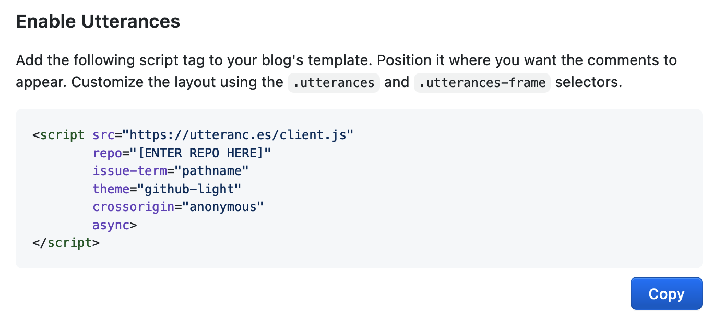
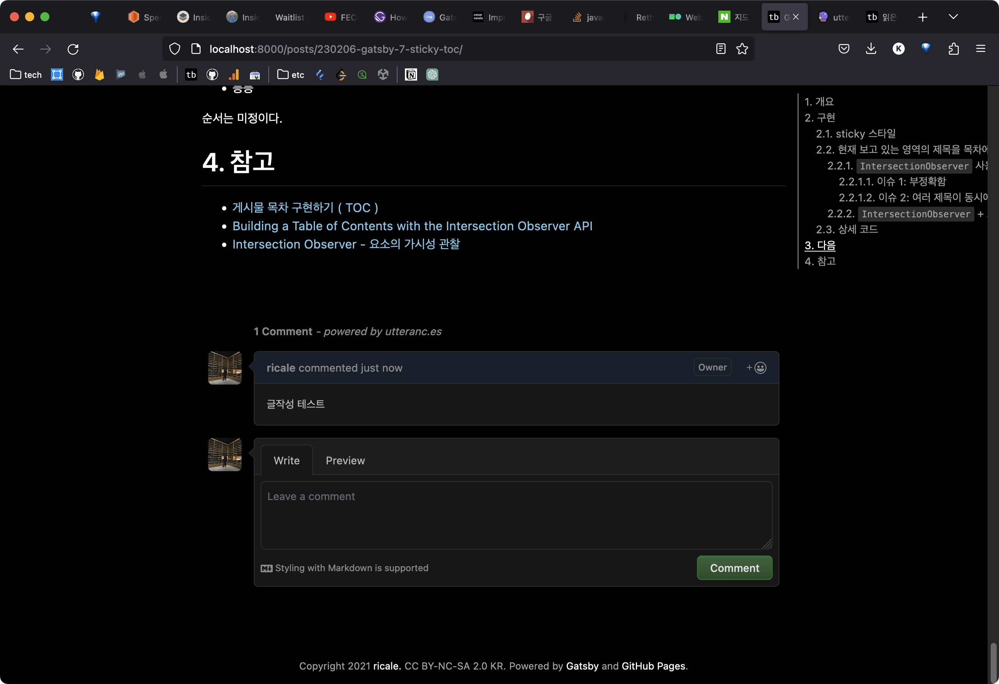
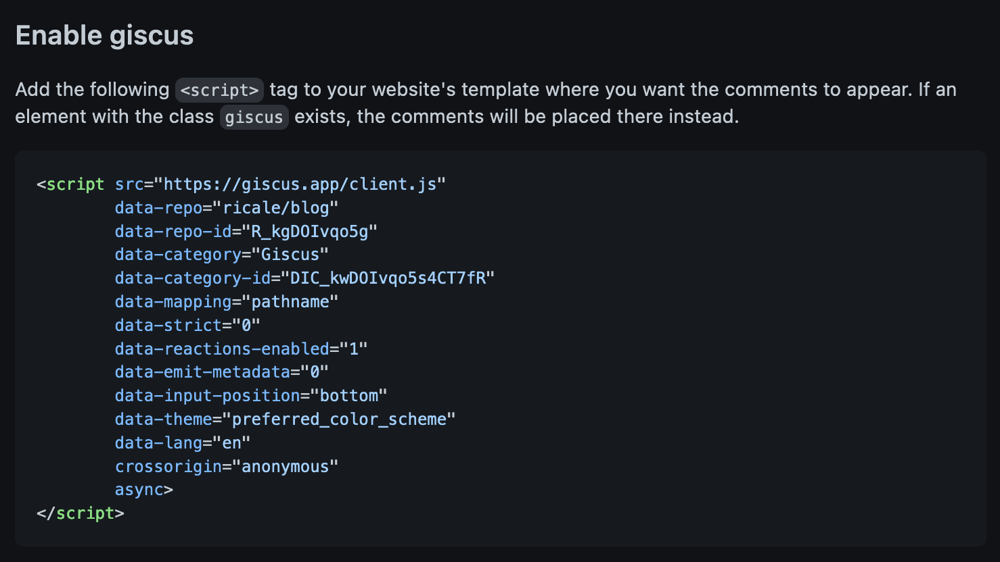
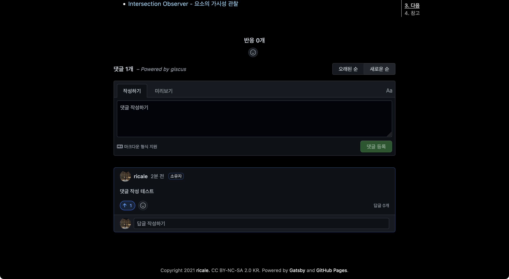

이전 글들에서는 Gatsby [기본 기능을 구현을 위한 튜토리얼을 소개하며 태그 기능을 구현](https://ricale.kr/blog/posts/230111-gatsby-1/)했고, [MDX 글 안에 인라인 이미지와 테이블을 삽입](https://ricale.kr/blog/posts/230112-gatsby-2/)했으며, [시리즈 기능도 만들어](https://ricale.kr/blog/posts/230119-gatsby-3-series/)보았고, [임시글 기능도 구현](https://ricale.kr/blog/posts/230122-gatsby-4-drafts/)했고, [Google Analytics 도 적용](https://ricale.kr/blog/posts/230126-gatsby-5-ga/)해보았으며, [목차 자동 생성 기능](https://ricale.kr/blog/posts/230128-gatsby-6-toc/) 및 [sticky 스타일](https://ricale.kr/blog/posts/230206-gatsby-7-sticky-toc/)까지 구현했다.

이번에는 댓글 기능을 구현해보자.

# 1. 개요

Gatsby 같은 [SSG](https://www.gatsbyjs.com/docs/glossary/static-site-generator/) 를 통해 구현된 정적 사이트에 댓글 기능을 다는 방법에는 [여러가지](https://www.gatsbyjs.com/docs/how-to/adding-common-features/adding-comments/)가 있겠지만, 이 글에서는 [utterances](https://utteranc.es/) 와 [giscus](https://giscus.app/) 두 가지만을 각각 적용해 볼 것이다.

두 서비스 다 GitHub API 를 활용한 서비스인데, utterances 는 GitHub 의 Issues API 를 사용하고, giscus 는 GitHub 의 Discussions API 를 사용한다.

# 2. 구현

먼저 utterances 로 댓글 기능을 구현해보고, 그다음에 giscus 로 구현해보겠다.

## 2.1. utterances 적용

utterances 적용은 굉장히 쉽다. [공식 웹페이지](https://utteranc.es/)의 Configuration 섹션을 쭉 따라가면서 설정해주면 마지막에 `script` 태그를 하나 만들어준다. ([리포지토리에 utterances 앱을 추가하는 걸 잊지 말자!](https://github.com/apps/utterances))



이 태그를 스크린샷에서 말하고 있는 것처럼 ("Position it where you want the comments to appear") 코멘트가 위치할 곳에 가져다 붙이기만 하면 된다, 라고 말하면 좋겠지만 React 환경에서는 이 `script` 태그를 단순히 가져다 붙이는 것으로는 적용되지 않는다. `useEffect` 를 사용해 초기화 시 동적으로 설정하게끔 해주어야 한다.

댓글 기능을 초기화하는 컴포넌트를 `Comments.tsx` 컴포넌트로 따로 작성해보자.

```tsx
// src/components/Comments.tsx

import React, { useEffect, useRef } from "react";

function Comments() {
  const ref = useRef<HTMLDivElement>(null);

  useEffect(() => {
    const scriptTag = document.createElement("script");
    const attrs = {
      src: "https://utteranc.es/client.js",
      repo: "USERNAME/REPONAME",
      "issue-term": "pathname",
      label: "utterances",
      theme: "github-dark",
      crossOrigin: "anonymous",
      async: "true",
    };
    Object.entries(attrs).forEach(([key, value]) => {
      scriptTag.setAttribute(key, value);
    });
    ref.current?.appendChild(scriptTag);
  }, []);

  return <div id="comments" ref={ref} />;
}

export default Comments;
```

그리고 이 컴포넌트를 글 상세 페이지 컴포넌트에서 사용하자.

```tsx
// src/pages/posts/{mdx.frontmatter__slug}.tsx

// ...

import Comments from "../../components/Comments";

function PostDetailPage({ data, children }: PageProps<PostDetailPageData>) {
  // ...
  return (
    <Layout>
      {/* ... */}
      <PostContent ref={ref as React.RefObject<HTMLDivElement>}>
        {children}
      </PostContent>
      {/* 아래처럼 붙여주자 */}
      <Comments />
    </Layout>
  );
}

// ...
```

그러면 아래처럼, GitHub Issues UI 가 추가된 것을 볼 수 있다.



GitHub 아이디가 있어야 한다는 제약만 빼면 아무나 자유롭게 댓글을 달 수 있다.

## 2.2. utterances 아쉬운 점

개인적으로 utterances 의 아쉬운 점은 딱 하나다. 글 자체에 리액션(따봉, 하트 등)을 할 수 없다는 것이다. GitHub Issues API 의 한계인지 아니면 utterances 가 미쳐 작업하지 못한 것인지는 불명이다.

여기서, giscus 가 등장한다.

## 2.3. giscus 적용

giscus 적용도 굉장히 쉽다. [공식 웹페이지](https://giscus.app/)의 Configuration 섹션을 쭉 따라가면서 설정해주면 마지막에 `script` 태그를 하나 만들어준다. ([리포지토리에 giscus 앱을 추가하는 걸 잊지 말자!](https://github.com/apps/giscus))



이 태그를 스크린샷에서 말하고 있는 것처럼 ("Add the following `<script>` tag to your website's template where you want the comments to appear.") 코멘트가 위치할 곳에 가져다 붙이기만 하면 된다, 라고 말하면 좋겠지만...

데자뷰가 느껴지는가? 그렇다면 정상이다. giscus 는 utterances 로부터 태어난 자식 같은 존재이다. ("Heavily inspired by utterances.") 따라서 적용 방법은 utterances 와 99% 동일하다.

giscus 역시 utterances 처럼, `script` 태그를 단순히 가져다 붙이는 것으로는 적용되지 않는다. `useEffect` 를 사용해 초기화 시 동적으로 설정하게끔 해주어야 한다.

giscus 를 위한 `Comments.tsx` 컴포넌트를 작성해보자.

```tsx
import React, { useEffect, useRef } from "react";

function Comments() {
  const ref = useRef<HTMLDivElement>(null);

  useEffect(() => {
    const scriptTag = document.createElement("script");
    const attrs = {
      src: "https://giscus.app/client.js",
      "data-repo": "USERNAME/REPONAME",
      "data-repo-id": "ID",
      "data-category": "Giscus",
      "data-category-id": "CATEGORY_ID",
      "data-mapping": "pathname",
      "data-strict": "0",
      "data-reactions-enabled": "1",
      "data-emit-metadata": "0",
      "data-input-position": "top",
      "data-theme": "dark",
      "data-lang": "ko",
      crossorigin: "anonymous",
      async: "true",
    };
    Object.entries(attrs).forEach(([key, value]) => {
      scriptTag.setAttribute(key, value);
    });
    ref.current?.appendChild(scriptTag);
  }, []);

  return <div id="comments" ref={ref} />;
}

export default Comments;
```

그리고 이 컴포넌트를 글 상세 페이지 컴포넌트에서 사용하자.

```tsx
// src/pages/posts/{mdx.frontmatter__slug}.tsx

// ...

import Comments from "../../components/Comments";

function PostDetailPage({ data, children }: PageProps<PostDetailPageData>) {
  // ...
  return (
    <Layout>
      {/* ... */}
      <PostContent ref={ref as React.RefObject<HTMLDivElement>}>
        {children}
      </PostContent>
      {/* 아래처럼 붙여주자 */}
      <Comments />
    </Layout>
  );
}

// ...
```

그러면 아래처럼, GitHub Discussions UI 가 추가된 것을 볼 수 있다.



GitHub 아이디가 있어야 한다는 제약만 빼면 아무나 자유롭게 글에 리액션을 추가하고 댓글을 달 수 있다.

## 2.4. giscus origin 제한하기

워낙에 설정 및 사용이 쉬운 툴이다 보니 자연스럽게 이런 의문이 들 수 있다. "내 아이디랑 리포지토리를 알고 있으면 아무나 설정해서 쓸 수 있는 거 아냐?" 맞다. 그리고 그것을 막기 위한 설정 또한 제공한다.

프로젝트 루트 디렉토리에 `giscus.json` 을 생성해서 아래처럼 작성하면 된다.

```js
// giscus.json
{
  "origins": ["https://ricale.kr"],
  "originsRegex": ["http://localhost:[0-9]+"]
}
```

주의할 점은 이 파일이 GitHub 리파지토리에 올라가야지만 적용된다는 것이다. 로컬에만 추가해놓고 테스트하면 적용되지 않으니 주의하자.

이 외에도 설정이 더 존재하는데 자세한 건 [공식 문서](https://github.com/giscus/giscus/blob/main/ADVANCED-USAGE.md)를 참고하자.

(utterances 도 [비슷한 기능이 존재](https://github.com/utterance/utterances/blob/master/utterances.json)하는데, 관련 공식 문서를 찾지는 못했다.)

## 2.5. utterances vs giscus

(상세한 설정 차이는 일단 무시하더라도) 기능적으로 보면 둘의 차이는 크게 두 가지가 있다.

|                   | utterances | giscus |
| ----------------- | ---------- | ------ |
| 쉬운 설치 및 적용 | O          | O      |
| 댓글 기능         | O          | O      |
| 대댓글 기능       | X          | O      |
| 글 리액션 기능    | X          | O      |

이것만 놓고 보면 utterances 보다는 giscus 를 사용하는 게 좋아보인다. 하지만 giscus 는 공식 문서에 다음과 같은 주의 문구가 있다.

> giscus is still under active development. GitHub is also still actively developing Discussions and its API. Thus, some features of giscus may break or change over time.

"GitHub Discussions 나 giscus 양 쪽 다 개발 중인 상태이므로 언제든 특정 기능이 망가지거나 변경될 수 있다"는 문구다.

위 문구가 대수롭지 않게 생각된다면, 그리고 대댓글과 글 리액션 기능이 필요하다면 giscus 를 추천한다.

위 문구가 신경이 쓰인다면, 혹은 굳이 대댓글이나 글 리액션 기능이 필요없다면 utterances 도 좋은 선택이다.

(이 블로그는 giscus 를 사용한다.)

## 2.6. 상세 코드

코드가 짧아 본문의 코드 조각만 봐도 적용하는데는 문제가 없을 것이다. 하지만 그래도 실제 적용된 코드 전문을 보고 싶다면 아래를 참고하자.

- [src/components/Comments.tsx](https://github.com/ricale/blog/blob/d15824f3d9574506bab748dba0400e5ceeb2c858/src/components/Comments.tsx)
- [src/pages/posts/\{mdx.frontmatter\_\_slug\}.tsx](https://github.com/ricale/blog/blob/d15824f3d9574506bab748dba0400e5ceeb2c858/src/pages/posts/%7Bmdx.frontmatter__slug%7D.tsx#L64)
- [giscus.json](https://github.com/ricale/blog/blob/d15824f3d9574506bab748dba0400e5ceeb2c858/giscus.json)

# 3. 다음

이로서 댓글 기능을 구현해보았다. 이외에도 다음에 정리할 것들은 아래와 같다.

- 코드블록 문법 하이라이팅 기능 구현
- GitHub Pages 배포
- RSS 피드 기능 구현
- 등등

순서는 미정이다.

# 4. 참고

- [utterances](https://utteranc.es/)
- [giscus](https://giscus.app/)
- [How add comments to your Gatsby site with utterances](https://www.darraghoriordan.com/2022/10/01/how-to-add-utterances-comments-gatsby-typescript/)
- giscus/giscus - [Add support to only allow specific origins](https://github.com/giscus/giscus/issues/104)
