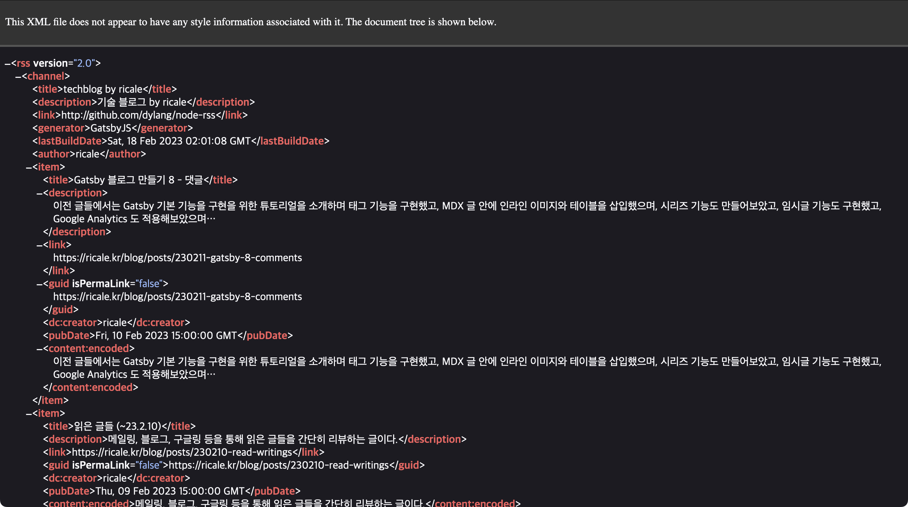
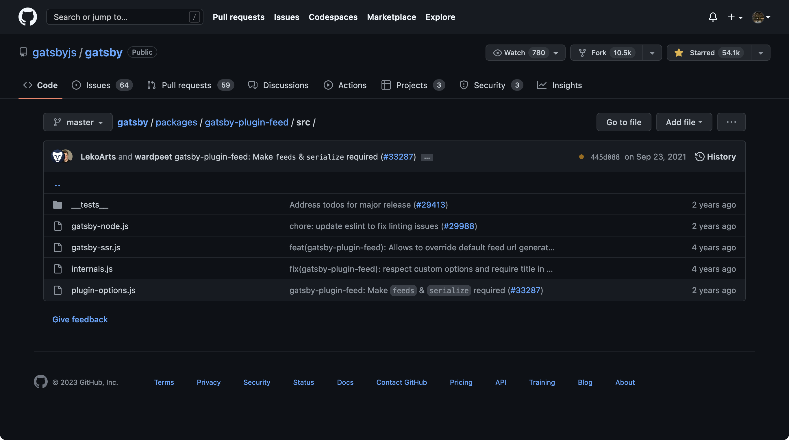
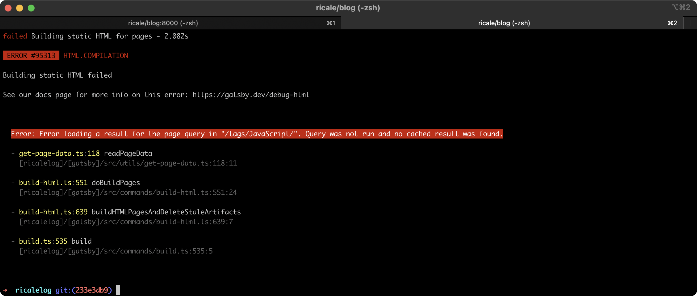

이전 글들에서는 Gatsby [기본 기능을 구현을 위한 튜토리얼을 소개하며 태그 기능을 구현](https://ricale.kr/blog/posts/230111-gatsby-1/)했고, [MDX 글 안에 인라인 이미지와 테이블을 삽입](https://ricale.kr/blog/posts/230112-gatsby-2/)했으며, [시리즈 기능도 만들어](https://ricale.kr/blog/posts/230119-gatsby-3-series/)보았고, [임시글 기능도 구현](https://ricale.kr/blog/posts/230122-gatsby-4-drafts/)했고, [Google Analytics 도 적용](https://ricale.kr/blog/posts/230126-gatsby-5-ga/)해보았으며, [목차 자동 생성 기능](https://ricale.kr/blog/posts/230128-gatsby-6-toc/) 및 [sticky 스타일](https://ricale.kr/blog/posts/230206-gatsby-7-sticky-toc/)까지 구현했고, 추가로 [댓글 기능](https://ricale.kr/blog/posts/230211-gatsby-8-comments/)도 구현했다.

이번에는 RSS 피드 기능을 구현해보자.

# 1. 개요

RSS 는 XML 형식으로 콘텐츠를 표현하는 방식이다. 주로 뉴스 사이트나 블로그 등에서 제공하며, 사용자는 이 RSS 를 전용 리더에서 모아보면서 관심있는 컨텐츠의 업데이트 여부를 한 눈에 볼 수 있다. 그냥 RSS 라고 부르기도 하고 RSS 피드(feed) 라고 부르기도 한다. RSS 를 모아 보는 프로그램 혹은 서비스는 RSS 리더, RSS 뷰어 등으로 불린다.

Gatsby 에서도 RSS 피드를 쉽게 만들 수 있는 플러그인을 제공한다.

# 2. 구현

그러면 플러그인으로 블로그 글 전체에 대한 기본 RSS 피드를 만들고, 이것을 활용해서 시리즈 별 RSS 피드도 만들어보자.

## 2.1. `gatsby-plugin-feed`

[`gatsby-plugin-feed`](https://github.com/gatsbyjs/gatsby/tree/master/packages/gatsby-plugin-feed) 을 설치하자.

```sh
npm install gatsby-plugin-feed
```

그리고 `gatsby-config.ts` 에 아래처럼 설정을 추가해주자.

```ts:title=gatsby-config.ts
// ...

const config: GatsbyConfig = {
  // ...
  plugins: [
    // ...
    {
      resolve: "gatsby-plugin-feed",
      options: {
        // 기본 쿼리.
        // RSS 피드 파일은 여러 개 만들 수도 있는데,
        // 그 모든 피드 파일을 생성할 때 공통으로 사용할 쿼리를 여기에 작성한다.
        query: `
          {
            site {
              siteMetadata {
                title
                author
                siteUrl
                description
              }
            }
          }
        `,
        feeds: [
          {
            // RSS 피드에 들어갈 글목록을 가져오는 쿼리
            query: `
              {
                allMdx(
                  filter: { frontmatter: { date: { ne: "" } } }
                  sort: { frontmatter: { date: DESC } }
                ) {
                  nodes {
                    excerpt
                    frontmatter {
                      title
                      slug
                      date(formatString: "YYYY. M. D.")
                      previewContent
                    }
                  }
                }
              }
            `,
            // 기본 쿼리와 글목록 쿼리로부터 데이터를 받아서 RSS 데이터를 만드는 함수
            serialize: ({ query: { site, allMdx } }: any) => {
              return allMdx.nodes.map((node: any) => ({
                ...node.frontmatter,
                description: node.frontmatter.previewContent ?? node.excerpt,
                url: `${site.siteMetadata.siteUrl}/posts/${node.frontmatter.slug}`,
                guid: `${site.siteMetadata.siteUrl}/posts/${node.frontmatter.slug}`,
                custom_elements: [
                  {
                    "content:encoded":
                      node.frontmatter.previewContent ?? node.excerpt,
                  },
                ],
              }));
            },
            // RSS 피드 파일이 생성될 위치
            output: "/rss.xml",
            // RSS 피드의 제목
            title: `${siteMetadata.title} by ${siteMetadata.author}`,
          },
        ],
      },
    },
  ],
};
```

그리고 빌드를 하면 `https://블로그주소/rss.xml` 에서 생성된 RSS 피드를 확인할 수 있다.



### 2.1.1. 이슈1: 로컬에서는 테스트 안 됨

공식 문서에서는 아래와 같이 언급하고 있다.

> _Note: This plugin only generates the `xml` file(s) when run in `production` mode! To test your feed, run: `gatsby build && gatsby serve`._

"RSS 피드는 프로덕션 모드에서만 생성된다"는 뜻이다. 그러니 테스트할 때는 `gatsby build && gatsby serve` 에서 하자. (`gatsby develop` 이나 `npm run start` 에서 헤매지 않도록 조심하자.)

### 2.1.2. 이슈2: RSS 피드에 글 본문 전체를 제공할 수 없음

RSS 피드를 제공하는 방식에는 피드 내에 본문 전체를 제공하는 방식도 있다. 사용자가 굳이 블로그/뉴스사이트에 접속하지 않고 RSS 리더만 봐도 모든 내용을 볼 수 있게 제공한다는 의미이다. (사용자 입장에서는 편리하지만 컨텐츠 제공자 입장에서는 블로그/뉴스사이트에 사용자가 접속하지 않으므로 광고 수익 등에 타격이 있을 수 있다.) 그런데 Gatsby 에서는 RSS 피드에 본문 전체를 넣을 수 없다.

`gatsby-plugin-feed` 공식 문서의 설정 예제를 보면 마치 넣을 수 있는 것처럼 보인다.

```js:title=gatsby-plugin-feed+의+README.md+에서+발췌
            serialize: ({ query: { site, allMarkdownRemark } }) => {
              return allMarkdownRemark.nodes.map(node => {
                return Object.assign({}, node.frontmatter, {
                  description: node.excerpt,
                  date: node.frontmatter.date,
                  url: site.siteMetadata.siteUrl + node.fields.slug,
                  guid: site.siteMetadata.siteUrl + node.fields.slug,
                  // `custom_elements` 설정을 보면 `node.html`, 즉 블로그 내용 전문을 넣고 있다.
                  custom_elements: [{ "content:encoded": node.html }],
                })
              })
            },
```

그런데 실제로 저 코드는 동작하지 않는다. 이건 사실 `gatsby-plugin-feed` 의 이슈가 아니라, `node.html` 값을 제공해야 하는 `gatsby-plugin-mdx` 의 문제다.

`gatsby-plugin-mdx` 의 공식 문서를 보면 [아래와 같은 안내](https://github.com/gatsbyjs/gatsby/tree/master/packages/gatsby-plugin-mdx#v3-to-v4-breaking-changes)가 있다.

> As mentioned above the `html` field was removed from the GraphQL node. We know that some of you used this for e.g. `gatsby-plugin-feed`. Unfortunately, for compatibility and performance reasons we had to remove it. We recommend using the `excerpt` field in the meantime until we find a feasible solution to provide MDX rendered as HTML. If you have any suggestions, please comment on the GitHub Discussion.

"`html` 필드를 이제 지원하지 않는다. `gatsby-plugin-feed` 등에서 쓰여온 값이라는 건 알고 있지만 성능 문제 때문에 어쩔 수 없다. 대신 `excerpt` 필드를 쓰는 걸 권장한다." 라는 내용이다.

따라서 RSS 피드에 본문 전체를 넣고 싶으면 방법은

1. `gatsby-plugin-mdx` 를 직접 고쳐서 쓰거나
2. `gatsby-plugin-mdx` 의 `mdxOptions` 옵션이나 `gatsbyRemarkPlugins` 옵션을 통해 방법을 찾거나
3. `gatsby-node.ts` 등 Gatsby 설정/미들웨어에서 직접 html 을 생성하거나
4. `gatsby-plugin-mdx` 대신 `gatsby-transformer-remark` 를 쓰거나

정도일 것이다.

1번은 엄두가 안나고 2번은 가능한지 알 수 없다. 3번은 시도해보기는 했지만 `gatsby-plugin-mdx` 와의 일관성 유지 문제도 있고, 결과적으로 mdx 파싱 엔진을 두 번 돌리는 꼴이라 너무 비효율적일 것 같아서 포기했다. 4번은 설정 마이그레이션 하기도 번거롭고 MDX 를 이제와서 버리기도 싫어서 포기했다.

만약 글 본문 전체를 RSS 피드에 넣고 싶다면 위 방안 중 하나를 고려해보자.

이 블로그는 현실과 타협하여 `excerpt` 값(본문의 앞 부분을 잘라서 저정한 문자열, 미리보기 정도로 생각하면 된다)을 넣고 있다.

```ts
            serialize: ({ query: { site, allMdx } }: any) => {
              return allMdx.nodes.map((node: any) => ({
                // ...
                custom_elements: [
                  {
                    "content:encoded":
                      node.frontmatter.previewContent ?? node.excerpt,
                  },
                ],
              }));
            },
```

## 2.2. 시리즈별 RSS 피드 제공

기본 RSS 피드를 적용하고 보니 시리즈별 RSS 피드도 만들어보고 싶어졌다. 그렇지만 `gatsby-plugin-feed` 에서는 하나의 쿼리 결과에 의해 여러 개의 RSS 피드를 만드는 기능을 제공하지 않는다.

하지만 우리가 누구인가. 이미 목차를 구현할 때 [기존 플러그인(`gatsby-remark-table-of-contents`)을 참고해서 필요한 플러그인을 얼기설기 만들](https://ricale.kr/blog/posts/230128-gatsby-6-toc/)어보지 않았던가? 이번에도 `gatsby-plugin-feed` 플러그인을 참고해서 필요한 플러그인을 만들어보자.

(그런데 이거, 시리즈별 RSS 피드를 누가 본다고 만드나? 아무리 생각해도 오버스펙아냐? 라는 생각이 들지만 일단 무시하자.)

### 2.2.1. `gatsby-plugin-feed` 구현 리뷰

일단 `gatsby-plugin-feed` 플러그인에서 필요한 코드를 가져오자.

플러그인 소스코드를 둘러보면 `gatsby-node.js`, `gatsby-ssr.js`, `internals.js`, `plugin-options.js` 네 파일로 이루어져있는 걸 확인할 수 있다.



`internals.js`, `plugin-options.js` 이 두 파일은 `gatsby-node.js`, `gatsby-ssr.js` 에서 사용하는 유틸성 코드가 담겨있다.

`gatsby-ssr.js` 는 이름만 봐도 SSR 을 위한 설정파일 같다. 이 블로그는 SSR 에 관심이 없으므로 패스하자.

그러므로 우리는 사실상 `gatsby-node.js` 만 보면 된다. 해당 파일의 내용을 살펴보자.

```js:title=gatsby-plugin-feed/src/gatsby-node.js
import fs from "fs-extra";
import path from "path";
import RSS from "rss";
import merge from "lodash.merge";

import { defaultOptions, runQuery } from "./internals";
import pluginOptionsSchema from "./plugin-options";

const publicPath = `./public`;

exports.onPostBuild = async ({ graphql, reporter }, pluginOptions) => {
  const options = {
    ...defaultOptions,
    ...pluginOptions,
  };

  // `options.query` 쿼리를 실행한다.
  const baseQuery = await runQuery(graphql, options.query);

  for (const { ...feed } of options.feeds) {
    if (feed.query) {
      // `options.feeds[n].query` 쿼리를 실행한다.
      // 결과를 `options.query` 쿼리의 결과와 합친다.
      feed.query = await runQuery(graphql, feed.query).then((result) =>
        merge({}, baseQuery, result)
      );
    }

    // 옵션들을 사용하기 쉽게 합치고 나눈다.
    const { setup, ...locals } = {
      ...options,
      ...feed,
    };

    // `serialze` 함수가 없으면 쿼리 결과를 가지고 어떻게 RSS 피드 파일을 만들지 알 수 없다.
    // 그러니 warning 만 던지고 아무것도 하지 않는다.
    if (!feed.serialize || typeof feed.serialize !== `function`) {
      reporter.warn(
        `You did not pass in a valid serialize function. Your feed will not be generated.`
      );
    } else {
      // 쿼리 결과로 RSS 피드에 쓸 데이터를 만든다.
      const rssFeed = (await feed.serialize(locals)).reduce((merged, item) => {
        merged.item(item);
        return merged;
      }, new RSS(setup(locals)));

      // 설정에 맞는 적절한 위치에 RSS 피드 파일을 만든다.
      const outputPath = path.join(publicPath, feed.output);
      const outputDir = path.dirname(outputPath);
      if (!(await fs.pathExists(outputDir))) {
        await fs.mkdirp(outputDir);
      }
      await fs.writeFile(outputPath, rssFeed.xml());
    }
  }
};
```

### 2.2.2. `gatsby-plugin-feed` 코드로 새로운 플러그인 작성

그러면 `gatsby-plugin-feed` 의 코드를 적절히 고쳐야 하는데, 그 전에 해당 코드를 어떻게 고치면 좋을지 생각해보자. 해당 플러그인에 어떻게 데이터를 넣을지 확인하면 명확해질 것 같다.

`gatsby-config.ts` 에서 `gatsby-plugin-feed` 에 적용했던 옵션을 참고해서, 시리즈별 RSS 피드를 만들기 위해 어떻게 설정을 지정하면 좋을지 작성해보자.

```ts:title=gatsby-config.ts
// ...

const config: GatsbyConfig = {
  // ...
  plugins: [
    // ...
    {
      // `resolve` 에는 직접 만들 플러그인의 이름을 넣자
      resolve: "gatsby-plugin-feed-by-group",
      options: {
        // `options.query` 는 `gatsby-plugin-feed` 에 넣었던 값을 변경할 필요가 없어보인다.
        query: /* ... */
        feeds: [
          {
            // 쿼리는 series 별로 grouping 해서 글목록을 가져오는 쿼리로 변경하자.
            query: `
              {
                allMdx(limit: 2000, filter: { frontmatter: { date: { ne: "" } } }) {
                  group(field: { frontmatter: { series: SELECT } }) {
                    fieldValue
                    edges {
                      node {
                        excerpt
                        frontmatter {
                          title
                          slug
                          originalDate: date
                          date(formatString: "YYYY. M. D.")
                        }
                      }
                    }
                  }
                }
              }
            `,
            // grouping 된 쿼리 결과를 가지고 시리즈별 데이터를 만들자.
            // `gatsby-plugin-feed` 에서는 이 함수의 결과값이 배열이었지만
            // 여기에서는 시리즈별 글목록에 대한 데이터를 만드는 것이므로
            // 아래처럼 중첩 배열이 될 것이다.
            // [
            //   {
            //     fieldValue: 'seriseName',
            //     items: [글데이터, 글데이터, 글데이터, ...]
            //   },
            //   { ... },
            //   { ... },
            //   ...
            // ]`
            serialize: ({ query: { site, allMdx } }: BySeriesSerializeParams) => {
              return allMdx.group.map((grp) => ({
                fieldValue: grp.fieldValue,
                items: grp.edges
                  .sort((a, b) =>
                    b.node.frontmatter.originalDate.localeCompare(
                      a.node.frontmatter.originalDate
                    )
                  )
                  .map(({ node }) => ({
                    ...node.frontmatter,
                    description: node.frontmatter.previewContent ?? node.excerpt,
                    url: `${site.siteMetadata.siteUrl}/posts/${node.frontmatter.slug}`,
                    guid: `${site.siteMetadata.siteUrl}/posts/${node.frontmatter.slug}`,
                    custom_elements: [
                      {
                        "content:encoded":
                          node.frontmatter.previewContent ?? node.excerpt,
                      },
                    ],
                  })),
              }));
            },
            // 시리즈마다 rss 파일 위치가 달라야하므로 이 값은 문자열에서 함수로 타입을 바꿔주자.
            output: (group: BySeriesOutputParams) =>
              `/series/${group.fieldValue}/rss.xml`,
            // 제목도 바꿔주면 좋겠지만, 오늘은 패스하자.
            title: `${siteMetadata.title} by ${siteMetadata.author}`,
          },
        ],
      },
    }
  ]
}
```

그리고 위 설정이 잘 적용되게끔 플러그인을 작성해보자. 2.2.1. 에서 확인한 코드를 복붙해서 가져다가 아래 부분만 바꿔주자.

```js:title=plugins/gatsby-plugin-feed-by-group/gatsby-node.js
// ...

exports.onPostBuild = async ({ graphql, reporter }, pluginOptions) => {
  // ...

  for (const { ...feed } of options.feeds) {
    if (feed.query) {
      feed.query = await runQuery(graphql, feed.query).then((result) =>
        merge({}, baseQuery, result)
      );
    }

    const { setup, ...locals } = {
      ...options,
      ...feed,
    };

    // 아래가 `gatsby-plugin-feed` 의 코드.
    // 참고용으로 주석처리했지만 지워도 무방하다.

    // if (!feed.serialize || typeof feed.serialize !== `function`) {
    //   reporter.warn(
    //     `You did not pass in a valid serialize function. Your feed will not be generated.`
    //   );
    // } else {
    //   const rssFeed = (await feed.serialize(locals)).reduce((merged, item) => {
    //     merged.item(item);
    //     return merged;
    //   }, new RSS(setup(locals)));

    //   const outputPath = path.join(publicPath, feed.output);
    //   const outputDir = path.dirname(outputPath);
    //   if (!(await fs.pathExists(outputDir))) {
    //     await fs.mkdirp(outputDir);
    //   }
    //   await fs.writeFile(outputPath, rssFeed.xml());
    // }

    // `gatsby-plugin-feed` 와 다르게 우리의 `serialize` 결과는 중첩 배열이다.
    const serializedArray = await feed.serialize(locals);
    const feedOptions = setup(locals);
    // 배열을 순화하면서
    for (const { fieldValue, items } of serializedArray) {
      // 시리즈별 RSS 데이터를 각각 만든다.
      const rssFeed = items.reduce((merged, item) => {
        merged.item(item);
        return merged;
      }, new RSS(feedOptions));

      // 당연히 RSS 피드 파일도 시리즈별로 각각 만든다.
      // `path.join` 의 두번째 인자가 `feed.output` 이 아닌
      // `feed.output({ fieldValue })` 인 것을 주목하자
      const outputPath = path.join(publicPath, feed.output({ fieldValue }));
      const outputDir = path.dirname(outputPath);
      if (!(await fs.pathExists(outputDir))) {
        await fs.mkdirp(outputDir);
      }
      await fs.writeFile(outputPath, rssFeed.xml());
    }
  }
};
```

그리고 빌드를 하면 `https://블로그주소/series/시리즈이름/rss.xml` 에서 생성된 RSS 피드를 확인할 수 있다.


### 2.2.3. RSS 피드 링크 추가

RSS 피드를 만들었으니 블로그 내에 RSS 피드 링크를 넣어주자.

#### 2.2.3.1. 전체 글목록 RSS 피드 링크

전체 글목록 RSS 피드 링크는 블로그의 최상단 고정 메뉴에 넣어줄 것이다.

그냥 링크만 넣어주면 되기 때문에 어려울 건 없다. 딱 하나 주의해야 할 것은 `<Link />` 컴포넌트를 쓰지 말고 `<a />` 태그를 써야 한다는 것.

```tsx:title=src/components/Layout/Header.tsx
// ...

const menuItems = [
  { path: "/posts", title: "모든글" },
  { path: "/series", title: "시리즈" },
  { path: "/tags", title: "태그" },
  // 다른 메뉴는 `path` 를 `<Link />` 에 넣어 사용하지만
  // RSS 링크는 `href` 를 `<a />` 에 넣어 사용해야 한다.
  { href: "/rss.xml", title: "RSS" },
  ...(isDevelopment ? [{ path: "/drafts", title: "임시글" }] : []),
];

// ...

function Header({ emphasize, title, author, siteUrl }: HeaderProps) {
  return (
    <Container emphasize={emphasize}>
      {/* ... */}
      <ul>
        {menuItems.map((item, i) => (
          <li key={i}>
            {/* 기존 구현에 영향을 주지 않으면서 RSS 링크를 추가했다. */}
            {item.path ? (
              <Link to={item.path}>{item.title}</Link>
            ) : (
              <a href={`${siteUrl}${item.href}`}>{item.title}</a>
            )}
          </li>
        ))}
      </ul>
      {/* ... */}
    </Container>
  );
}

// ...
```

#### 2.2.3.2. 시리즈별 글목록 RSS 피드 링크

마찬가지로 시리즈별 글목록 페이지에 RSS 피드 링크를 넣어주자.

```tsx:title=src/templates/SeriesDetailPageTemplate.tsx
// ...

const SeriesDetailPageTemplate = ({ pageContext, data }) => {
  // ...

  // 메타데이터로부터 siteUrl 을 가져오자.
  const { siteUrl } = data.site.siteMetadata;

  return (
    <Layout minContentHeight={500}>
      <ListPageHeader title={series} subtitle="시리즈" note={totalCount} />
      {/* `SimplePostList` 가 어떻게 수정되었는지는 "2.3. 상세 코드" 섹션을 참고하자. */}
      <SimplePostList
        data={edges}
        actions={
          // 이렇게 링크를 만들어주자.
          <RssLink href={`${siteUrl}/series/${series}/rss.xml`}>RSS</RssLink>
        }
      />
    </Layout>
  );
};

const RssLink = styled.a``;

export const pageQuery = graphql`
  query ($series: String) {
    # ...

    # 메타 데이터를 가져올 쿼리를 추가하자.
    site {
      siteMetadata {
        siteUrl
      }
    }
  }
`;

// ...
```

### 2.2.4. 이슈1: `gatsby-plugin-feed-by-group` 와 `gatsby-plugin-feed` 를 통합할 수 없음

2.2.2. 에서 만든 `gatsby-plugin-feed-by-group` 은 `gatsby-plugin-feed` 내용을 복사해서 만든 플러그인이다.

잘 구현하면 `gatsby-plugin-feed-by-group` 가 `gatsby-plugin-feed` 기능을 포함하면서 시리즈별 RSS 피드를 만드는 기능까지 포함할 수 있을 것 같다. 하지만 실제로는 그렇게 하지 않고 `gatsby-plugin-feed-by-group` 와 `gatsby-plugin-feed` 을 별개로 각각 쓰고 있다.

왜냐하면 하나로 통합하면 빌드 시 높은 확률로 에러가 나기 때문이다.

해당 에러 메시지는 너무나 불친절하다. 에러의 원인을 추적하고자 했지만 결국 실패했다.



게다가 "높은 확률"로 에러가 난다. 항상 에러가 나는 것이 아니다. 그래서 원인을 추적하기가 더욱 힘들다. "메모리 이슈라도 있는 건가?" 하고 추정하고 있지만 그 이상은 알 수 없는 상태다.

`gatsby-plugin-feed-by-group` 와 `gatsby-plugin-feed` 를 별개로 각각 적용하면 에러가 거의 발생하지 않는다.

### 2.2.5. 이슈2: 정체불명의 에러

바로 윗항목과 이어진다. `gatsby-plugin-feed-by-group` 와 `gatsby-plugin-feed` 를 분리했기 때문에 그 빈도가 현저히 줄기는 했지만, 여전히 가끔 빌드 시 에러가 난다. 에러 메시지도 위와 동일하다. 에러의 원인을 추적하기는 어려운 상태다.

일단 에러 발생 후 빌드를 재시도하면 대체로 성공하기 때문에, 원인을 찾는 것은 포기한 상태다.

(퇴근 후 제한적인 시간을 사용했다고는 하지만, 이 에러의 원인을 찾기 위해 사나흘은 쓴 것 같다. 결국 못 찾았다.)

## 2.3. 상세 코드

본문의 코드 조각들은 생략된 부분이 있으므로, 코드 전문을 보고 싶다면 아래를 참고하자.

- [gatsby-config.ts](https://github.com/ricale/blog/blob/f8da053e0275c038bab2542954663b9f7f594120/gatsby-config.ts#L64)  
  이 파일이 너무 길어져서 일부 플러그인 설정을 별개의 파일로 분리했다.
  - [config/plugins/getGatsbyPluginFeedConfig.ts](https://github.com/ricale/blog/blob/f8da053e0275c038bab2542954663b9f7f594120/config/plugins/getGatsbyPluginFeedConfig.ts)
  - [config/plugins/getGatsbyPluginFeedByGroupConfig.ts](https://github.com/ricale/blog/blob/f8da053e0275c038bab2542954663b9f7f594120/config/plugins/getGatsbyPluginFeedByGroupConfig.ts)
- gatsby-plugin-feed-by-group
  - [plugins/gatsby-plugin-feed-by-group/gatsby-node.js](https://github.com/ricale/blog/blob/f8da053e0275c038bab2542954663b9f7f594120/plugins/gatsby-plugin-feed-by-group/gatsby-node.js)
- 전체 글목록 RSS 피드 링크 추가
  - [src/components/Layout/index.tsx](https://github.com/ricale/blog/blob/f8da053e0275c038bab2542954663b9f7f594120/src/components/Layout/index.tsx)
  - [src/components/Layout/Header.tsx](https://github.com/ricale/blog/blob/f8da053e0275c038bab2542954663b9f7f594120/src/components/Layout/Header.tsx)
- 시리즈별 글목록 RSS 피드 링크 추가
  - [src/components/SimplePostList.tsx](https://github.com/ricale/blog/blob/f8da053e0275c038bab2542954663b9f7f594120/src/components/SimplePostList.tsx)
  - [src/templates/SeriesDetailPageTemplate.tsx](https://github.com/ricale/blog/blob/f8da053e0275c038bab2542954663b9f7f594120/src/templates/SeriesDetailPageTemplate.tsx)

# 3. 다음

이로서 RSS 피드 기능을 구현해보았다. 이외에도 다음에 정리할 것들은 아래와 같다.

- 코드블록 문법 하이라이팅 기능 구현
- GitHub Pages 배포
- 등등

순서는 미정이다.

# 4. 참고

- [gatsby/packages/gatsby-plugin-feed](https://github.com/gatsbyjs/gatsby/tree/master/packages/gatsby-plugin-feed)
