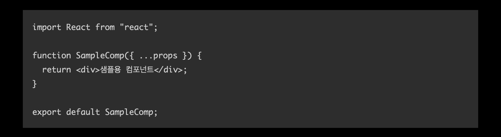
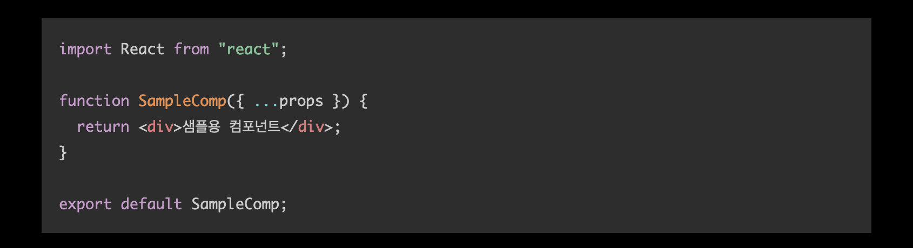
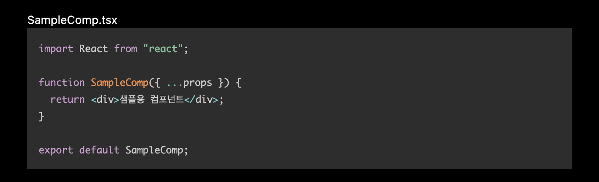
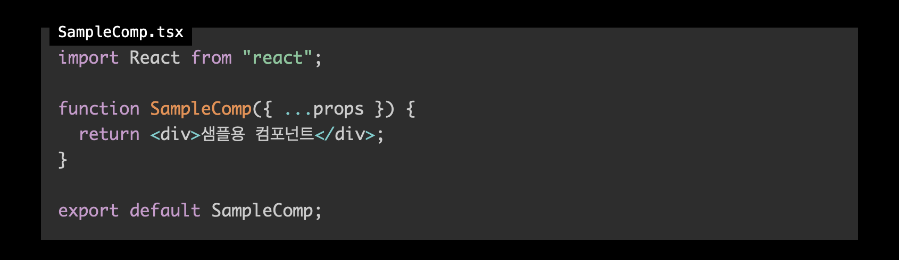
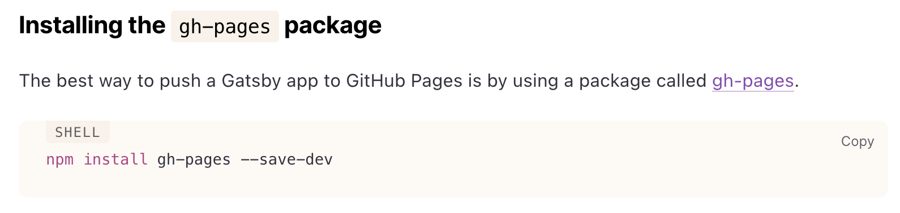
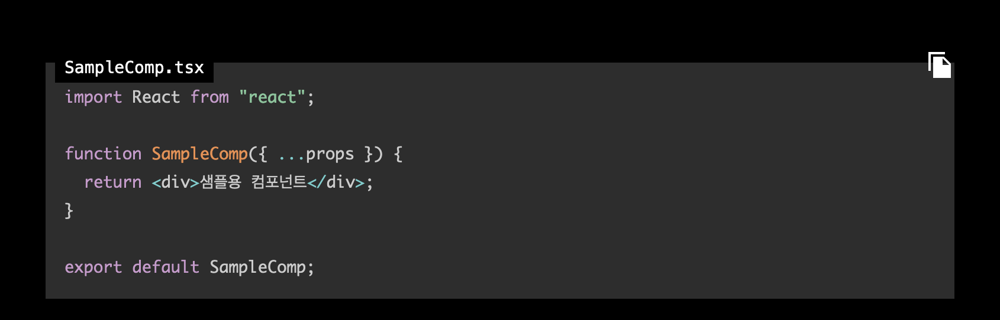
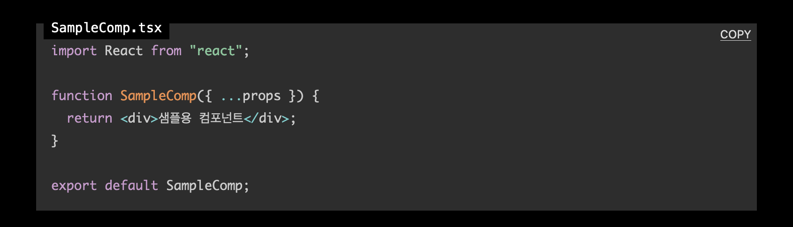

이전 글들에서는 Gatsby [기본 기능을 구현을 위한 튜토리얼을 소개하며 태그 기능을 구현](https://ricale.kr/blog/posts/230111-gatsby-1/)했고, [MDX 글 안에 인라인 이미지와 테이블을 삽입](https://ricale.kr/blog/posts/230112-gatsby-2/)했으며, [시리즈 기능도 만들어](https://ricale.kr/blog/posts/230119-gatsby-3-series/)보았고, [임시글 기능도 구현](https://ricale.kr/blog/posts/230122-gatsby-4-drafts/)했고, [Google Analytics 도 적용](https://ricale.kr/blog/posts/230126-gatsby-5-ga/)해보았으며, [목차 자동 생성 기능](https://ricale.kr/blog/posts/230128-gatsby-6-toc/) 및 [sticky 스타일](https://ricale.kr/blog/posts/230206-gatsby-7-sticky-toc/)까지 구현했고, 추가로 [댓글 기능](https://ricale.kr/blog/posts/230211-gatsby-8-comments/)도 구현한 뒤 [RSS 피드도 적용](https://ricale.kr/blog/posts/230219-gatsby-9-rss-feed/)했다.

이번에는 코드블록을 개선해보자.

# 1. 개요

코드블록은 마크다운에서 아래와 같은 문법을 썼을 때

````
```js
import React from "react";

function SampleComp({ ...props }) {
  return <div>샘플용 컴포넌트</div>;
}

export default SampleComp;
```
````

아래처럼 보여주는 기능을 말한다.



여기에 우리는 세 가지 기능을 적용해 볼 것이다.

1. 문법 하이라이팅
2. 코드블록 제목
3. 코드블록 내용 복사 기능

# 2. 구현

문법 하이라이팅은 플러그인을 사용해 간단히 구현할 것이다. 코드블록 제목과 코드블록 내용 복사 기능은 기존의 플러그인만으로는 조금 아쉽기 때문에 플러그인을 조금 고쳐서 적용해볼 것이다.

## 2.1. 문법 하이라이팅 - `gatsby-remark-prismjs`

문법 하이라이팅 방법은 간단하다. `gatsby-remark-prismjs` 플러그인을 적용해주면 된다.

먼저 설치하고

```shell{promptUser: ricale}
npm install gatsby-remark-prismjs prismjs
```

설정도 추가해주자.

```ts{13-18}:title=gatsby-config.ts
// ...

const config: GatsbyConfig = {
  // ...
  plugins: [
    // ...
    {
      resolve: "gatsby-plugin-mdx",
      options: {
        // ...
        gatsbyRemarkPlugins: [
          // ...
          {
            resolve: "gatsby-remark-prismjs",
            options: {
              // 인라인 코드 블록 (`code`) 에는 별도의 하이라이팅을 하지 않겠다는 설정
              noInlineHighlight: true,
            },
          },
        ],
      },
    }
  ],
};
```

마지막으로 테마도 적용해줘야 한다. `gatsby-browser.ts` 에서 적용하자.

```ts:title=gatsby-browser.ts
require("prismjs/themes/prism-solarizedlight.css")
```

여기서 어떤 테마를 적용할 수 있는지는 [prismjs](https://prismjs.com/) 공식 페이지에서 볼 수 있다. 테마마다 어떤 css 파일을 import 해야하는지는 [이 목록](https://github.com/PrismJS/prism/tree/1d5047df37aacc900f8270b1c6215028f6988eb1/themes)을 참고하자.

여기까지 적용하면 아래처럼 코드가 문법에 맞춰 하이라이팅 된 것을 볼 수 있다.



이 외에도 `gatsby-remark-prismjs` 플러그인은 아래의 유용한 기능들을 옵션으로 제공한다.

- 쉘 스크립트 문법을 위한 프롬프트 추가
- 특정 라인 하이라이팅 추가
- 라인 넘버링 추가

이 옵션들은 [공식 문서](https://github.com/gatsbyjs/gatsby/tree/master/packages/gatsby-remark-prismjs)에 잘 설명되어 있으니 필요하다면 해당 문서를 참고하자.

## 2.2. 코드블록에 제목 삽입

코드블록에 해당 코드가 포함된 파일명 등으로 제목을 넣고 싶을 수 있다. 맨 윗줄에 주석으로 제목을 표시할 수도 있지만 그다지 예쁘지는 않다. 제목을 넣을 수 있는 기능을 적용해보자.

### 2.2.1. `gatsby-remark-code-titles`

[`gatsby-remark-code-titles`](https://github.com/DSchau/gatsby-remark-code-titles) 플러그인을 적용하면 쉽게 제목을 추가할 수 있다.

```sh
npm i gatsby-remark-code-titles
```

설치한 뒤 아래처럼 설정을 추가하면 된다.

```ts{13-18}:title=gatsby-config.ts
// ...

const config: GatsbyConfig = {
  // ...
  plugins: [
    // ...
    {
      resolve: "gatsby-plugin-mdx",
      options: {
        // ...
        gatsbyRemarkPlugins: [
          // ...
          {
            resolve: 'gatsby-remark-code-titles',
            options: {
              className: 'your-custom-class-name',
            },
          },
          {
            resolve: "gatsby-remark-prismjs",
            options: {
              noInlineHighlight: true,
            },
          },
        ],
      },
    }
  ],
};
```

이제 MDX 내에서 코드블록을 작성할 때 아래처럼 제목을 넣어줄 수 있다.

````
```js:title=SampleComp.tsx
import React from "react";

function SampleComp({ ...props }) {
  return <div>샘플용 컴포넌트</div>;
}

export default SampleComp;
```
````

그러면 아래처럼 적용된 것을 볼 수 있다.



제목이 좀 밋밋해 보인다면 스타일을 수정해서 예쁘게 꾸미자.

### 2.2.2. `gatsby-remark-code-titles` 를 수정해서 사용

그런데 스타일을 수정하려고 보니 마음에 들지 않는 점이 있다. 플러그인을 적용하고 제목을 지정하면 해당 MDX 구문은 아래처럼 HTML 로 나온다.

```html
<div>
  <div class="gatsby-code-title">SampleComp.tsx</div>
</div>
<div>
  <div class="gatsby-highlight" data-language="ts">
    <pre class="language-ts">
      <code class="language-ts">
        <!-- 코드블록 본문 -->
      </code>
    </pre>
  </div>
</div>
```

물론 이 구조만으로도 충분히 `gatsby-code-title` 클래스로 예쁘게 스타일을 지정할 수 있다. (만약 이 구조에 만족한다면 이 섹션을 읽지 않아도 괜찮다. 바로 2.3. 으로 넘어가자.)

하지만 나는 마음에 들지 않았다. 내가 원하는 구조는 아래 같은 구조였다.

```html
<div class="codeblock-container">
  <div class="codeblock-title">SampleComp.tsx</div>
  <div>
    <div class="gatsby-highlight" data-language="ts">
      <pre class="language-ts">
        <code class="language-ts">
          <!-- 코드블록 본문 -->
        </code>
      </pre>
    </div>
  </div>
</div>
```

이렇게 코드블록 제목과 본문을 같이 어우르는 컨테이너가 있어야 코드블록 제목에 `position: absolute;` 스타일을 달아서 내가 원하는 모양으로 만들 수 있었다. 하지만 `gatsby-remark-code-titles` 플러그인은 HTML 구조를 바꿀 수 있는 기능을 지원해주지는 않았다.

그렇다면 이전 글들에서 계속 해왔던대로 `gatsby-remark-code-titles` 플러그인 코드를 복사해와서 조금 고쳐서, 내부 플러그인으로 `gatsby-remark-codeblock` 플러그인을 작성해보자.

```js{24-39}:title=plugins/gatsby-remark-codeblock/index.js
// https://github.com/DSchau/gatsby-remark-code-titles 의 코드를 토대로 작성

const visit = require("unist-util-visit");
const qs = require("query-string");

module.exports = function gatsbyRemarkCodeTitles({ markdownAST }) {
  visit(markdownAST, "code", (node, index, parent) => {
    const [language, params] = (node.lang || "").split(":");
    const options = qs.parse(params);
    const { title, ...rest } = options;
    if (!title || !language) {
      return;
    }

    let newQuery = "";
    if (Object.keys(rest).length) {
      newQuery =
        `:` +
        Object.keys(rest)
          .map((key) => `${key}=${rest[key]}`)
          .join("&");
    }

    parent.children.splice(index, 1, {
      type: "parent",
      children: [
        {
          type: "parent",
          children: [{ type: "text", value: title }],
          data: {
            hProperties: { className: "codeblock-title" },
          },
        },
        node,
      ],
      data: {
        hProperties: { className: "codeblock-container" },
      },
    });

    node.lang = language + newQuery;
  });

  return markdownAST;
};

```

이제 MDX 가 원하는 형태의 HTML 로 변환되어 나온다. 스타일도 적용해보자.

```scss:title=src/components/MdxContent/codeblockCss.ts
const codeblockCss = css`
  // ...
  .codeblock-container {
    position: relative;
    padding-top: 0.1px;
    .codeblock-title {
      position: absolute;
      top: 0px;
      left: 8px;
      padding: 2px 8px;

      font-size: 0.875rem;
      font-family: consolas, monospace;
      background-color: #000000;
    }
    .codeblock-title + div pre[class*="language-"] {
      margin-top: 8px;
    }
  }
`;
```

이제 원하는대로 제목이 노출된다.



## 2.3. 코드블록에 복사 버튼 삽입

기술 문서나 기술 블로그를 돌아다니다 보면 코드블록의 내용을 클립보드에 복사할 수 있는 버튼이 포함되어 있는 경우가 있다.



이것도 넣어보자.

### 2.3.1. `gatsby-remark-code-buttons`

[`gatsby-remark-code-buttons`](https://github.com/iamskok/gatsby-remark-code-buttons) 플러그인을 적용하면 쉽게 복사 버튼을 추가할 수 있다.

```sh
npm i gatsby-remark-code-buttons
```

설치한 뒤 아래처럼 설정을 추가하면 된다.

```ts{13}:title=gatsby-config.ts
// ...

const config: GatsbyConfig = {
  // ...
  plugins: [
    // ...
    {
      resolve: "gatsby-plugin-mdx",
      options: {
        // ...
        gatsbyRemarkPlugins: [
          // ...
          'gatsby-remark-code-buttons',
        ],
      },
    }
  ],
};
```

공식 문서에는 MDX 를 지원하지 않는다고 적혀있지만 ("This plugin doesn't support MDX. Example of MDX copy button.") 클립보드 복사 기능 자체는 문제 없이 동작한다.



스타일은 직접 (관련 엘리먼트들의 클래스 이름을) 지정할 수 있는 많은 옵션을 제공하므로, 플러그인의 공식 문서를 참고하자.

### 2.3.2. `gatsby-remark-code-buttons` 를 수정해서 사용

그런데 이 플러그인도 2.2.1. 의 `gatsby-remark-code-titles` 와 동일한 이슈가 있다. HTML 구조가 마음에 들지 않는다는 것이다.

그러니 이번에도 플러그인의 코드를 참고해서 2.2.2. 에서 만든 내부 플러그인에 복사 버튼 기능을 추가하자.

(`gatsby-remark-code-buttons` 의 기본 기능에 만족한다면 이 섹션은 넘어가도 된다. 2.4. 로 가자.)

먼저 복사 버튼 엘리먼트를 추가할 것이다.

```js{14,26-39}:title=plugins/gatsby-remark-codeblock/index.js
// ...

const { CONTAINER_CLASS, BUTTON_CLASS } = require("./constants");

const TITLE_CLASS = "codeblock-title";
const BUTTON_LABEL = "COPY";

module.exports = function gatsbyRemarkCodeTitles({ markdownAST }) {
  visit(markdownAST, "code", (node, index, parent) => {
    const [language, params] = (node.lang || "").split(":");
    const options = qs.parse(params);
    const {
      title,
      hideCopyButton, // 복사버튼을 표시하지 않고 싶을 때 사용할 옵션
      ...rest
    } = options;
    if (!language) {
      return;
    }

    parent.children.splice(index, 1, {
      type: "parent",
      children: [
        // ...
        node,
        // `hideCopyButton` 옵션이 지정되지 않았다면
        // 코드블록 본문 뒤에 복사 버튼을 추가한다.
        ...(hideCopyButton
          ? []
          : [
              {
                type: "parent",
                children: [{ type: "text", value: BUTTON_LABEL }],
                data: {
                  hName: "button",
                  hProperties: { className: BUTTON_CLASS },
                },
              },
            ]),
      ],
      data: {
        hProperties: { className: CONTAINER_CLASS },
      },
    });

    // ...
  });

  return markdownAST;
};
```

그리고 복사 기능을 `plugins/gatsby-remark-codeblock/gatsby-browser.js` 에 구현해주자.

이 부분은 `gatsby-remark-code-buttons` 의 구현을 대부분 가져오지 않고 직접 구현했는데 이유는 두 가지가 있다.

- 해당 플러그인에는 엘리먼트의 클래스 이름 및 문구들을 직접 지정할 수 있는 옵션이 많이 었었지만, 나 혼자 쓸 플러그인에 그런 기능은 필요 없으므로 모두 뺐다.
- 해당 플러그인에서는 복사 기능을 `document.execCommand('copy');` API 를 사용해 구현했는데, 이건 근래에 [권장되는 방식이 아니](https://developer.mozilla.org/en-US/docs/Web/API/Document/execCommand)므로 `navigator.clipboard` API 를 사용해 구현했다.

```js:title=plugins/gatsby-remark-codeblock/gatsby-browser.js
const { BUTTON_CLASS, CONTAINER_CLASS } = require("./constants");

require("./toast.css");

const TOAST_CLASS = "codeblock-copy-toast";
const TOAST_MESSAGE_CLASS = "codeblock-copy-toast-message";
const TOAST_MESSAGE = "코드가 복사되었습니다.";
const TOAST_DURATION = 2000;

// `onClientEntry` 은 브라우저 런타임 환경이 실행될 때 실행된다.
// `window.onload`` 혹은 `document.addEventListener("DOMContentLoaded")`` 를 생각하면 된다.
exports.onClientEntry = () => {
  document.querySelector("body").addEventListener("click", async (evt) => {
    const targetElement = evt.target;
    if (targetElement.className !== BUTTON_CLASS) {
      return;
    }

    // 눌린 버튼의 코드블록 본문 엘리먼트를 찾아내 내용을 가져온다.
    const code = targetElement
      .closest(`.${CONTAINER_CLASS}`)
      .querySelector("pre").innerText;

    // 위에서 가져온 내용을 클립보드에 넣는다.
    await navigator.clipboard.writeText(code);

    // 복사가 성공했음을 알리는 토스트 엘리먼트를 만들어서 보여준다.
    const toastElement = document.createElement("div");
    toastElement.className = TOAST_CLASS;
    toastElement.innerHTML = `
      <div class="${TOAST_MESSAGE_CLASS}">${TOAST_MESSAGE}</div>
    `.trim();
    document.body.appendChild(toastElement);
    setTimeout(() => {
      document.body.removeChild(toastElement);
    }, TOAST_DURATION);
  });
};

```

이제 복사 버튼이 잘 추가된 걸 확인할 수 있다.



눌러보면 잘 동작한다.

## 2.4. 상세 코드

위 코드 조각들은 생략된 부분이 있으므로, 코드 전문을 보고 싶다면 아래를 참고하자.

- [gatsby-config.ts](https://github.com/ricale/blog/blob/58aa51105b654f814f32b1cc8a3e8b476bd00c3d/gatsby-config.ts#L39)
  - [config/plugins/getGatsbyPluginMdxConfig.ts](https://github.com/ricale/blog/blob/58aa51105b654f814f32b1cc8a3e8b476bd00c3d/config/plugins/getGatsbyPluginMdxConfig.ts#L7)
- [gatsby-browser.ts](https://github.com/ricale/blog/blob/58aa51105b654f814f32b1cc8a3e8b476bd00c3d/gatsby-browser.ts)
- plugins/gatsby-remark-codeblock
  - [plugins/gatsby-remark-codeblock/index.js](https://github.com/ricale/blog/blob/58aa51105b654f814f32b1cc8a3e8b476bd00c3d/plugins/gatsby-remark-codeblock/index.js)
  - [plugins/gatsby-remark-codeblock/gatsby-browser.js](https://github.com/ricale/blog/blob/58aa51105b654f814f32b1cc8a3e8b476bd00c3d/plugins/gatsby-remark-codeblock/gatsby-browser.js)
  - [plugins/gatsby-remark-codeblock/constants.js](https://github.com/ricale/blog/blob/58aa51105b654f814f32b1cc8a3e8b476bd00c3d/plugins/gatsby-remark-codeblock/constants.js)
  - [plugins/gatsby-remark-codeblock/toast.css](https://github.com/ricale/blog/blob/58aa51105b654f814f32b1cc8a3e8b476bd00c3d/plugins/gatsby-remark-codeblock/toast.css)
  - [plugins/gatsby-remark-codeblock/package.json](https://github.com/ricale/blog/blob/58aa51105b654f814f32b1cc8a3e8b476bd00c3d/plugins/gatsby-remark-codeblock/package.json)
- [src/components/MdxContent/codeblockCss.ts](https://github.com/ricale/blog/blob/58aa51105b654f814f32b1cc8a3e8b476bd00c3d/src/components/MdxContent/codeblockCss.ts)

## 3. 다음

이로서 코드블록 관련 기능을 구현해보았다. 이제 다음에 정리할 것은 "GitHub Pages 배포" 정도만 남은 것 같다.

## 4. 참고

- [gatsby/packages/gatsby-remark-prismjs](https://github.com/gatsbyjs/gatsby/tree/master/packages/gatsby-remark-prismjs)
- [gatsby-remark-code-titles](https://github.com/DSchau/gatsby-remark-code-titles)
- [gatsby-remark-code-buttons](https://github.com/iamskok/gatsby-remark-code-buttons)
