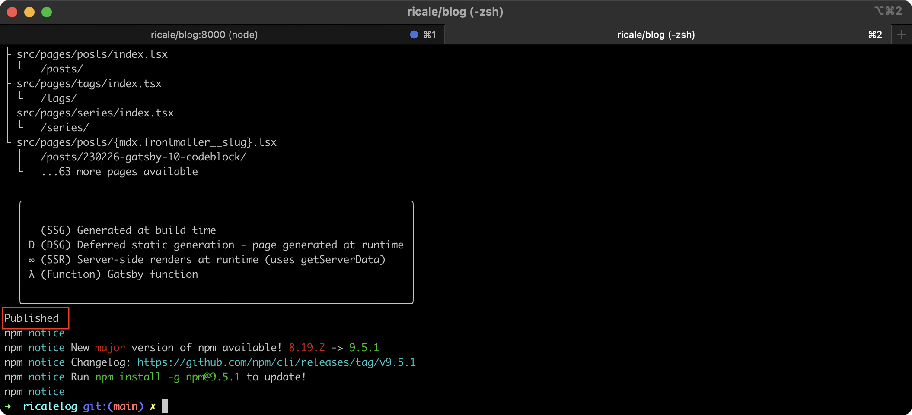
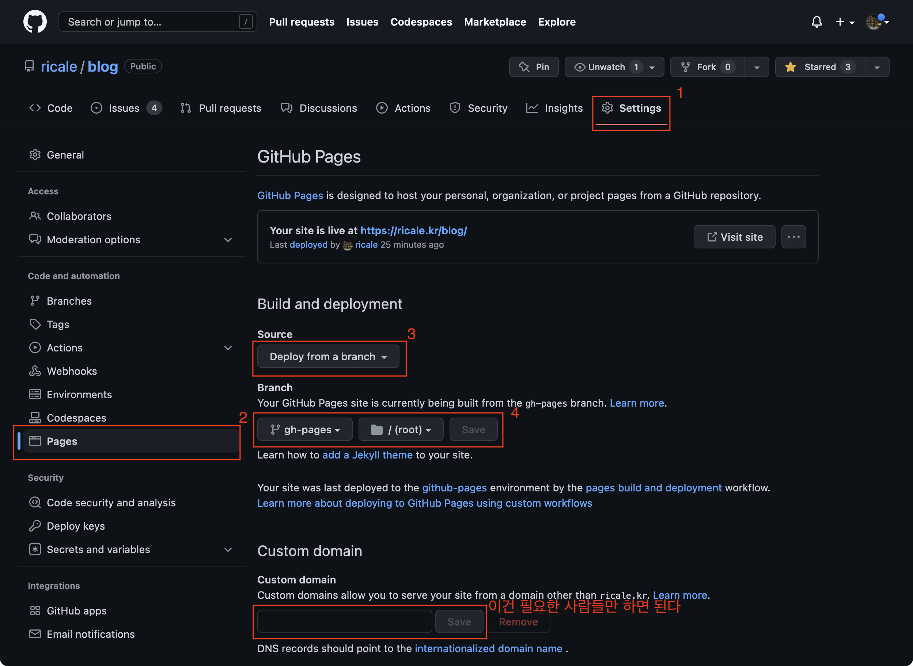
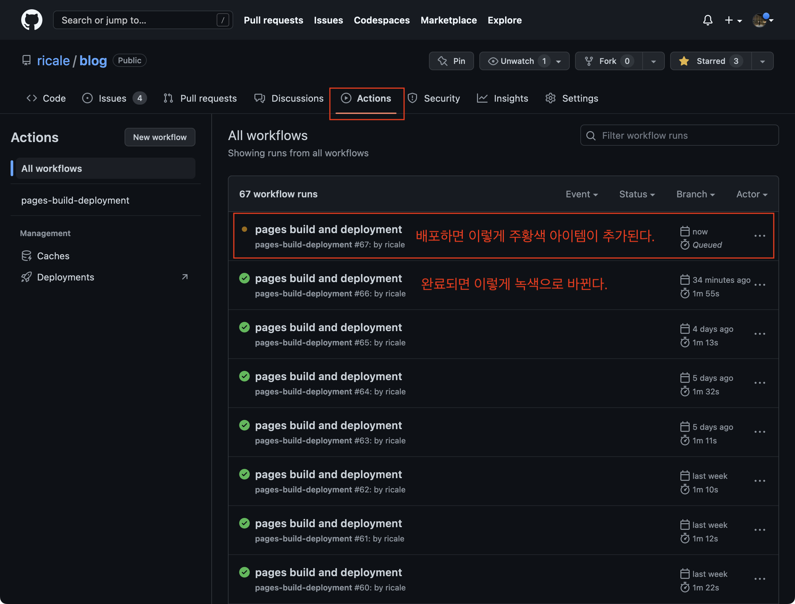
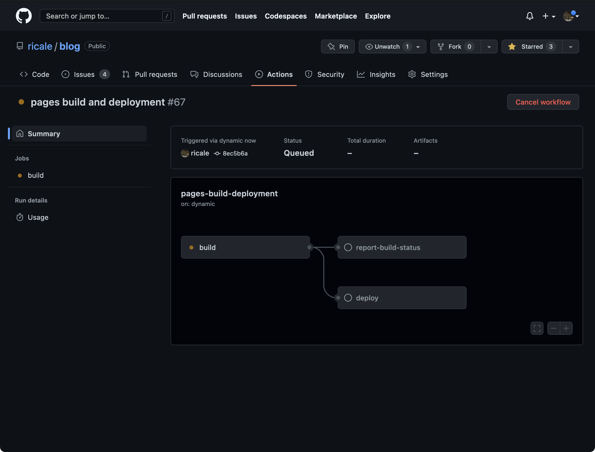
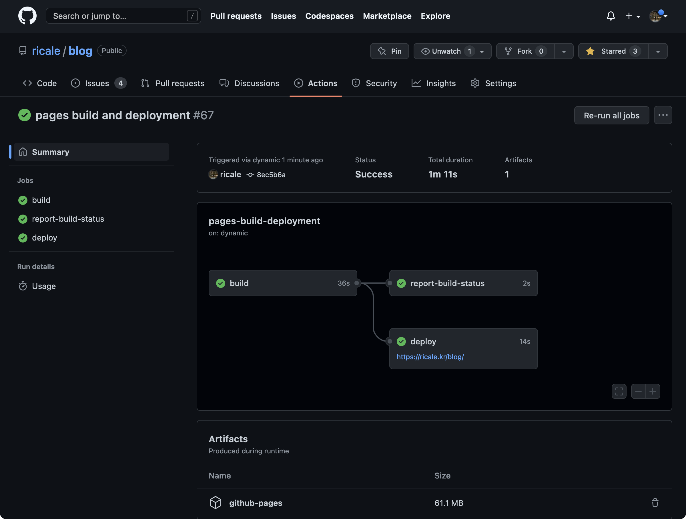

이전 글들에서는 Gatsby [기본 기능을 구현을 위한 튜토리얼을 소개하며 태그 기능을 구현](https://ricale.kr/blog/posts/230111-gatsby-1/)했고, [MDX 글 안에 인라인 이미지와 테이블을 삽입](https://ricale.kr/blog/posts/230112-gatsby-2/)했으며, [시리즈 기능도 만들어](https://ricale.kr/blog/posts/230119-gatsby-3-series/)보았고, [임시글 기능도 구현](https://ricale.kr/blog/posts/230122-gatsby-4-drafts/)했고, [Google Analytics 도 적용](https://ricale.kr/blog/posts/230126-gatsby-5-ga/)해보았으며, [목차 자동 생성 기능](https://ricale.kr/blog/posts/230128-gatsby-6-toc/) 및 [sticky 스타일](https://ricale.kr/blog/posts/230206-gatsby-7-sticky-toc/)까지 구현했고, 추가로 [댓글 기능](https://ricale.kr/blog/posts/230211-gatsby-8-comments/)도 구현한 뒤 [RSS 피드도 적용](https://ricale.kr/blog/posts/230219-gatsby-9-rss-feed/)한데다가 [코드블록을 개선](https://ricale.kr/blog/posts/230226-gatsby-10-codeblock/)하기까지 했다.

이제 마지막으로 구현한 블로그를 GitHub Pages 에 배포해보자.

# 1. 개요

이제 구현한 Gatsby 블로그를 다른 사랆들도 볼 수 있도록 배포해 볼 것이다.

(어쩌다보니 이 글을 시리즈의 열한번째로 작성하고 있지만, 실제로 작업한 순서대로 글을 작성했다면 이 글은 시리즈의 두세번째 글이 되었을 것이다.)

Gatsby 에서는 [Gatsby Cloud 에 배포하는 것을 권장](https://www.gatsbyjs.com/docs/how-to/previews-deploys-hosting/deploying-to-gatsby-cloud/)하고 있지만, 나는 이미 도메인을 GitHub Pages 에 등록해놓고 사용하고 있으므로 GitHub Pages 에 배포할 것이다. 만약 Gatsby 의 권장대로 하고 싶다면 [해당 글](https://www.gatsbyjs.com/docs/how-to/previews-deploys-hosting/deploying-to-gatsby-cloud/)을 참고하자.

이미 Gatsby 공식 문서에도 [GitHub Pages 배포에 대한 안내 문서](https://www.gatsbyjs.com/docs/how-to/previews-deploys-hosting/how-gatsby-works-with-github-pages/)가 있고 해당 글이 잘 정리되어 있으므로 영어가 불편하지 않다면 해당 글을 읽는 것을 권한다. 이 글은 기록을 위한 글일 뿐이고, 해당 글을 답습하는 글이다.

# 2. 구현

## 2.1. GitHub Pages

[GitHub Pages](https://pages.github.com/) 는 GitHub 에서 제공하는 정적 사이트 호스팅이다. 당연히 사용을 위해서는 GitHub 아이디가 필요하며, 소스코드 관리 또한 GitHub 리포지토리에서 해야만 한다.

(만약 GitHub 을 사용하기 싫다면 Gatsby 에서 [AWS Amplify](https://www.gatsbyjs.com/docs/how-to/previews-deploys-hosting/deploying-to-aws-amplify/), [Azure Static Web Apps](https://www.gatsbyjs.com/docs/how-to/previews-deploys-hosting/deploying-to-azure/), [Firebase](https://www.gatsbyjs.com/docs/how-to/previews-deploys-hosting/deploying-to-firebase/), [Heroku](https://www.gatsbyjs.com/docs/how-to/previews-deploys-hosting/deploying-to-heroku/), [Vercel](https://www.gatsbyjs.com/docs/how-to/previews-deploys-hosting/deploying-to-vercel/) 등에 배포하는 방법도 안내하고 있으므로 [해당 글들 목록](https://www.gatsbyjs.com/docs/how-to/previews-deploys-hosting/)을 참고하자.)

## 2.2. `gh-pages` 로 배포

JavaScript 에는 GitHub Pages 배포 기능을 제공하는 [gh-pages](https://github.com/tschaub/gh-pages) 라는 훌륭한 모듈이 있다. 우리는 해당 모듈을 사용할 것이다.

해당 모듈을 설치하자.

```sh
npm i gh-pages --save-dev
```

그리고 `package.json` 의 `scripts` 에 아래 명령어를 추가하자.

```js:title=package.json
{
  // ...
  "scripts": {
    // ...
    // 배포 대상이 sub path 가 아닐 경우 `--prefix-paths` 옵션은 필요없다.
    // (예, `MYDOMAIN.COM`, `username.github.io`)
    "deploy": "gatsby build && gh-pages -d public -b main"

    // sub path 에 배포할 경우 `--prefix-paths` 옵션이 필요하다.
    // (예, `MYDOMAIN.COM/subpath/`, `username.github.io/reponame/`)
    "deploy": "gatsby build --prefix-paths && gh-pages -d public",
  },
  // ...
}
```

만약에 sub path 에 배포할 경우 `gatsby-config.ts` 에 `pathPrefix` 값도 넣어주어야 한다.

```ts:title=gatsby-config.ts
// ...
const config: GatsbyConfig = {
  pathPrefix: "/blog",
  // ...
}
```

그리고 프로젝트의 루트 디렉토리에서 아래 명령어를 실행하자.

```sh
npm run deploy
```

그러면 자동으로 배포가 진행된다.



## 2.3. GitHub 리포지토리 설정 확인

(이 설정을 배포 전에 해줘야 했던가, 아니면 최초 배포 시 자동으로 기본값이 들어가던가 기억나지 않는다.)

위 명령어를 실행했는데 배포가 되지 않았다면 스크린샷처럼 리포지토리 설정 페이지를 확인하면 된다.



## 2.4. GitHub Actions 에서 배포 확인

GitHub 리포지토리의 Actions 페이지에 들어가면 배포 진행 상황을 볼 수 있다.



각 아이템을 클릭하면 상세 진행 상태도 볼 수 있다.



배포가 잘 완료되면 아래처럼 모두 녹색불이 들어온다.



배포가 실패했다면 실패 이유도 알려준다.


## 2.5. 배포 대상 도메인에서 확인

이제 블로그 주소에 접속하면 배포가 잘 된 것을 확인할 수 있다.


# 3. 다음

드디어 "Gatsby 블로그 구현" 정리는 일단락되었다. 추가로 구현/수정하는게 생기면 또 정리하도록 하겠다.

당분간 "다음"은 없다.

# 4. 참고

- [How Gatsby Works with GitHub Pages](https://www.gatsbyjs.com/docs/how-to/previews-deploys-hosting/how-gatsby-works-with-github-pages/)
