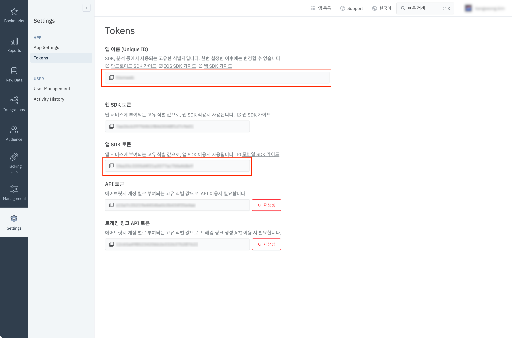
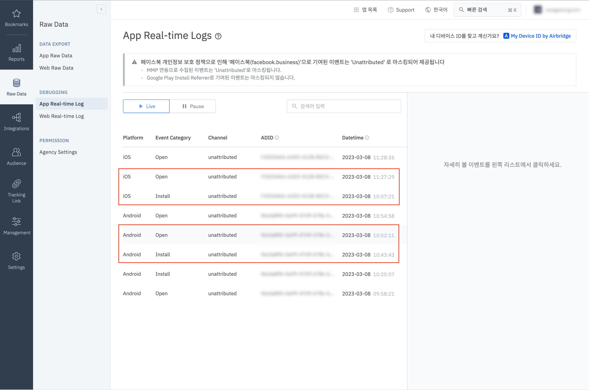

# 1. 개요

에어브릿지Airbridge 는 모바일 앱의 마케팅 성과 분석을 위한 솔루션이다. 앱 안에 SDK 를 삽입하면 사용자가 어떤 광고를 통해 앱에 들어왔으며 어떤 액션까지 (요컨대 설치만 했는지, 가입까지 했는지, 결제까지 했는지) 도달했는지를 추적해준다. 마케터는 분석된 결과를 통해 어떤 광고의 효과가 더 좋은지 알 수 있으며 다음 광고 전략 수립에 참고할 수 있다.

사용을 위해서는 에어브릿지가 제공하는 SDK 를 앱 내에 설치해줘야 한다. 문제는 우리 회사의 서비스가 React Native 하이브리드 앱(앱은 껍데기일 뿐 앱 내에 있는 웹뷰에서 동작하는 웹앱이 본체인 앱)인데 반해, 하이브리드 앱 설정을 위한 공식 문서는 안드로이드, iOS 만 있다는 것이었다.

관련해서 에어브릿지 측에 문의하면 아래와 같은 취지의 답변을 받을 수 있다. (정확한 워딩은 더 친절했지만, 그대로 옮기지는 않겠다.)

> React Native 는 웹뷰와 관련해서 고객사마다 사용 방법이 다양해서 통일된 방법을 제공하지 못하고 있다. 그러니 안드로이드/iOS 의 하이브리드 앱 설정 문서를 참고해서 설정하시길 바란다.

즉, React Native SDK 와 웹뷰 내 웹앱의 웹 SDK 의 연결을 문서 없이 직접 해줘야 한다는 소리다. 그것도 안드로이드 자바 코드와 iOS Objective-C 코드를 직접 건드려서 말이다. 문제는 나는 그 둘에 대해 거의 모른다는 것이고, 사내의 다른 개발자들도 마찬가지라는 것이다.

하지만 어째겠는가. 어떻게든 해내야 하지 않겠는가. 결국 꽤 많은 검색과 삽질을 했고, 겨우 연동에 성공했다. 이 글은 나같이 안드로이드나 iOS 개발을 전혀 모르는 사람을 위해, 그리고 혹시 같은 일을 반복할지도 모르는 미래의 자신을 위해 작성한다.

# 2. 적용

## 2.1. 에어브릿지 React Native SDK 적용

React Native SDK 적용은 [공식 문서에도 잘 정리되어있다](https://developers.airbridge.io/docs/react-native-sdk). 기록을 위해 여기에도 간단히 정리해보자.

먼저 설치를 하자.

```sh
yarn add airbridge-react-native-sdk
```

iOS 라면 `pod install` 을 잊지 말자

```sh
cd ios
pod install
```

그리고 안드로이드는 `MainApplication.java` 에 아래처럼 추가해주자.

```java{3,10}:title=MainApplication.java
// ...

import co.ab180.airbridge.reactnative.AirbridgeRN;

// ...

@Override
public void onCreate() {
    super.onCreate();
    AirbridgeRN.init(this, "APP_NAME", "APP_TOKEN");
    // ...
}
```

`"APP_NAME"`과 `"APP_TOKEN"`은 에어브릿지 대시보드에서 확인할 수 있다.



iOS 는 아래처럼 `AppDelegate.m` 에 추가해주자.

```objectivec{3,8}:title=AppDelegate.m
// ...

#import <AirbridgeRN/AirbridgeRN.h>

//...

- (BOOL)application:(UIApplication *)application didFinishLaunchingWithOptions:(NSDictionary *)launchOptions {
    [AirbridgeRN getInstance:@"APP_TOKEN" appName:@"APP_NAME" withLaunchOptions:launchOptions];
    ...
}
```

이렇게하면 아래처럼 안드로이드/iOS 의 앱 설치 및 실행 이벤트는 확인할 수 있다.



## 2.2. 하이브리드 앱 설정 적용 - 안드로이드

일반적인 React Native 앱이라면 2.1. 설정만으로 충분하다. 하지만 하이브리드 앱이라면 안드로이드를 위한 추가적인 설정이 필요하다. 왜냐하면 웹뷰 내 웹앱에서 발생하는 이벤트를 웹앱의 이벤트가 아닌 네이티브앱의 이벤트로 변경해서 에어브릿지에 전달해야 하기 때문이다. (웹앱 내에는 이미 웹 SDK 가 설치 및 적용되어 있다고 가정한다.)

에어브릿지 공식 문서에는 React Native 하이브리드 앱 설정에 관한 문서는 없지만 안드로이드 하이브리드 앱 설정에 관한 문서는 존재한다. 해당 문서에는 웹뷰를 사용중인 액티비티에서 아래와 같이 코드를 작성하라고 되어 있다.

```java
public class MainActivity extends Activity {

    @Override
    protected void onCreate(Bundle savedInstanceState) {
        super.onCreate(savedInstanceState);
        setContentView(R.layout.activity_main);
        initWebView();
    }

    void initWebView() {
        webView = findViewById(R.id.webView);
        webView.getSettings().setJavaScriptEnabled(true);
        webView.getSettings().setDomStorageEnabled(true);

        Airbridge.setJavascriptInterface(webView, "WEB_TOKEN");

        webView.setWebChromeClient(new WebChromeClient());
        webView.setWebViewClient(new WebViewClient());
        webView.loadUrl("http://dev.blog.airbridge.io/websdk-web-app/");
    }
}
```

하지만 React Native 는 당연히 이런 코드를 삽입할 수 없다. 왜냐하면 React Native 에서 기본적으로 제공해주는 `MainActivity` 에서는 `react-native-webview` 라이브러리의 초기화에 관여할 수 없기 때문이다. 그렇다면 우리는 다른 방법을 찾아야 한다.

다행히도 `react-native-webview` 측은 이런 상황이 있을 수 있다는 것을 알고 있었던 것 같다. 그래서 자신들의 네이티브 컴포넌트를 래핑해서(정확히는 상속받아서) 사용할 수 있는 방법을 [정리해서 문서로 제공](https://github.com/react-native-webview/react-native-webview/blob/master/docs/Custom-Android.md)하고 있다.

### 2.2.1. `react-native-webview` 를 상속 받는 네이티브 컴포넌트 작성

먼저 `react-native-webview` 의 컴포넌트를 상속받을 안드로이드 네이티브 컴포넌트 `CustomWebViewManager` 를 작성하자.

```java{6,8,10-11,20-26,28-30,32-35,37-39,41-44}:title=android/app/src/main/java/.../CustomWebViewManager.java
package com.packages.your;

import android.webkit.WebView;

import com.facebook.react.uimanager.ThemedReactContext;
import com.reactnativecommunity.webview.RNCWebViewManager;

import co.ab180.airbridge.Airbridge;

// RNCWebViewManager 를 상속 받아서 CustomWebViewManager 를 만들자
public class CustomWebViewManager extends RNCWebViewManager {
  protected static final String REACT_CLASS = "RCTCustomWebView";
  protected static class CustomWebViewClient extends RNCWebViewClient { }

  protected static class CustomWebView extends RNCWebView {
    public CustomWebView(ThemedReactContext reactContext) {
      super(reactContext);
    }
  }

  // 에어브릿지 문서의 안드로이드 하이브리드 앱 설정을 적용하기 위해서는
  // `createViewInstance` 메서드를 오버라이드해서 적용하는 것이 적절하다.
  @Override
  protected WebView createViewInstance(ThemedReactContext reactContext) {
    // 부모의 `createViewInstance` 를 사용해서 기본 웹뷰 인스턴스를 가져오자
    RNCWebView webView = (RNCWebView) super.createViewInstance(reactContext);

    // 에어브릿지에서 요구하는 설정 두 개를 활성화해주자.
    webView.getSettings().setJavaScriptEnabled(true);
    webView.getSettings().setDomStorageEnabled(true);

    // 안드로이드 네이티브와 웹뷰 내 웹앱을 연결하자.
    // 여기서 주의할 것은 두 번째 인자로 넣어주는 토큰이 WEB_TOKEN 이라는 것이다.
    // 2.1. 에서 사용했던 APP_TOKEN 과는 다르다.
    Airbridge.setJavascriptInterface(webView, "WEB_TOKEN");

    // 아래 두 줄은 왜 사용하지 않냐면 `RNCWebViewManager` 에서 아래 두 줄에 해당하는 설정을 이미 해주고 있기 때문이다.
    // webView.setWebChromeClient(new WebChromeClient());
    // webView.setWebViewClient(new WebViewClient());

    // 에어브릿지에서 필요한 파일을 로드하는 것으로 추정된다.
    webView.loadUrl("http://dev.blog.airbridge.io/websdk-web-app/");
    return webView;
  }

  @Override
  protected RNCWebView createRNCWebViewInstance(ThemedReactContext reactContext) {
    return new CustomWebView(reactContext);
  }

  @Override
  public String getName() {
    return REACT_CLASS;
  }

  @Override
  protected void addEventEmitters(ThemedReactContext reactContext, WebView view) {
    view.setWebViewClient(new CustomWebViewClient());
  }
}
```

이걸로 끝이 아니다. React Native 에서 안드로이드 네이티브 컴포넌트를 작성할 때는 `*Package` 파일도 항상 같이 작성해주어야 한다. `CustomWebViewPackage` 를 아래처럼 작성하자.

```java:title=android/app/src/main/java/.../CustomWebViewPackage.java
package com.packages.your;

import androidx.annotation.NonNull;

import com.facebook.react.ReactPackage;
import com.facebook.react.bridge.NativeModule;
import com.facebook.react.bridge.ReactApplicationContext;
import com.facebook.react.uimanager.ViewManager;

import java.util.Arrays;
import java.util.Collections;
import java.util.List;

public class CustomWebViewPackage implements ReactPackage {
    @NonNull
    @Override
    public List<NativeModule> createNativeModules(@NonNull ReactApplicationContext reactContext) {
        return Collections.emptyList();
    }

    @Override
    public List<ViewManager> createViewManagers(ReactApplicationContext reactContext) {
        return Arrays.asList(new CustomWebViewManager());
    }
}
```

마지막으로 `MainApplication` 에 이 컴포넌트를 등록해주자. 바로 위에서 작성한 `CustomWebViewPackage` 를 사용하면 된다.

```java{12}:title=android/app/src/main/java/.../MainApplication.java
// ...

public class MainApplication extends Application implements ReactApplication {

  private final ReactNativeHost mReactNativeHost =
      new ReactNativeHost(this) {
        // ...

        @Override
        protected List<ReactPackage> getPackages() {
          // ...
          packages.add(new CustomWebViewPackage());
          return packages;
        }

        // ...
      };

  // ...
}
```

### 2.2.2. 작성한 네이티브 컴포넌트를 React Native 코드에 적용

이제 2.2.1. 에서 작성한 네이티브 컴포넌트를 React Native 코드에서도 쓸 수 있도록 해주자.

방법은 간단하다. `react-native-webview` 를 사용할 때 우리가 작성한 네이티브 컴포넌트를 설정으로 넣어주면 된다.

```jsx{5-6,13-14}:title=WebView.android.jsx
import React, { Component, forwardRef } from 'react';
import { requireNativeComponent } from 'react-native';
import { WebView as RNWebView } from 'react-native-webview';

// 2.2.1. 에서 작성한 네이티브 컴포넌트를 가져오자
const RCTCustomWebView = requireNativeComponent('RCTCustomWebView');

const WebView = forwardRef(({...props}, ref) => {
  return (
    <RNWebView
      {...props}
      ref={ref}
      // react-native-webview 가 사용할 네이티브 컴포넌트를 교체해주자
      nativeConfig={{ component: RCTCustomWebView }}
    />
})

export default WebView;
```

이제 안드로이드에서는 에어브릿지 하이브리드 앱 설정이 잘 적용된다.

## 2.3. 하이브리드 앱 설정 적용 - iOS

일반적인 React Native 앱이라면 2.1. 설정만으로 충분하다. 하지만 하이브리드 앱이라면 iOS 를 위한 추가적인 설정이 필요하다. 왜냐하면 웹뷰 내 웹앱에서 발생하는 이벤트를 웹앱의 이벤트가 아닌 네이티브앱의 이벤트로 변경해서 에어브릿지에 전달해야 하기 때문이다. (웹앱 내에는 이미 웹 SDK 가 설치 및 적용되어 있다고 가정한다.)

에어브릿지 공식 문서에는 React Native 하이브리드 앱 설정에 관한 문서는 없지만 iOS 하이브리드 앱 설정에 관한 문서는 존재한다. 해당 문서에는 웹뷰를 사용중인 클래스에서 아래와 같이 코드를 작성하라고 되어 있다.

```objectivec
WKWebViewConfiguration* configuration = [[WKWebViewConfiguration alloc] init];

WKUserContentController* controller = [[WKUserContentController alloc] init];
[AirBridge.webInterface injectTo:controller withWebToken:@"WEB_TOKEN"];

configuration.userContentController = controller;

WKWebView* webview = [[WKWebView alloc] initWithFrame:CGRectZero configuration:configuration];
```

하지만 React Native 는 당연히 이런 코드를 삽입할 수 없다. React Native 에서 기본적으로 제공해주는 `AppDelegate` 클래스에서는 `react-native-webview` 라이브러리의 초기화에 관여할 수 없기 때문이다. 그렇다면 우리는 다른 방법을 찾아야 한다.

다행히도 `react-native-webview` 측은 이런 상황이 있을 수 있다는 것을 알고 있었던 것 같다. 그래서 자신들의 네이티브 컴포넌트를 래핑해서(정확히는 상속받아서) 사용할 수 있는 방법을 [정리해서 문서로 제공](https://github.com/react-native-webview/react-native-webview/blob/master/docs/Custom-iOS.md)하고 있다.

### 2.3.1. `patch-package`

여기까지 읽으면 iOS 도 안드로이드와 동일한 과정으로 진행하면 될 거라 생각하기 쉽다. 하지만 아쉽게도 아니다. 왜냐하면 우리는 `react-native-webview` 라이브러리 중 `RNCWebView` 클래스의 `setUpWkWebViewConfig` 메서드를 오버라이딩 해야 하는데 이 메서드가 *비공개 멤버*이기 때문이다. *비공개 멤버는 오버라이딩이 불가능*하다.

그렇다면 어떻게 해야 할까? 라이브러리를 직접 고쳐줘야 한다. 하지만 node_modules 에 있는 라이브러리를 직접 고쳐주면 git 으로 관리되지도 않고, node_modules 를 재설치하면 변경사항이 다 초기화 되어버린다. 그렇다고 라이브러리를 fork 뜨자니 배보다 배꼽이 더 커질 것 같고 관리도 어려워질 것 같다. 이렇게 고민하고 있을 때 해결책으로 [`patch-package`](https://github.com/ds300/patch-package) 가 등장한다.

`pacth-package` 는 node_modules 의 특정 모듈을 수정하고 그 수정사항을 git 으로 관리할 수 있게 해주는 라이브러리다.

일단 설치하자.

```sh
yarn add patch-package postinstall-postinstall
```

그리고 node_modules 에서 `react-native-webview` 를 찾아서 아래처럼 `setUpWkWebViewConfig` 를 공개 멤버로 추가해주자.

```objectivec{7}:title=node_modules/react-native-webview/apple/RNCWebView.h
// ...
- (void)requestFocus;
#if !TARGET_OS_OSX
- (void)addPullToRefreshControl;
- (void)pullToRefresh:(UIRefreshControl *_Nonnull)refreshControl;
#endif
- (WKWebViewConfiguration *_Nonnull)setUpWkWebViewConfig;

@end

```

수정한 뒤에 해당 수정 내역을 별도의 파일로 만들도록, 아래처럼 명령어를 실행하자.

```sh
npx patch-package react-native-webview
```

그러면 아래와 비슷한 형식의 파일이 프로젝트 내에 자동으로 생성된다.

```patch:title=patches/react-native-webview+11.23.1.patch
diff --git a/node_modules/react-native-webview/apple/RNCWebView.h b/node_modules/react-native-webview/apple/RNCWebView.h
index 90c9d62..e898b73 100644
--- a/node_modules/react-native-webview/apple/RNCWebView.h
+++ b/node_modules/react-native-webview/apple/RNCWebView.h
@@ -114,5 +114,6 @@ shouldStartLoadForRequest:(NSMutableDictionary<NSString *, id> *_Nonnull)request
 - (void)addPullToRefreshControl;
 - (void)pullToRefresh:(UIRefreshControl *_Nonnull)refreshControl;
 #endif
+- (WKWebViewConfiguration *_Nonnull)setUpWkWebViewConfig;

 @end
```

이 파일을 git 에 추가해서 관리하자.

```sh
# 파일명은 라이브러리 버전이나 환경에 따라 다를 수 있다.
git add ./patches/react-native-webview+11.23.1.patch
```

마지막으로 `package.json` 에 `scirpts` 를 하나 추가해주자. 이 스크립트는 `yarn`/`yarn add` 등 모듈 설치 명령어 직후에 `patch-package` 가 자동으로 적용되게끔 해준다.

```json:title=package.json
{
  // ...
  "scripts": {
    "postinstall": "patch-package"
  }
  // ...
}
```

이제 `setUpWkWebViewConfig` 를 공개 멤버로 접근할 수 있다.

### 2.3.2. `react-native-webview` 를 상속 받는 네이티브 컴포넌트 작성

그러면 이제 남은 과정은 안드로이드와 거의 동일하다. `react-native-webview` 의 컴포넌트를 상속받을 iOS 네이티브 컴포넌트 `RCTCustomWebView` 를 작성하자.

```objectivec:title=ios/MY_APP/RCTCustomWebView.h
#import <RNCWebView.h>
#import <AirBridge/AirBridge.h>
// 헤더 파일이 필요하긴 하지만 상속만 받으면 될 뿐, 내용은 없어도 된다.
@interface RCTCustomWebView : RNCWebView
@end
```

```objectivec{9-18}:title=ios/MY_APP/RCTCustomWebView.m
#import "RCTCustomWebView.h"

@interface RCTCustomWebView ()

@end

@implementation RCTCustomWebView { }

// 2.3.1 에서 공개 멤버로 변경한 `setUpWkWebViewConfig` 를 오버라이딩 하자
- (WKWebViewConfiguration *)setUpWkWebViewConfig
{
  // 부모의 `setUpWkWebViewConfig` 를 사용해서 기본 웹뷰 설정 객체를 가져오자
  WKWebViewConfiguration *wkWebViewConfig = [super setUpWkWebViewConfig];
  // 에어브릿지에 해당 설정을 사용해서 웹뷰와 네이티브 앱을 연결해주자.
  // 여기서 주의할 것은 `withWebToken` 인자로 넣어주는 토큰이 WEB_TOKEN 이라는 것이다.
  [AirBridge.webInterface injectTo:wkWebViewConfig.userContentController withWebToken:@"WEB_TOKEN"];
  return wkWebViewConfig;
}

@end
```

React Native 에서 iOS 네이티브 컴포넌트를 작성할 때는 `*Manager` 파일도 같이 작성해주어야 하는 모양이다. `RCTCustomWebViewManager` 를 아래처럼 작성하자.

```objectivec:title=ios/MY_APP/RCTCustomWebViewManager.h
#import "RNCWebViewManager.h"

@interface RCTCustomWebViewManager : RNCWebViewManager
@end
```

```objectivec:title=ios/MY_APP/RCTCustomWebViewManager.m
#import "RCTCustomWebViewManager.h"
#import "RCTCustomWebView.h"

@interface RCTCustomWebViewManager () <RNCWebViewDelegate>

@end

@implementation RCTCustomWebViewManager { }

RCT_EXPORT_MODULE()

- (UIView *)view
{
  RCTCustomWebView *webView = [RCTCustomWebView new];
  webView.delegate = self;
  return webView;
}

@end
```

### 2.3.3. 작성한 네이티브 컴포넌트를 RN 코드에 적용

이제 2.3.2. 에서 작성한 네이티브 컴포넌트를 React Native 코드에서도 쓸 수 있도록 해주자.

방법은 간단하다. `react-native-webview` 를 사용할 때 우리가 작성한 컴포넌트를 설정으로 넣어주면 된다.

```jsx{7-8,15-20}:title=WebView.ios.jsx
import React, { forwardRef } from 'react';
import { requireNativeComponent, NativeModules } from 'react-native';
import { WebView as RNWebView } from 'react-native-webview';

const { RCTCustomWebViewManager } = NativeModules;

// 2.3.2. 에서 작성한 네이티브 컴포넌트를 가져오자
const RCTCustomWebView = requireNativeComponent('RCTCustomWebView');

const WebView = forwardRef(({...props}, ref) => {
  return (
    <RNWebView
      {...props}
      ref={ref}
      // react-native-webview 가 사용할 네이티브 컴포넌트를 교체해주자
      // 안드로이드와 다른 점은 viewManager 도 같이 설정해주어야 한다는 점이다
      nativeConfig={{
        component: RCTCustomWebView,
        viewManager: RCTCustomWebViewManager,
      }}
    />
  );
})

export default WebView;
```

# 3. 마무리

이제 웹뷰에 삽입된 웹앱에서 에어브릿지 API 가 실행되면 웹앱의 이벤트가 아니라 네이티브의 이벤트로 올라오는 걸 확인할 수 있다.


# 4. 참고

- [react-native-webview/docs/Custom-Android.md](https://github.com/react-native-webview/react-native-webview/blob/master/docs/Custom-Android.md)
- [react-native-webview/docs/Custom-iOS.md](https://github.com/react-native-webview/react-native-webview/blob/master/docs/Custom-iOS.md)
- [Aribridge React Native SDK](https://developers.airbridge.io/docs/react-native-sdk)
- [Airbridge Android SDK - 하이브리드 앱 설정](https://developers.airbridge.io/docs/android-sdk#%ED%95%98%EC%9D%B4%EB%B8%8C%EB%A6%AC%EB%93%9C-%EC%95%B1-%EC%84%A4%EC%A0%95)
- [Airbridge iOS SDK - 하이브리드 앱 설정](https://developers.airbridge.io/docs/ios-sdk#%ED%95%98%EC%9D%B4%EB%B8%8C%EB%A6%AC%EB%93%9C-%EC%95%B1-%EC%84%A4%EC%A0%95)
- [patch-package](https://github.com/ds300/patch-package)
