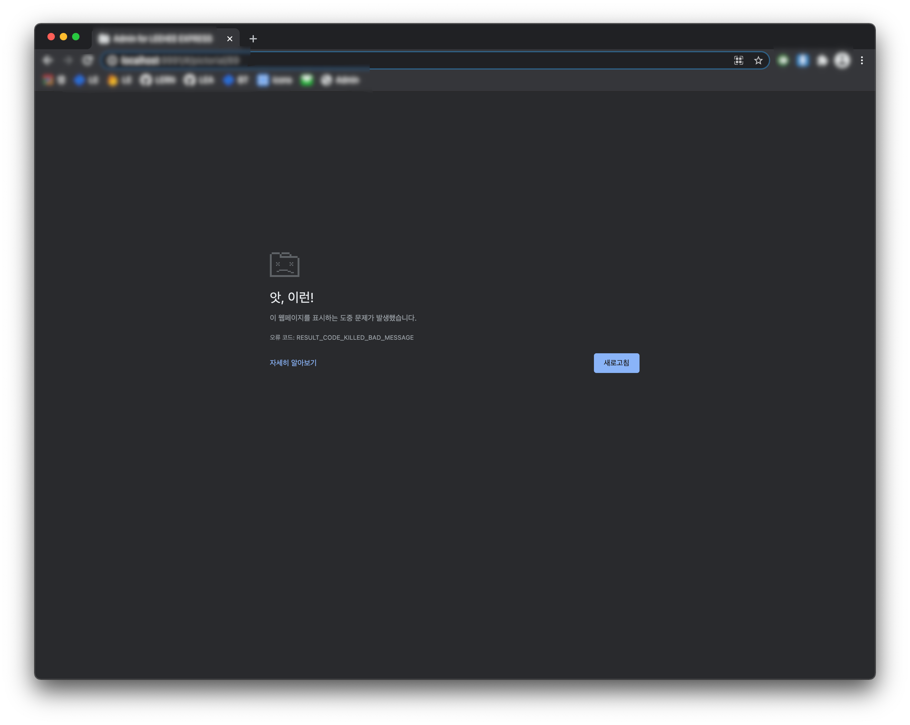

## 1. 발단

3월 초 즈음 크롬이 업데이트된 이후로 우리 웹앱에서 이미지 업로드가 되지 않는 현상이 발생했다. 해당 현상은 크롬 사용자에게만 나타났다. 그냥 자바스크립트 에러가 나면서 기능이 동작하지 않는 정도가 아니다. 아래처럼 아예 크롬이 죽어버린다.



크롬이 죽는 순간 개발자도구도 같이 죽기 때문에, 이 현상의 유일한 단서는 화면에 표시된 `RESULT_CODE_KILLED_BAD_MESSAGE` 뿐이었다. 하지만 해당 메시지를 포함한 여러 가지 조합으로 검색을 시도해봤지만 유의미한 정보를 찾을 수는 없었다.

불행 중 다행인 것은 파이어폭스로는 해당 기능이 문제없이 동작한다는 것이었다. 일단 고객 측에는 임시로 파이어폭스를 사용해달라고 하고, 원인을 찾기로 했다.

## 2. 현황 및 원인

현재 우리의 이미지 업로드 기능은 아래와 같이 구현되어 있다.

1. 사용자가 이미지 업로드를 시도하면 이미지 업로드 Redux Action 이 발송(`dispatch`) 된다.
2. 해당 액션을 듣고 있던 Redux Saga 가 Web Worker 에 이미지 업로드를 요청(`worker.postMessage`)한다.
   - 이미지는 여러 개일 수 있고 고용량일 수도 있기 때문에 메인 스레드에서는 직접 업로드하지 않고 워커 스레드를 사용한다.
3. Web Worker 는 `fetch` 메서드를 사용해 이미지 업로드 리퀘스트를 발송한다.
   - 이미지가 여러 개일 경우 리퀘스트는 이미지 개수만큼 발송된다.
4. 이미지 업로드가 성공/실패할 때마다 메인 스레드에 결과를 알린다 (`self.postMessage`).

크롬이 죽는 시점은 `fetch` 메서드가 실행되는 순간이다 (위에서는 3번 시점). 리퀘스트는 발송되지 않고 `fetch` 가 호출되는 그 순간 바로 죽어버린다.

테스트를 위해 워커에서 다른 리퀘스트들도 요청해봤는데 다른 리퀘스트들은 정상적으로 동작했다. 오로지 `body` 에 파일이 실려있을 때만 크롬이 죽었다.

왜 파일 업로드 요청에서만 죽는가? 라는 것은 알아내지 못했다. 혹시 우리가 Web Worker 혹은 `fetch` 메서드의 중요한 무언가를 놓친 게 아닐까 싶다가도, 크롬 업데이트 전에는 문제없었으며 현재도 파이어폭스 및 사파리에서는 멀쩡히 동작하기 때문에 그건 아닌 것 같았다.

그리고 설령 우리가 놓친 게 뭔가 있다고 할지라도 꽤 오랜 시간을 검색에 투자했음에도 이렇다 할 글을 찾지 못한 걸로 봐서는 쉽게 찾아질 녀석은 아닌 게 분명했다.

따라서 우리는 일단 근본적인 원인을 찾는 것은 멈추고 **'Web Worker 에서 `fetch` 메서드로 파일 업로드 시도'**를 원인으로 하여 해결책을 찾기로 했다.

## 3. 수정

원인을 찾았으니 해결 방법은 명확하다. `fetch` 메서드를 쓰지 않으면 된다. 대신 `XMLHttpRequest` 를 쓰자. `fetch` 메서드의 문제가 맞다면 이것만으로도 충분히 버그는 제거될 것이다.

### 3.1. `fetch` 를 사용한 기존 코드

```javascript
// UI로부터 받아온 해시 형식의 데이터를 FormData 로 변환하는 메서드
function getFormData(body) {
  const formData = new FormData();
  Object.keys(body).forEach((key) => {
    if (body[key] instanceof FileList) {
      for (let i = 0; i < body[key].length; i++) {
        formData.append(key, body[key][i]);
      }
    } else {
      formData.append(key, body[key]);
    }
  });
  return formData;
}

// 리퀘스트 발송 메서드
async function uploadImages(method, url, data) {
  return await fetch(URL, {
    method: "POST",
    mode: "cors",
    headers: {
      Authorization: "JWT TOKEN",
    },
    body: getFormData(data),
  });
}

await uploadImages(/* ... */);
```

### 3.2. `XMLHttpRequest` 를 활용해 수정한 코드

```javascript
// `XMLHttpRequest`를 사용한 코드

// async/await 문법을 사용하기 위해 Promise 활용
async function uploadImagesUsingXhr(method, url, token, data) {
  return new Promise((resolve, reject) => {
    const xhr = new XMLHttpRequest();
    xhr.open(method, url, true);
    xhr.setRequestHeader("Authorization", "JWT TOKEN");
    xhr.onreadystatechange = function () {
      if (this.readyState === 4) {
        resolve(JSON.parse(xhr.response));
      }
    };
    xhr.onerror = function onerror(e) {
      reject(e);
    };

    xhr.send(getFormData(data));
  });
}

await uploadImagesUsingXhr(/* ... */);
```

## 4. 결과

다행히도 `XMLHttpRequest` 를 활용해 수정하자 크롬에서도 문제없이 동작하게 되었다. 일단은 한숨 돌릴 수 있게 되었다.
